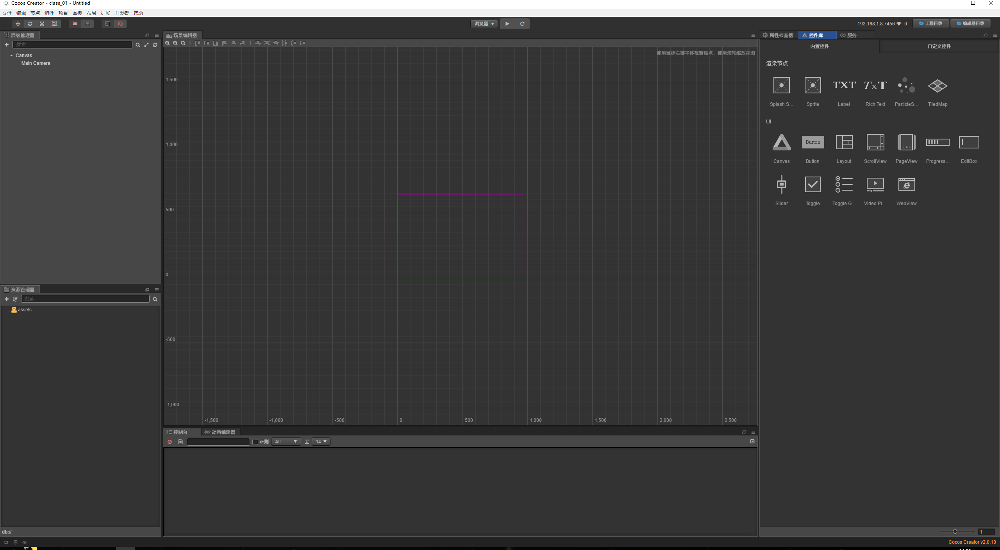
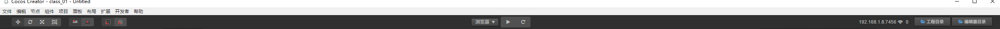
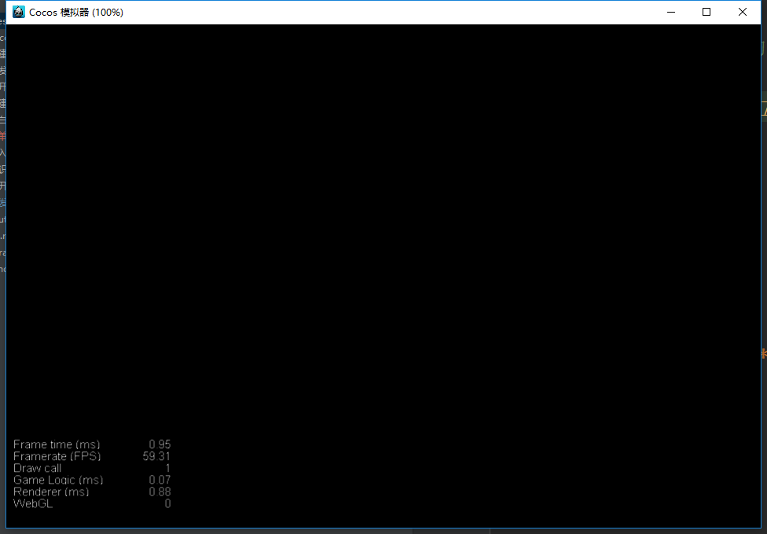
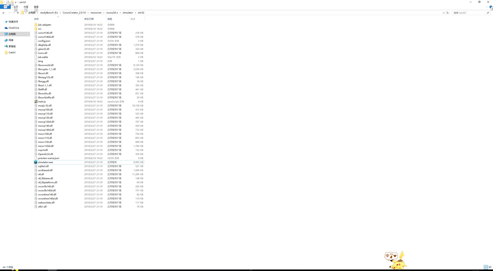
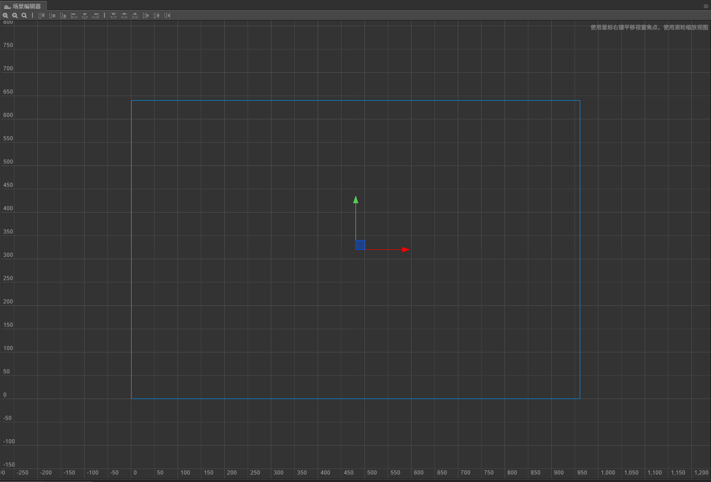
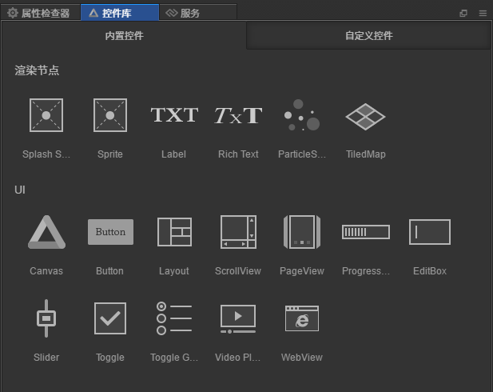

# 开发工具的使用
> 可以拖拽下工具栏，萌新的我就先随便拖拽调了下我喜欢的位置(下面的讲解以我拖拽后工作区域来讲解)

> 简单了解开发工具,后面实际应用会详细的讲解
1. **菜单** (最上方)

* 最中间的下拉框 **模拟器**和**浏览器**下拉框，旁边有个播放按钮可以运行

* 选中模拟器点击运行 则会打开个窗口运行 如下图所示

  

* 选中浏览器点击运行，则会打开浏览器运行 如下图所示
  
  
  
* 这边肯定有朋友会问，浏览器我电脑上安装了所以浏览器运行打开的是浏览器，那模拟器我没安装啊，模拟器在哪里，其实就是我们安装的cocos creator,下面带大家来找下模拟器的安装目录,路径为**\CocosCreator_2.0.10\resources\cocos2d-x\simulator\win32**
  
  注意看有个文件名为**simulator.exe**，其实这个就是模拟器运行文件

* 我们看下菜单这边左上角还有4个按钮 如下图 我们从左往右说起
  

  

  * 移动工具
  * 旋转工具
  * 缩放工具
  * 矩形变换工具
  
* 我们看下菜单右上角 有个工程目录按钮，这个按钮点击后就能跳到你的项目路径

2. **层级管理器** (左侧 上面一块区域)

* 现在我们看下左侧 层级管理器 如下图

     

* 这个主要用来管理我们的场景树，将每个场景分层管理好

3. **资源管理器** (左侧 下面一块区域)

* 我们看下左侧 下面一块区域 如下图
  
     

* 管理我们整个资源目录，比如游戏里有哪些资源，能在这个目录下看到

4. **场景编辑器**

* 场景编辑器在开发工具的正中央 

* 双击下层级管理器下的canvas，如下图所示
     
* 我们可以拼接游戏的界面，对游戏进行可视化的编辑，比以前代码调坐标肯定方便很多

5. **属性检查器**

* 现在看右侧tab的第一个属性检查器，如下图所示
     
* 每一个文件都有自己的属性，每个节点每个资源都有属性

6. **控件库**

* 现在再看右侧tab第二个控件库，如下图所示
  
* 可以将控件拖拽至场景编辑器，和层级管理器中选择某一场景，右键创建节点一样的效果，看个人爱好选择
* 自定义控件，就是自己写的控件啦，之后涉及到了再说

7. **控制台**

* 大家还记得场景选择器下面一部分是什么吗，对就是我们的控制台如图所示
  
* 运行模拟器浏览器打印日志的地方，不多赘述，大家都知道的应该
* 多注意看看控制台的报错信息，红色的表示错误

8. **动画编辑器**

* 前面控制台是个tab页，在他的右侧就是我们的动画编辑器了，如图所示
  
* 之后会详细介绍，怎么做动画

