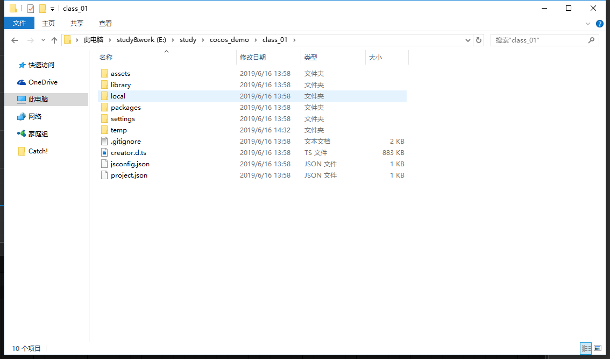
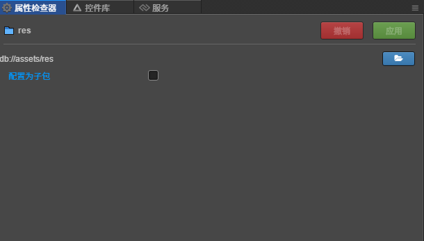

# 新建项目文件的组成
> 打开新建的项目
* 认真看之前分享内容的小伙伴肯定知道如何快速打开项目所在文件目录吧，、
让我们一起点击菜单右上方的 **工程目录** 吧
* 打开后如下图所示
    
* 进入项目文件夹，如下图所示，然后我们慢慢讲解
    
    
> 这里主要讲解assets
* assets
    * 在我的电脑中的assets和开发工具中资源管理器中的assets是同步的
    * 一般会规范的创建以下几个文件(官方)
        1. res - (与resources意思相同,不需要代码加载的资源，为了提高性能)
        2. resources - (与res意思相同,用代码加载的资源，为了提高性能)
        3. scenes - (场景文件夹)
        4. scripts - (保存脚本)
    * 现在我们愉快的在开发工具里建这4个文件夹吧(找到资源管理器右键assets新建文件夹)， 
        建完后如下图所示
    
    * 现在我们打开我的电脑，找项目文件夹，卧槽，会惊喜的发现，有些地方不一样啊，如下图所示
    
    * 我们建了4个文件夹，开发工具作为老板还给我们买一送一了，大家有没有注意到有4个后缀为meta的文件
    * 这个是我们传统开发遇不到的，.meta文件是和前面建立的文件同名的，
        然后可以通过编辑器打开现在我随意打开个给大家看看,然后简单翻译下?
        ``` javascript
            {
              "ver": "1.0.1",
              "uuid": "fc91b7ee-3b69-4262-8d8a-4e9b8477e23c",
              "isSubpackage": false,
              "subpackageName": "",
              "subMetas": {}
            }
        ```
        1. ver 版本号咯
        2. uuid 唯一标识咯
        3. isSubpackage 是不是子包:不是
        4. subpackageName 子包名称:空
        5. subMetas 子原数据:空对象
    * 调戏下这个文件吧。我们先用开发工具，点到该文件看下他的属性检查器 如下图所示
    
    * 我要打钩了然后再用编辑器打开这个文件，打完勾发现多了个选项可以填写名称，然后在点击下应用
    
    * 接下来打开这个文件
        ```
            {
              "ver": "1.0.1",
              "uuid": "fc91b7ee-3b69-4262-8d8a-4e9b8477e23c",
              "isSubpackage": true,
              "subpackageName": "我调戏下你",
              "subMetas": {}
            }
        ```
    * 卧槽(原来下没文化的萌新码农,遇事只会卧槽)，发现了没有，开发工具做的属性设置，
        对应的meta文件也改变了啊~~变了啊~
    * 所以所有的文件创建的场景啊节点啊都是这样的吧(以后学习就知道了，待验证)
    * 注意,文件不能乱删，后续项目，场景节点各种引用关系，
        应该是和uuid绑定的，删掉在建一样的uuid是不一致的，引用会出错
    * 上述情况我们测试下，我删除下res文件，然后在新建，
        然后在打开这个文件看下和之前的有什么变化  
        ```
            {
              "ver": "1.0.1",
              "uuid": "bf11a44f-5b9d-49ad-938b-23515fbdb697",
              "isSubpackage": false,
              "subpackageName": "",
              "subMetas": {}
            }
        ```
    * 果然不一样了，那我们在设置一样的属性试试   
        ```
            {
              "ver": "1.0.1",
              "uuid": "bf11a44f-5b9d-49ad-938b-23515fbdb697",
              "isSubpackage": true,
              "subpackageName": "我调戏下你",
              "subMetas": {}
            }
        ``` 
    * 所以看上去完全一样，但和之前的uuid比下的确变了
    * 提交项目时,.meta文件也是需要提交的可以看下，项目下gitignore文件就知道
        哪些文件是必须提交的