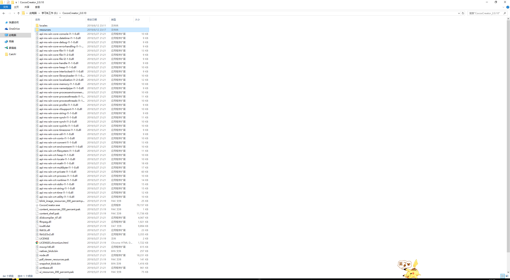
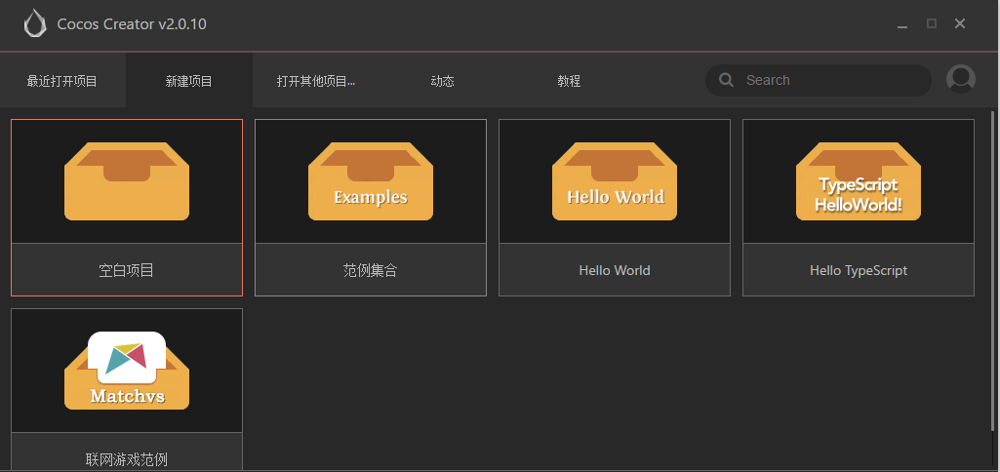
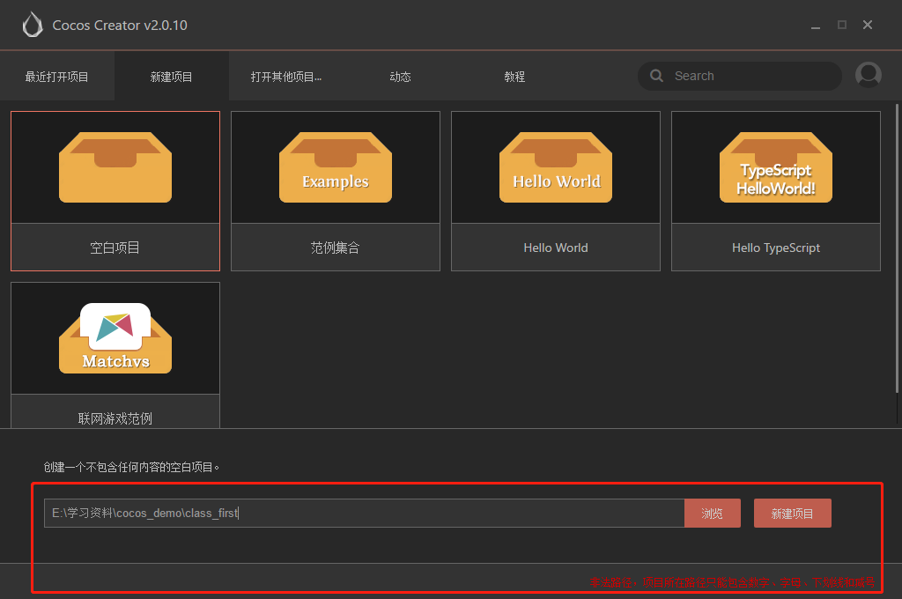
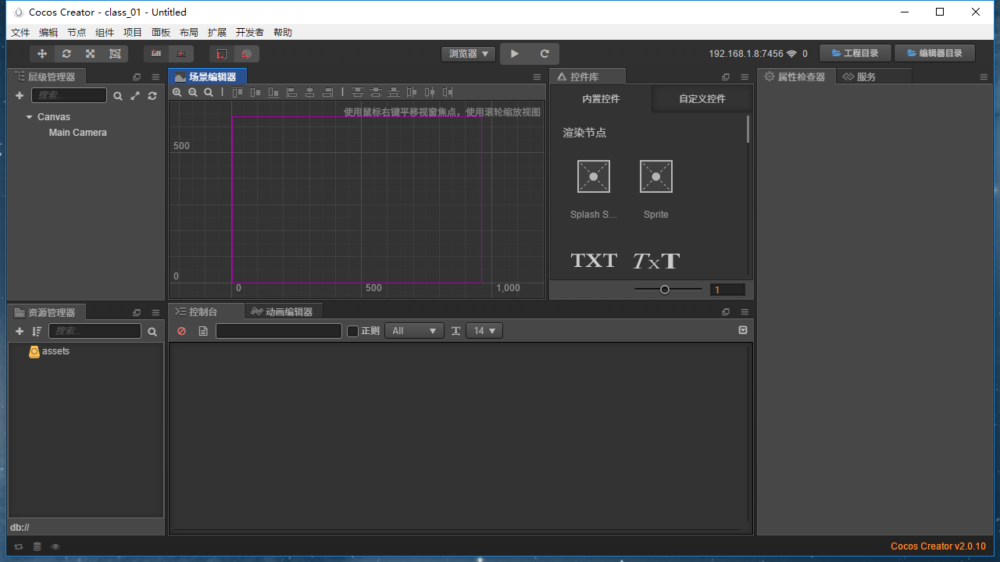

# 打开Creator

> 简单了解安装目录下的文件 

1. 鼠标右键桌面CocosCreator.exe 选择 **打开文件所在位置** 点击，如下图
   

2. 进入resources的目录 如下图
   

这里主要要说2点

* **cocos2d-x** 文件为cocos的游戏引擎

* **engine** 文件为cocos的h5的游戏引擎，大家能点击里面的文件看，有关引擎的基本都是后缀为js的文件

> 创建项目

1. 首次使用Cocos Creator的小伙伴们，先要注册自己的账号，这里就不多赘述了

2. 注册后登陆后,打开后应该就能看到这个了
   

   * 注意上方的tab页 主要有**最近打开项目**，**新建项目**，**打开其他项目**，**动态**，**教程**

   * 这里着重讲下**新建项目**
     

   * **空白项目**
     等等会重点讲，待会我就以空白项目为例

   * **范例集合**
     这个其实也是挺有用的，当不清楚一些例子之类的，可以新建项目查看~

   * **hello world**
     学代码的你不可能对这个不熟悉的，可以说是第一个上手可看的项目，也可以新建看下吧~

   * **typescript** && **联网游戏范例**

     暂时还不熟，作为新手玩家，哦不，作为初学者，我现在还没有好好深入这个，以后学到了自然会和大家分享~

> 空白项目走起

  1.创建空白项目文件路径为英文，中文可能会在之后构建项目的时候报错，好吧- -我这边已经报错了

2.改完路径后创建成功啦~
