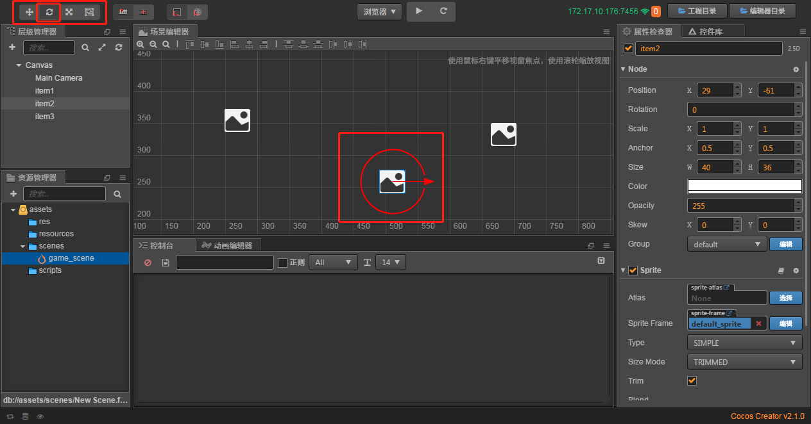

# 初识场景树
> 准备工作
1. 第一天我们简单介绍了Creator的使用，一些规范，现在可以做一些简单的回忆及复习
2. 我们新建个项目，这里我命名为class_nodetree,用来学习今天的场景树
3. 根据规范，我们依然需要新建这么几个文件，并且创建新的场景**game_scene**,如下图所示

    
    
4. 我们在层级管理器Canvas上右击新建1个单色精灵(创建的时候可以直接改名)，具体操作是鼠标移至Canvas -> 右键
     -> 创建节点 -> 创建渲染节点 -> Sprite(单色)，顺便改名为item1，如果创建时没改名，
     也可以右键创建的节点重命名
5. 复制item1，然后黏贴几份副本，最后呈现的效果是

    
    
> 开始玩耍单色精灵
1. 移动
    * 我们先点击左侧层级管理器的item1，然后观察场景编辑器的单色精灵，如下图所示

       
    
    * 首先大家能看到坐标轴吧。横着的是x轴，竖着的是y轴
    * 见到两轴交接处，坐标原点这边有个蓝色的矩形了没有
    * 大家按在蓝色矩形的地方对其进行拖动
    * 我们目前创建了3个单色精灵让我们拖拽他们，让他们分开吧，如图所示
    
       
    
    * 请再次点击3个单色节点，看右侧属性检查器 position的属性 如图所示
    
    
    
    * 能明显看到，我们拖拽引起了这个属性的变化，不信你可以一边拖拽一边看这边
        (后续其他属性请小伙伴自己观察我就不一一截图说明了)
        
2. 旋转 
    * 还记得第一天菜单左侧的那几个按钮嘛，对，就是旋转，缩放等按钮，
        我们现在就先来玩下旋转
    * 先点击选中你想要的旋转的单色精灵，这边我以item2为例，
        然后在点击菜单左侧的旋转按钮，如图所示
    
         
    
    * 我们鼠标拖动让它转起来吧 
    
      
    
3. 缩放  
    * 和前面旋转一样，我们点击菜单的缩放，然后来调戏x轴和y轴   
    
      
    
    * 请观察右侧属性检查器个属性的变化
    
4. 当然你也可以直接在右侧属性检查器改变其属性(这里就不做截图了小伙伴自己玩耍)

> 简单解释下场景树及节点
1. 场景树概念
    * 树状结构，就像你电脑里面的文件一层一层嵌套的关系
    * 根节点就是Canvas，前面的单色精灵就是子节点，如图所示
    
     
    
2. 节点
    * 第一天我们简单讲过，还记得Canvas下其实有2个节点，一个是Node，一个是Canvas嘛
    * 我们来看下单色精灵，点击左侧层级管理器的单色精灵，然后在看右侧的属性检查器，
        如下图所示
        
     
    
    * 同样能看到有Node节点，而且还有个我们第一天没见过的精灵节点
    * Node节点应该是最大的父类节点了，每个节点都应该有(待验证)    
    
3. 官方的解释
    * creator是由一个一个的游戏场景组成，通过代码逻辑来控制场景跳转
    * creator场景是一个树形结构
    * 树形结构必然有父节点，孩子节点
    * cc.Node就是场景树中的节点对象
    * 任何一个节点都有一个cc.Node
        
    
    
    
        
    
    
     