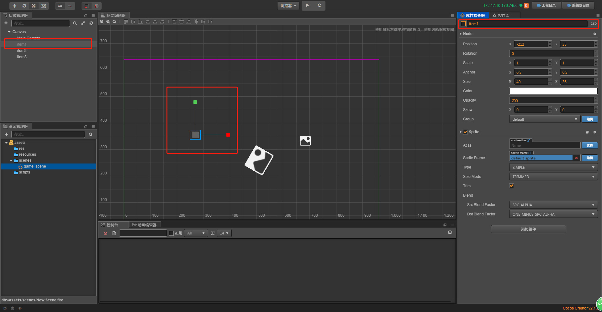
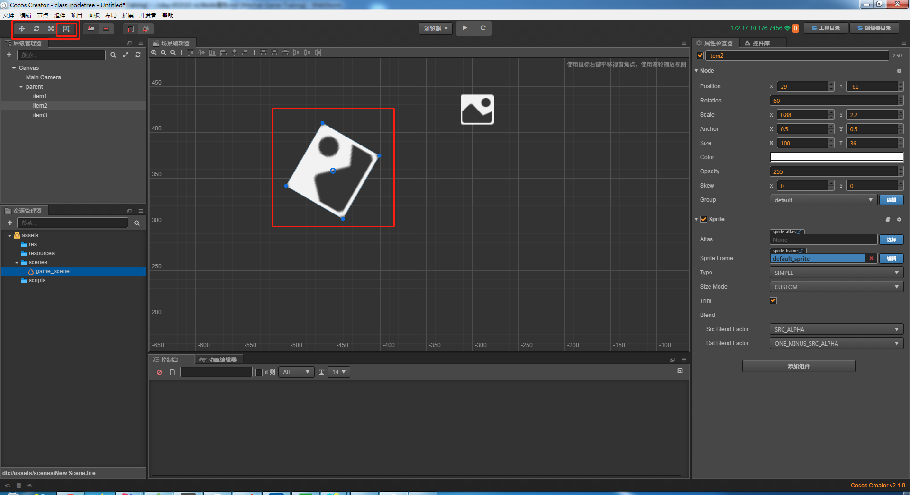
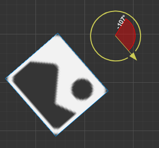
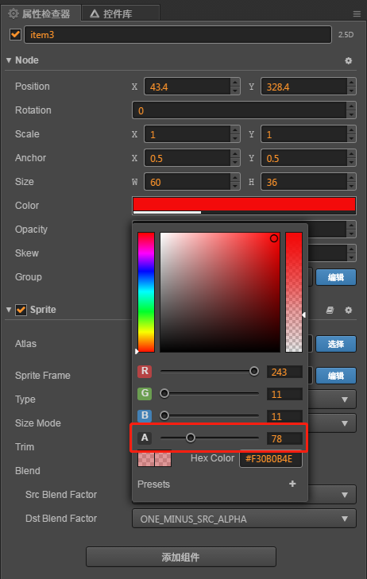

# cc.Node属性
1. **name** - 获取节点的名字
    * 这里和第二点active一起讲
    * 先来看下截图
    
     
    
    * 这里红框圈出来的，复选框代表active的可见性，选中则为可见，不勾选则不可见
    * 复选框右边显示的是节点名字，就是name属性
    * 我们现在取消选中，看下变化，的确是不可见的，见下图所示
    
    
    
2. **active** - 设置节点的可见性
    * 见第一点name
3. **position** -相对坐标
    * 见01-初识场景树 有简单解释过
    * 参照物是父亲节点，改变父亲节点位置可以带着儿子一起动(酷不酷炫不选)
    * 我们建立个parent空节点，然后把之前的3个单色精灵放在parent，然后拖拽
        3个单色精灵一起移动了耶！！(这个就是相对坐标的好处)
        下面如图所示
        
        
        
4. **rotation** -旋转
    * 见01-初识场景树 有简单解释过
    * 顺时针为正，和数学上是相反的
5. **scale** -缩放
    * 见01-初识场景树 有简单解释过
6. **anchor** -锚点
    * 我们先选中一个单色精灵，然后点击左上角菜单最后面的这个按钮，如图所示
    
    
    
    * 仔细观察场景编辑器选中的单色精灵，中心位置有个空心圆，这个就是锚点
    * 如何理解，比如说一张照片让你挂墙上，比方说坐标是100，100，那你放在这个点上的
        照片，是以哪个点为基准，是以照片的左上角为基准还是以照片的正中心为基准，
        锚点就是这个作用    
    * 精灵的左下角(一个正方形的左下角)坐标是0，0，
        右上角坐标是1，1，锚点是可以超出这个范围的
    * 所以右侧属性选择器，你们看到锚点默认是0.5，0.5，就是精灵的正中心
    * 下图是改变锚点后的旋转，精灵就不是以自身正中心旋转了，因为我改变了它的锚点，哈哈
    
        
    
7. **Size** -大小
    * 节点的大小
    * 响应事件
8. **Color** -环境颜色
    * 颜色嘛，当然就是改颜色啦，我们可以在右侧属性检查器里修改颜色
    
    
    
9. **Opacity** -透明度
    * 透明度，可以在颜色里调整，如图所示
    
    
    
    * 255是完全不透明
    * 可能会影响孩子节点的透明度
    * 比如以后游戏元素的交互，点到某个东西上面变颜色就可以用这个调试
10. **Skew** -扭曲
    * 来来来，调戏单色精灵，扭一个平行四边形
    * 通过改变skew的x和y的值，如下图所示
    
    
    
11. **Group** -分组
    * 我们很多地方会用到分组，比如碰撞检测
    * 对游戏对象分组
    * Creator给了个默认组，default
    * 比方说飞机大战，player和enemy，我们新建2个分组看看，点击右侧属性检查器，
        group右边的编辑按钮，如下图所示
        
      
    
    * 然后我们点击添加分组，添加2个分组player和enemy，如下图所示
    
     
    
    * 看到了没，允许产生碰撞的分组配对！！可以根据分组做相关的处理
    * 其他运用，比如游戏地图上的障碍物做一个分组之类的！！
    * 然后我们就可以点击我们的单色精灵，给它分到你想要给它的组了~   
12. **parent** -父亲节点的cc.Node
    * 每个节点只有一个父节点，不可能有多个父节点(除了根节点，他没有父节点)
    * 如我们现在的例子，item1的父节点就是parent
13. **children/childrenCount** -孩子节点
    * 每个节点不一定有子节点 如item1下面就没有子节点
    * parent下的子节点有3个，分别是item1，item2，item3
14. **tag** -节点标签
    * 方便管理节点，之后碰到了详细的讲