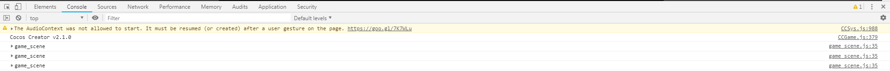
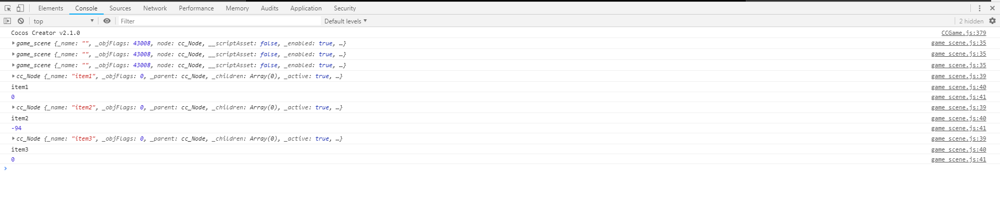
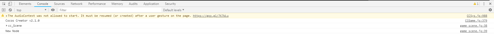
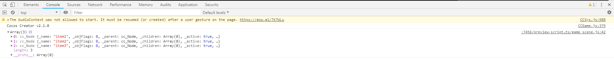

# 代码组件
> 概念
1. 每个代码组件实例都继承自cc.Component(构造函数),所以有一个node数据成员指向cc.Node
2. cc.Class({...})定义导出一个新的类的构造函数，它继承自cc.Component
3. 当为每个节点添加组件的时候，会实例化(new)这个组件类，生成一个组件实例(js语法new)
4. 当组件加载运行的时候，代码函数里面的this指向这个组件的实例
5. 代码组件在挂载的时候扩展自cc.Component，里面有个成员node会指向节点(cc.Node)
    所以在代码组件里面，可以使用this.node来访问这个组件实例挂载的节点对象
6. 代码里访问cc.Node总要属性

> 操作热身下
1. 在scripts文件夹下创建我们的脚本**game_scene**
2. 双击打开，我这边在第一天设置过WS,所以会在WS中打开这个文件，
    具体文件自动生成的代码，在第一天分享中可以看到
3. 我们给item3添加这个组件，实际上做的事情就是生成了个组件实例,
    挂载在item3节点(概念下的第三点)
4. 可以添加多个组件
5. 调戏下代码吧，我们在脚本中onLoad下打印下实例this，代码如下
    ```
        cc.Class({
            extends: cc.Component,
        
            properties: {
                // foo: {
                //     // ATTRIBUTES:
                //     default: null,        // The default value will be used only when the component attaching
                //                           // to a node for the first time
                //     type: cc.SpriteFrame, // optional, default is typeof default
                //     serializable: true,   // optional, default is true
                // },
                // bar: {
                //     get () {
                //         return this._bar;
                //     },
                //     set (value) {
                //         this._bar = value;
                //     }
                // },
            },
        
            // LIFE-CYCLE CALLBACKS:
        
            onLoad () {
                console.log(this);
            },
        
            start () {
        
            },
        
            // update (dt) {},
        });
    ```
6. 看下浏览器的控制台,如图所示

      
    
7. 我们可以继续调戏组件，在item1，item2上也挂载代码组件，然后打开浏览器在看下     
    
    
    
    * 果然生成了3个实例，同一个组件，实例化3次
    
    
    
    * 仔细看下他们的node和_id
    
8. 代码里如何找到节点
    * 在start的方法里添加打印语句
    * 打印`this.node`
    * 当然我们可以继续获得node的属性，比如说
        ```
            cc.Class({
                extends: cc.Component,
            
                properties: {
                    // foo: {
                    //     // ATTRIBUTES:
                    //     default: null,        // The default value will be used only when the component attaching
                    //                           // to a node for the first time
                    //     type: cc.SpriteFrame, // optional, default is typeof default
                    //     serializable: true,   // optional, default is true
                    // },
                    // bar: {
                    //     get () {
                    //         return this._bar;
                    //     },
                    //     set (value) {
                    //         this._bar = value;
                    //     }
                    // },
                },
            
                // LIFE-CYCLE CALLBACKS:
            
                onLoad () {
                    console.log(this);
                },
            
                start () {
                    console.log(this.node);
                    console.log(this.node.name);
                    console.log(this.node.angle);
                },
            
                // update (dt) {},
            });
        ```
    * 请看浏览器的控制台
    
        
        
    * 之后请查阅API文档(只截取了部分)
    
        
 
 9. 真玩代码模式  
    * 好奇了，canvas有没有父亲节点呢，我们先将代码改造下
    * 只打印`this.node._parent`
    ```
    cc.Class({
        extends: cc.Component,
    
        properties: {
            // foo: {
            //     // ATTRIBUTES:
            //     default: null,        // The default value will be used only when the component attaching
            //                           // to a node for the first time
            //     type: cc.SpriteFrame, // optional, default is typeof default
            //     serializable: true,   // optional, default is true
            // },
            // bar: {
            //     get () {
            //         return this._bar;
            //     },
            //     set (value) {
            //         this._bar = value;
            //     }
            // },
        },
    
        // LIFE-CYCLE CALLBACKS:
    
        onLoad () {
        },
    
        start () {
            console.log(this.node._parent);
        },
    
        // update (dt) {},
    });
    ```
    * 先看下现状，看下item1，2，3他们的父节点是否是parent
    
        
        
    * 没什么问题，然后我们把item123的这个组件移除，然后挂载到canvas下，在看下结果
    
        
        
    * 炫！ 酷！ 屌！ 炸！ 天！竟然是有父节点的，一开始以为是个空对象或者什么的，
        然后new node的_parent就没有了返回的是null
        
    * Canvas移除我们的代码组件，给parent添加组件，并且修改代码，打印`children`看下情况
    
        ```
            cc.Class({
                extends: cc.Component,
            
                properties: {
                    // foo: {
                    //     // ATTRIBUTES:
                    //     default: null,        // The default value will be used only when the component attaching
                    //                           // to a node for the first time
                    //     type: cc.SpriteFrame, // optional, default is typeof default
                    //     serializable: true,   // optional, default is true
                    // },
                    // bar: {
                    //     get () {
                    //         return this._bar;
                    //     },
                    //     set (value) {
                    //         this._bar = value;
                    //     }
                    // },
                },
            
                // LIFE-CYCLE CALLBACKS:
            
                onLoad () {
                },
            
                start () {
                    console.log(this.node.children);
                },
            
                // update (dt) {},
            });
        ```
        
        
    
    * 和期望的一样，没任何问题，调戏结束~
    