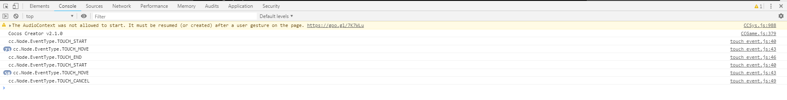

# 触摸事件
> 概念
1. 触摸事件类型: START,MOVED,ENDED,CANCEL
    * START 触摸开始
    * MOVED 移动的时候
    * ENDED 在物体上面停止触摸(物体内)
    * CANCEL 在物体外面停止触摸(物体外)
2. 监听触摸事件: node.on(类型,callback,target(回调函数的this),[useCapture])
3. 关闭触摸事件: node.off(类型,callback,target(回调函数的this),[useCapture])
4. targetOff(target): 移除所有的注册事件
5. 回调函数的参数设置: function(t(cc.Touch))
6. cc.Touch: getLocation返回触摸的位置;getDelta返回距离上次的偏移
7. cc.Event: stopPropagationImmediate/stopPropagation停止事件的传递
8. 事件冒泡: 触摸事件支持节点树的事件冒泡，会从当前层往上一层一层的向父节点传递
9. 完成物体跟随手指触摸的案例

> 开始玩耍
1. 在Canvas下创建个单色精灵，名字起item，然后颜色改为红色
2. 触摸事件的思路，开始编写脚本代码
    * 新建名为**touch_event**的js文件
    * 把该文件绑定在item上
    * 注册事件
        ```
        onLoad () {
                //监听对应的触摸事件，向游戏引擎底层注册一个回调函数，当有触摸事件发生的时候，就会调用这个回调函数
                //回调函数格式 function(t){} t->cc.TOUCH对象，触摸事件对象，该对象包括触摸信息，事件信息
                //回调函数this指向谁，就是第三个参数 target，可以为空
                //function的bind也可以，显示绑定
                this.node.on(cc.Node.EventType.TOUCH_START, function(t){
                    console.log("cc.Node.EventType.TOUCH_START");
                },this);
                this.node.on(cc.Node.EventType.TOUCH_MOVE, function(t){
                    console.log("cc.Node.EventType.TOUCH_MOVE");
                },this);
                this.node.on(cc.Node.EventType.TOUCH_END, function(t){
                    console.log("cc.Node.EventType.TOUCH_END");
                },this);
                this.node.on(cc.Node.EventType.TOUCH_CANCEL, function(t){
                    console.log("cc.Node.EventType.TOUCH_CANCEL");
                },this);
            },
        ```
    * 打开浏览器测试下 如下图所示
    
        
        
    * 删除之前绑定的事件，这边代码重构下
    
        ```
           cc.Class({
               extends: cc.Component,
           
               properties: {
                   // foo: {
                   //     // ATTRIBUTES:
                   //     default: null,        // The default value will be used only when the component attaching
                   //                           // to a node for the first time
                   //     type: cc.SpriteFrame, // optional, default is typeof default
                   //     serializable: true,   // optional, default is true
                   // },
                   // bar: {
                   //     get () {
                   //         return this._bar;
                   //     },
                   //     set (value) {
                   //         this._bar = value;
                   //     }
                   // },
               },
           
               on_touch_start(t){
                   console.log("cc.Node.EventType.TOUCH_START");
               },
           
               on_touch_move(t){
                   console.log("cc.Node.EventType.TOUCH_MOVE");
               },
           
               on_touch_end(t){
                   console.log("cc.Node.EventType.TOUCH_END");
               },
           
               on_touch_cancel(t){
                   console.log("cc.Node.EventType.TOUCH_CANCEL");
               },
           
               // LIFE-CYCLE CALLBACKS:
           
               onLoad () {
                   //监听对应的触摸事件，向游戏引擎底层注册一个回调函数，当有触摸事件发生的时候，就会调用这个回调函数
                   //回调函数格式 function(t){} t->cc.TOUCH对象，触摸事件对象，该对象包括触摸信息，事件信息
                   //回调函数this指向谁，就是第三个参数 target，可以为空
                   //function的bind也可以，显示绑定
                   this.node.on(cc.Node.EventType.TOUCH_START, this.on_touch_start, this);
                   this.node.on(cc.Node.EventType.TOUCH_MOVE, this.on_touch_move, this);
                   this.node.on(cc.Node.EventType.TOUCH_END, this.on_touch_end, this);
                   this.node.on(cc.Node.EventType.TOUCH_CANCEL, this.on_touch_cancel, this);
           
                   //关闭touch_move事件
                   this.node.off(cc.Node.EventType.TOUCH_MOVE, this.on_touch_move, this);
               },
           
               start () {
           
               },
           
               // update (dt) {},
           });
        ```
    * 这样触摸移动事件就被关闭了
    
        
        
    * 移除掉所有的事件
    
        `this.node.targetOff(this);`
    
    * 可以打印触摸的坐标及距离上一次触摸变化了多少
    * 这里可以做个简单有趣的demo，拖拽单色精灵，可在屏幕中拖着移动
        ```
            /**
             *  触摸的位置 屏幕坐标 左下角(0,0) getLocation();
             *  距离上一次触摸变化了多少 getDelta() x和y各变化了多少
             * @param t cc.Touch
             */
            on_touch_move(t){
                // console.log("cc.Node.EventType.TOUCH_MOVE");
                console.log(t.getLocation(), t.getDelta());
                let delta = t.getDelta();
                this.node.x += delta.x;
                this.node.y += delta.y;
            },
        ```
3. 讲下冒泡
    * 向上传递 父亲包括孩子，孩子的事情，父亲也会管，会一直向上传递(默认情况)
    * 可以调用函数，阻止冒泡
        * `stopPropagationImmediate()`立刻停止传递         