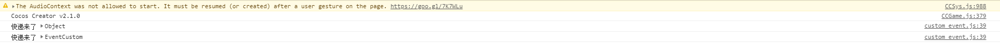

# 自定义事件
> 使用方法
1. 监听: this.node.on("自定义事件名称", function, target, useCapture);
2. 触发:  emit("事件名称", [detail]); - 只有自己能收到
3. 冒泡派送: dispatchEvent(new cc.Event.EventCustom("name",是否冒泡传递));

> 开始玩耍
1. 开始编写脚本代码
    * 新建名为**custom_event**的js文件
    * 把该文件绑定在item上
    * 注册事件
        ```
            onLoad () {
                //接收者
                //事件类型是自定义的字符串，这里pkg_event随便起的名字，意思就是包裹事件(模拟下快递)
                //回调函数 e->Event.EventCustom的实例
                this.node.on("pkg_event", function(e){
                    console.log("快递来了");
                }, this)
                //派送者，只能传递给自己
                this.node.emit("pkg_event");
            },
        ```
        
        
        
    * 如何传递参数
        ```
            onLoad () {
                //接收者
                //事件类型是自定义的字符串，这里pkg_event随便起的名字，意思就是包裹事件(模拟下快递)
                //回调函数 e->Event.EventCustom的实例
                this.node.on("pkg_event", function(e){
                    console.log("快递来了", e);
                }, this)
                //发送者，只能传递给自己
                this.node.emit("pkg_event", {name: 'gqf', age: 27});
            },
        ```
        
        
        
    * 向上传递
        * 具体代码如下
        ```
            //ture冒泡向上传递 false则相反
            let e = new cc.Event.EventCustom("pkg_event", true);
            this.node.dispatchEvent(e);
        ```
        * 先看下父级Canvas还没有接受时控制台的情况
        
        
        
        * 的确调用了2次，现在我们创建新的脚本**recv_event.js**绑定在canvas接受
        
        * 重构下custom_event的代码，把派送的代码放在start函数里,然后让自己不接受，代码注释即可
        ```
                onLoad () {
                    //接收者
                    //事件类型是自定义的字符串，这里pkg_event随便起的名字，意思就是包裹事件(模拟下快递)
                    //回调函数 e->Event.EventCustom的实例
                    /*this.node.on("pkg_event", function(e){
                        console.log("快递来了", e);
                    }, this)*/
                },
            
                start () {
                    //发送者，只能传递给自己
                    this.node.emit("pkg_event", {name: 'gqf', age: 27});
                    //派送 向父级传递
                    let e = new cc.Event.EventCustom("pkg_event", true);
                    this.node.dispatchEvent(e);
                },
        ```
        
        * 然后在recv_event接受
        ```
                onLoad () {
                    this.node.on("pkg_event", function(e){
                        console.log("快递来了,这里是Canvas", e);
                    }, this)
                },
        ```
        
        
        
        * 把前面的冒泡flag改成false这边就收不到了