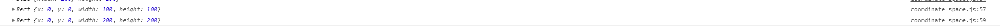

# cc.Size / cc.Rect
> 知识大纲
1. cc.Size: 包含宽度和高度信息的对象{width: 100, height: 100}
2. new cc.Size(w, h), cc.size(w, h)创建一个大小对象
3. cc.Rect: 矩形对象，new cc.Rect(x, y, w, h)， cc.rect(x, y, w, h);
4. Rect.contains(Point) 点是否在矩形内
5. intersects 两个矩形是否相交
6. 自行查找API

> 练习
1. 直接在脚本里编写代码，创建Size对象
    ```
        let s1 = new cc.Size(100, 100);
        console.log(s1);
        let s2 = cc.size(200, 200);
        console.log(s2);
    ```
    
    
    
2. 创建矩形对象 (注意这里的x,y和h5的canvas有些不同，
    x,y指的是矩形左下角的顶点，而不像canvas是左上角的顶点)
    ```
        let rect1 = new cc.Rect(0, 0, 100, 100);
        console.log(rect1);
        let rect2 = cc.rect(0, 0, 200, 200);
        console.log(rect2);
    ```
    
    
    
3. 判断点是否在矩形内
    ```
        let p1 = cc.v2(50, 50);
        let p2 = cc.v2(100, 100);
        let p3 = cc.v2(200, 200);
        console.log(rect1.contains(p1));
        console.log(rect1.contains(p2));
        console.log(rect1.contains(p3));
    ```
    
    
    
    * 结合上文,矩形的几个参数是{x: 0, y: 0, width: 100, height: 100}
    * 我们3个点分别是(50, 50),(100, 100),(200, 200)
    * 第一个点明显在里面，所以为true
    * 第二个点在矩形上，也算包含，所以也为true
    * 第三个点明显就在外面了，所以为false
    
4. 两个矩形是否相交
    ```
        let rect1 = new cc.Rect(0, 0, 100, 100);
        console.log(rect1);
        let rect2 = cc.rect(0, 0, 200, 200);
        console.log(rect2);
        let rect3 = cc.rect(300, 300, 10, 10);
        console.log(rect3);

        console.log(rect1.intersects(rect2));
        console.log(rect1.intersects(rect3));
    ```
    
    
    
    * 很明显的答案，小伙伴自己分析，在多做练习哈~
    

