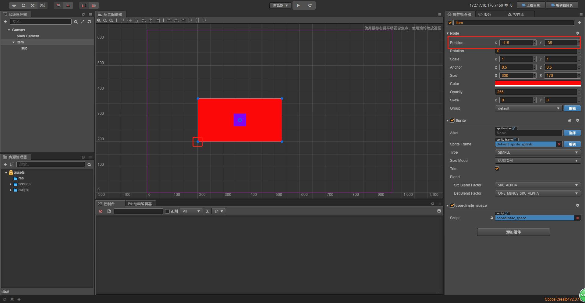
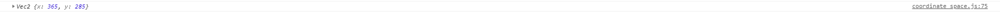

# creator坐标系
> 概念
1. 世界(屏幕)坐标系
2. 节点坐标系，又叫相对坐标系，两种相对节点原点的查找方式
    1. 左下角为原点
    2. 锚点为原点(AR)
3. 节点坐标和屏幕坐标的互相转换
4. 获取在父节点坐标系下的节点包围盒
5. 获取在世界坐标系下的节点包围盒
6. 触摸事件对象世界坐标与节点坐标的转换

> 练习
1. 屏幕坐标的坐标原点在屏幕的左下角，
    从左往右是x轴，从下到上是y轴，和数学的第一象限坐标系一致
2. 节点坐标系，这里要画一张草图
    
    
    
    * O点为世界屏幕坐标系原点(0, 0)
    * 假设A点坐标是(100,100)，B(300,300) ->这里指的是对应世界坐标系
    * 那节点坐标系又是什么意思，比如说B以A为参照为，他的相对坐标系就是(200, 200)
    * B点对于世界坐标系坐标是(300,300)，他的节点坐标系(相对于A点来说)就是(200, 200)
    * 假设A还是个有大小的矩形，那b相对于A的坐标原点是哪个，这里参照概念第二条，在加图说明
    
    
    
    * 图中涂抹的地方就对应2个查找方式，一个是A的左下角,一个是A的锚点  
3. 节点坐标和屏幕坐标的互相转换,编写代码
    1. 节点坐标转换屏幕坐标
    ```
        //节点坐标转到屏幕坐标
        let w_pos = this.node.convertToWorldSpace(cc.v2(0, 0));
        console.log(w_pos);
    ```
    
    
    
    * 可能部分小伙伴看不懂这个坐标数字，其实它是用红色矩形左小角的点和坐标原点做计算
    * 这边变化了下在截2个图给大家看下
    
    
    
    
    
    * 总结，是以item左下角的点以世界坐标原点做参考
    
    * 我们使用另外个API,就是以A的锚点以世界坐标原点做参考
    ```
        //节点坐标转到屏幕坐标
        let w_pos = this.node.convertToWorldSpaceAR(cc.v2(0, 0));
        console.log(w_pos);
    ```
    
    
    
    * 明显结果不一样了，原因是我们是用A的锚点在以世界坐标原点作参考
    * 我们这里做个简单的运算。之前是200，200，现在的答案是365，285
    * 我们看下A，也就是item的宽和高，分别是330，170(从下往上数第三个截图，右侧属性检查器)
    * 330的一半是165，170的一半是85，200+165=365，200+85=285
    * 验证了答案！
    
    
    
    