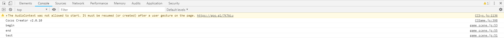

# Action
> 知识大纲
1. Action类是动作命令，我们创建Action，然后节点运行action就能执行Action的动作
2. Action分为两类
    1. 瞬时完成的ActionInstant
    2. 要一段时间才能完成的ActionInterval
3. runAction: 节点运行action
4. cc.moveTo, cc.moveBy - to是目标 by是变化
5. cc.rotateBy, cc.rotateTo
6. cc.scaleBy, cc.scaleTo
7. cc.fadeOut, cc.fadeIn，cc.fadeTo
8. cc.callFunc， cc.delayTime
9. cc.sequence, cc.repeat, cc.repeatForever
10. easing: 加上缓动特效，cc.easeXXXXX查看文档设置自己想要的缓动对象
11. stopAction: 停止运行action
12. stopAllActions: 停止所有的action

> 练习
0. 之前描述的太过详细，以后这边就不在赘述，新建单色精灵啊，新建脚本啊什么的，大家都懂的哈~
1. cc.moveTo, cc.moveBy - 移动
    ```
    onLoad () {
        //第一个参数是时间 持续时间多久，单位是s，第二个参数是目标，可以是坐标也可以是点
        let actionTo = cc.moveTo(2, cc.v2(100, 100));
        this.node.runAction(actionTo);
    },
    ```
    * 这里是moveTo方法，运行后看到我们的item移动了对吧~就是在2s到了100，100的位置~cool~
    
    ```
    onLoad () {
        //第一个参数是时间 持续时间多久，单位是s，第二个参数是目标，可以是坐标也可以是点
        /*let actionTo = cc.moveTo(2, cc.v2(100, 100));
        this.node.runAction(actionTo);*/

        let actionBy = cc.moveBy(2, cc.v2(100, 100));
        this.node.runAction(actionBy);
    },
    ```
    * 这里是moveBy方法，运行后看到我们的item移动了对吧~就是在2s变化了100，100的距离~同样cool~
    * 这边肯定会有小伙伴会问，2个方法怎么移动的是一样的?其实性质是不一样的
    * 这里举个例子，比方说在x轴上。作者在50，0的位置，然后如果moveTo(100,0),作者移动到了100，0
        这个目标,实际上是不是就是走了50的距离啊。这里记住,to的100，0是目标
        但如果是moveBy(100,0)就过分了，他是要变化100啊，强行让作者走到了(150, 0),所以by的100，0
        是变化 

2. cc.rotateBy, cc.rotateTo - 旋转 
    * 和move的to和by是一样的道理
    * 这里就不演示了，小伙伴自行玩耍 
    
3. cc.scaleBy, cc.scaleTo - 缩放  
    * 略微有些不同，比方说当前的节点scale为2
    * 使用scaleTo(2,2)是没有变化的 2秒钟scale变为2,最终和之前的2没任何变化
    * 使用scaleTo(2,2)是有变化的， 2秒钟scale变为2*2=4，最终变成4了啊，之前可是2啊

4. cc.fadeIn，cc.fadeOut, cc.fadeTo - 淡入淡出，改变透明度
    * 淡入淡出在游戏里对应的是什么，哈哈爆装备知道嘛。淡入，
        游戏角色或者敌方尸体总要消失吧，淡出    
    * API中这2个方法只要传入时间duration就可以了
    * 测试淡入的时候记得先把item的透明度先改为0哈
    ```
    let fadeIn = cc.fadeIn(2);
    this.node.opacity = 0;
    this.node.runAction(fadeIn);
    ```
    * fadeOut这里就不演示了，注意透明度变为0，但物体还在的
    * fadeTo就该实际传参数改变透明度，比如老子喜欢半透明的
    * fadeTo就要传2个参数了
        1. 第一个参数，还是时间老样子,单位是s
        2. 第二个参数，0-255, 0 是透明
    ```
    let fadeTo = cc.fadeTo(1, 128);
    this.node.runAction(fadeTo);
    ```
5. cc.callFunc, cc.delayTime
    1. cc.callFunc
        * 前面的这些方法其实都是要一段时间才能完成的ActionInterval
        * 直接上代码
        ```
        let func = cc.callFunc(function(){
            console.log("test");
        }.bind(this));
        console.log("begin");
        this.node.runAction(func);
        console.log("end");
        ```
        
        
        
        * 他的机制并不是在begin和end中间执行
    2. cc.delayTime
        * 模拟游戏爆装备
        * 一开始item就存在，让他存在3s，然后模拟没人捡装备慢慢消失，然后删除
        ```
        let dt = cc.delayTime(3);
        let fo = cc.fadeOut(0.5);
        let cb = cc.callFunc(function(){
        	this.node.removeFromParent();
        }.bind(this));
        let seq = cc.sequence([dt,fo,cb]);
        this.node.runAction(seq);            
        ```

6. cc.sequence, cc.repeat, cc.repeatForever
    1. cc.sequence
        * item移动到目的地后，隐藏怎么做？ 命令清单(队列)[Action1,A2,A3...]
        * 编写代码
            ```
            let a1 = cc.moveTo(2, 100, 100);
            let a2 = cc.fadeOut(1);
            let seq = cc.sequence([a1, a2]);
            this.node.runAction(seq);
            ```
        * 运行后发现，可以可以已经完成了我们的目标
        * 一个节点可以运行多个action 比如去目的地和隐藏一起做？
            ```
            let a1 = cc.moveTo(2, 100, 100);
            let a2 = cc.fadeOut(2);
           /* let seq = cc.sequence([a1, a2]);
            this.node.runAction(seq);*/
            this.node.runAction(a1);
            this.node.runAction(a2);
            ```
        * 隐身即无敌，一边隐身一边行动，就问你牛逼不牛逼~    
    2. cc.repeat
        * 可以设置重复的次数
        ```
        let s1 = cc.scaleTo(0.8, 1.1);
        let s2 = cc.scaleTo(0.8, 0.7);
        let seq = cc.sequence([s1, s2]);
        let r = cc.repeat(seq, 3); //重复3次
        this.node.runAction(r);
        ```
        
    3. cc.repeatForever
        * 一直重复就是无限次数，可以用这个新的API
        ```
        let s1 = cc.scaleTo(0.8, 1.1);
        let s2 = cc.scaleTo(0.8, 0.7);
        let seq = cc.sequence([s1, s2]);
        let rf = cc.repeatForever(seq);
        this.node.runAction(rf);
        ```
 7. easing - 缓动特效  
    * 有各种缓动的方式，请各位小伙伴自行查找API，这里只演示几种
        ```
        let move_to_action = cc.moveTo(2, 200, 200).easing(cc.easeBackOut());
        this.node.runAction(move_to_action);
        ```
        ```
        let rt = cc.rotateBy(3, 360).easing(cc.easeCubicActionInOut());
        let rf = cc.repeatForever(rt);
        this.node.runAction(rf);
 
        ```
 8. stopAction / stopAllActions 
    1. stopAction
       * 传参action
       * 停止你所传入的action行为
    2. stopAllActions      
       * 没有参数
       * 停止该节点所有的action行为
       
    ```
    this.node.on(cc.Node.EventType.TOUCH_START,function(t){
        // this.node.stopAction(rf);
        this.node.stopAllActions();
    },this)
    ```  
 9. 小练习
    * 移动到100,0，然后删除自己
    ```
    let move_to = cc.moveTo(3, 100, 0);
    let cb = cc.callFunc(function(){
        this.node.removeFromParent();
    }.bind(this))
    let seq = cc.sequence([move_to,cb]);
    this.node.runAction(seq);    
    ```   
     