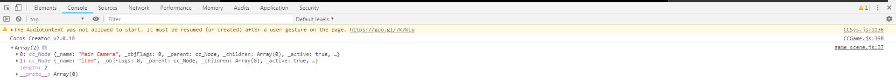

# 组件入口函数

> 知识大纲
1. onLoad: 组件加载的时候调用，保证了你可以获取到场景中的其他节点，
    以及节点关联的资源数据
2. start: 也就是第一次执行update之前触发
3. update(dt): 组件每次刷新的时候调用，距离上一次刷新的时间会在所有画面更新前执行
4. lateUpdate(dt): 刷新完后调用会在所有画面更新后执行
5. onEnable: 启用这个组件的时候调用
6. onDisable: 禁用这个组件的时候调用
7. onDestroy: 组件实例销毁的时候调用

> 练习
1. 先来看下我们自动生产的脚本，代码组件
    ```
    //返回了一个构造函数，然后继承了cc.Component
    //代码组件，也有cc.Component方法
    cc.Class({
        extends: cc.Component,
    
        properties: {
            // foo: {
            //     // ATTRIBUTES:
            //     default: null,        // The default value will be used only when the component attaching
            //                           // to a node for the first time
            //     type: cc.SpriteFrame, // optional, default is typeof default
            //     serializable: true,   // optional, default is true
            // },
            // bar: {
            //     get () {
            //         return this._bar;
            //     },
            //     set (value) {
            //         this._bar = value;
            //     }
            // },
        },
    
        // LIFE-CYCLE CALLBACKS:
    
        // onLoad () {},
    
        start () {
    
        },
    
        // update (dt) {},
    });
    ```
2. 组件入口函数，也称生命周期函数 (前3点最为常用)
    1. onLoad - 组件在加载的时候运行
        * 你可以在onLoad里面访问场景的节点和数据，这个时候场景的节点和数据都已经准备好了
        * 我们新建的代码组件挂在Canvas上，来验证第一点
        * 不用担心在canvas下创建的单色精灵取不到，不用担心节点还没有出来
        ```
        onLoad () {
            console.log(this.node.children);
        },
        ```
        
        
        
    2. start - 组件在第一次update调用之前执行 (和下面的update一起测试)
    3. update(dt) - 每一次游戏刷新的时候调用 dt是距离上一次刷新的时间  
        ```
        onLoad () {
            console.log(this.node.children);
        },
    
        start () {
            console.log('start');
        },
    
        update (dt) {
            console.log('update', dt);
        },
        ``` 
        
         
     
    4. lateUpdate(dt) - 刷新完后调用会在所有画面更新后执行 dt同样也是距离上一次刷新的时间    
     
    5. 另外几个小伙伴自己测试，如同字面意思一样