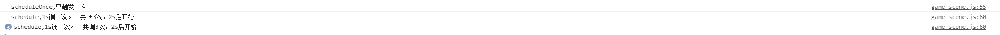

# Schedule定时器操作

> 概念及API
0. 注意，如果节点或组件没有激活是不会调用的
1. scheduleOnce(函数, time): time秒后启动一次定时器
2. schedule(函数, 多长时间调一次, 次数,  多长时间后开始)
    * cc.macro.REPEAT_FOREVER
3. unschedule(函数); // 取消这个定时器操作
4. unscheduleAllCallbacks  取消所有的定时器操作

> 练习
1. 节点或者组件必须是激活状态，如果是被隐藏的节点，都是无法在启动定时器的
2. 启动一次定时器(上一节destroy过了，别忘记取消，因为非激活状态无法启动定时器)
    ```
    //只触发一次调用，多少时间后触发一次，这里是2s后触发
    this.scheduleOnce(function(){
        console.log('scheduleOnce,只触发一次')
    }.bind(this), 2);
    ```
3. 有次数的定时器，不断的调用你设置的次数
    ```
    //1s调一次。一共调3次，2s后开始
    this.schedule(function(){
        console.log('schedule,1s调一次。一共调3次，2s后开始')
    }.bind(this),1,3,2)
    ```
    
    
    
    * 以前的版本次数可能是数值+1,我这边的版本传几就是调用几次
    * 想让定时器一直执行下去，可以把次数的参数改为`cc.macro.REPEAT_FOREVER`

4. unschedule和unscheduleAllCallbacks
    * 这里演示下5s中后取消所有的定时器,演示前先把上面个次数改成永远一直执行哦，能看出效果
        ```
         //5s后取消所有定时器
         this.scheduleOnce(function(){
             this.unscheduleAllCallbacks();
             console.log('已取消所有定时器')
         }.bind(this), 5)   
        ```
        
            
        
    * 只取消一个定时器-unschedule，传入函数对象
        ```
            let cb = function(){
                console.log("=========================")
            }.bind(this);
            //少传2个参数，默认值是永远执行，马上开始
            this.schedule(cb, 0.5); 
            
            this.scheduleOnce(function(){
                this.unschedule(cb); //取消这个定时器
                console.log('取消了啊这1个定时器')
            }.bind(this), 5)
        ```    
        