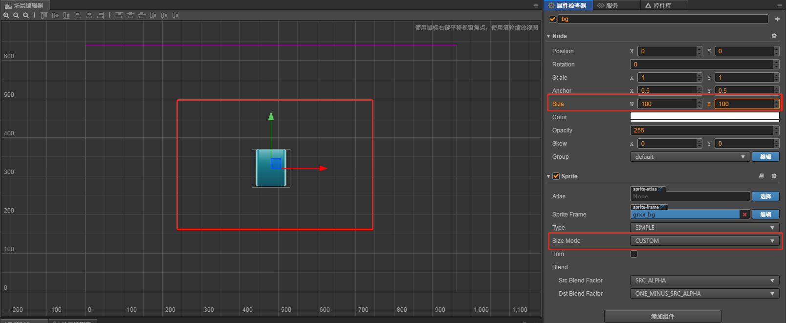

# cc.Sprite
> 概念
1. 游戏中显示一个图片，通常我们把这个叫做”精灵” sprite
2. cocos creator如果需要显示一个图片，那么需要在节点上挂一个精灵组件
    为这个组件指定要显示的图片(SpriteFrame)
3. 显示一个图片的步骤
    1. 创建一个节点
    2. 添加一个组件
    3. 要显示的图片(SpriteFrame)拖动到SpriteFrame
    4. 配置图片的SIZE_MODE
        1. CUSTOM 大小和CCNode的大小一致
        2. RAW 原始的图片大小
        3. TRIMMED 大小为原始图片大小, 显示的内容是裁剪掉透明像素后的图片
    5. trim: 是否裁剪掉 图片的透明区域, 如果勾选，就会把完全透明的行和列裁掉，
        做帧动画的时候，我们一般是用原始大小不去透明度,这样动画不至于抖动
4. 精灵更换spriteFame      
5. 快捷创建带精灵组件的节点

> 练习
1. 这次给大家准备了res，res文件下的有些图片会用到的
2. 老样子新建项目什么之类的准备工作就不多说了
3. 开始玩耍吧！！
    1. 在Canvas新建一个空节点，起名为**bg**
    2. 点击bg，点击属性检查器的添加组件，选择渲染组件，选择Sprite
    3. SpriteFrame就是你要选择的图片
    4. 把res下的**grxx_bg**拖拽到SpriteFrame下
    
        
        
    5. 这样图片就显示出来啦！！
    6. 配置Size Mode
    
        
        
        1. CUSTOM
            * 和节点的大小保持一致，比如说随便改下节点的大小我们看下效果
                
                
            
            * 可以理解用户可以自定义宽高哦    
                
        2. TRIMMED
            * 先要了解下trim
            * 比如一个很大的矩形图片，里面内容就是中间个很小的人物，
                就算四周裁剪掉，也不会影响你的图片内容，只是图片大小减少了，
                这个就是trim,类似这样
                
                
            
            * 所以属性检查器中有个trim的属性可以勾选,选中则会把透明的部分剪裁掉，
                中间的不会裁掉，只会裁四周
            * 使用的是被裁前的大小，内容使用裁剪后的内容，然后会拉大到被裁前的大小
            * 鼠标移上去的解释大家看下(移到SizeMode上)   
                
                
                       
        3. RAW
            * 显示原始大小
            * 如果改变节点size，它会自动切换到Custom模式
            
        4. 做动画
            * 简单提一句，一般是用RAW原始大小，然后不勾选trim不去透明度，这样动画就不会抖动
    7. 配置type
        * 这边我单独放在后面讲解[点击此处](./02-图片模式.md)     
            
        
    
            