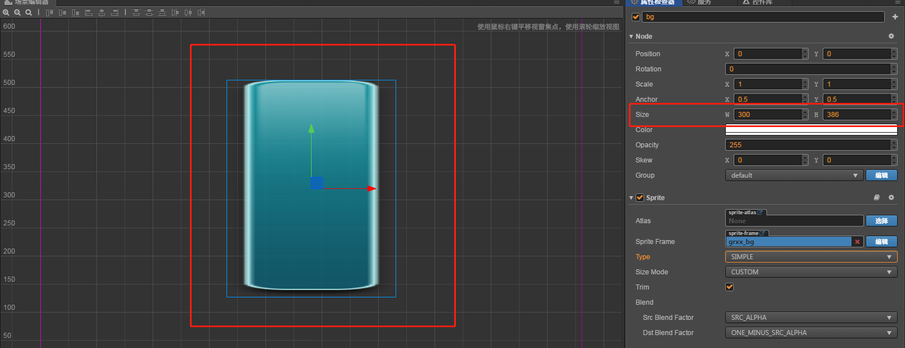

# 九宫格的使用
> 知识大纲
1. 指定拉伸区域, 让图片在拉伸的时候某些区域不会改变
    比如圆角,聊天气泡等
2. 九宫格能省图片资源, (弹出对话框)
3. 编辑九宫格,来制定缩放区域
4. 体会对话框背景的九宫拉伸

> 练习

* 说这个之前，我们先把模式改为simple，宽度300不变

    
    
* 这个拉伸效果并不是我们想要的，还记得知识大纲中的那个九宫格嘛

    
    
* 九宫格的拉伸原理，就是四个角的保持不变，只拉伸其余的地方的宽高，
    我们试下把模式改为Slice看看  
    
* 什么反应都没有，这个是为什么，因为我们还没有编辑区域，就是一共四根线把图片分为九宫格吧
    我们这边还没有编辑这四个线！！
    
* 点击Sprint Frame的编辑按钮开始编辑九宫格，点击确定
    
    
        
* 效果就出来了
    
    
    
* 简单总结，通过切片的方式，保证四个角不变，中间的部分拉伸  

* 实际用处: 比如说统一的对话框，内容可多可少，但总体的样子是一样的 

* 重要的事说3遍，可以省资源，就比如聊天气泡，我只要出一张图就可以了