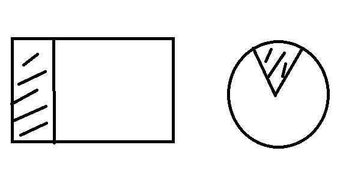

# Filled模式
> 概念
1. 配置Filled模式
2. 配置Filled模式, 设置为Radius参数
3. 配置Radius的参数模式
    * 中心: 位置坐标(0, 1小数), (0, 0)左下角, (1, 1) 右上角 (0.5, 0.5) 中心点 
    * Fill Start 开始的位置: 0 ~1, 右边中心点开始，逆时针走 
    * Fill Range: 填充总量(0, 1]
    * FillRange为正，那么就是逆时针，如果为负，那么就是顺时针 
4. 个性化时间进度条案例
5. 游戏中道具的时间进度显示都可以   

> 练习
1. 先简单科普filled能做什么
    * 设置填充的方式(圆，矩形)，可以使用比例来裁剪显示图片(只显示的比例) - 用图片来解释这句话的意思
    
        
        
    * 使用比例来裁剪显示图片(打阴影部分的)
    
2. 准备工作
    * 把**seat_normal_bk**拖到层级管理器**bg**下面
    * 把**seat_time_bar**拖到层级管理器**seat_normal_bk**下面
    
        
       