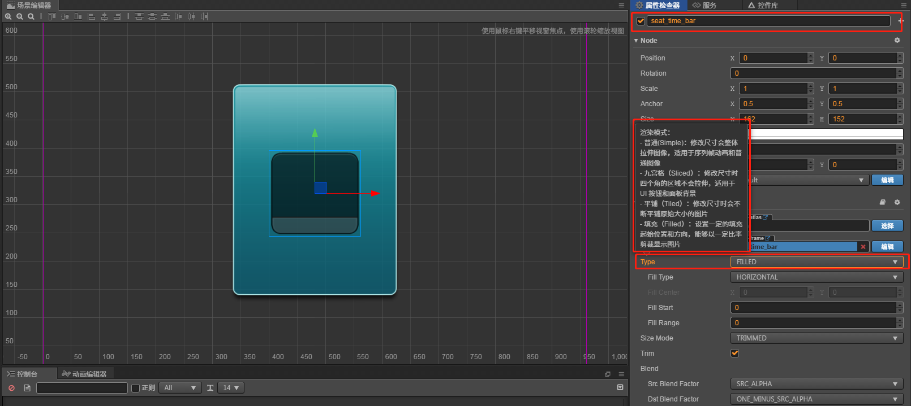
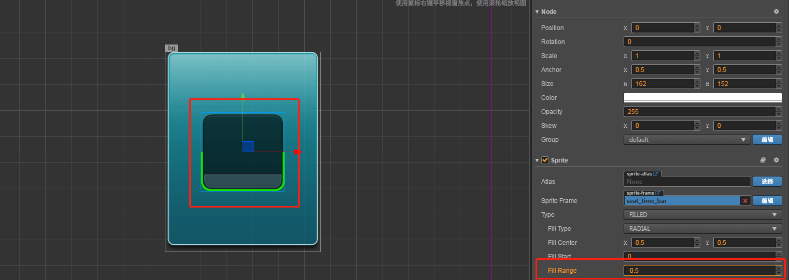

# Filled模式
> 概念
1. 配置Filled模式
2. 配置Filled模式, 设置为Radius参数
3. 配置Radius的参数模式
    * 中心: 位置坐标(0, 0)左下角, (1, 1) 右上角 (0.5, 0.5) 中心点 
    * Fill Start 开始的位置: 0 ~1, 右边中心点开始，逆时针走 
    * Fill Range: 填充总量(0, 1]
    * FillRange为正，那么就是逆时针，如果为负，那么就是顺时针 
4. 个性化时间进度条案例
5. 游戏中道具的时间进度显示都可以   

> 练习
1. 先简单科普filled能做什么
    * 设置填充的方式(圆，矩形)，可以使用比例来裁剪显示图片(只显示的比例) - 用图片来解释这句话的意思
    
        
        
    * 使用比例来裁剪显示图片(打阴影部分的)
    
2. 准备工作
    * 把**seat_normal_bk**拖到层级管理器**bg**下面
    * 把**seat_time_bar**拖到层级管理器**seat_normal_bk**下面
    
        
        
3. 开始玩耍
    * 在**seat_time_bar**的属性检查器下改变它的type，改为**filled**
    
        
     
    * fillType
        1. HORIZONTAL 水平
        2. VERTICAL 竖直
        3. RADIAL 圆形(这里用圆形玩耍)  
        
    * 圆形设置的参数
    
        
        
        * 中心点 0~1的小数，0，0左小角，0.5，0.5说明是圆心
        * 开始位置 开始的位置: 0 ~1, 右边中心点开始，逆时针走 
        * 旋转角度 填充总量(0, 1],FillRange为正，那么就是逆时针，如果为负，那么就是顺时针 
        * 这个感觉玩过Canvas的一看就知道了，不在做赘述 
        
        
        
        * 先看到外面一圈高亮的显示了嘛，0.5，0.5代表圆心，0的开始位置代表右边中心点
            0.5的旋转角度代表转了一半
            
        * 我们换个-0.5看下   
        
        
        
        * 果然换方向了啊，大家看下高亮的那一圈去下面了
        
        * 游戏里运用场景，cd图标，转完一圈可以在使用
        
    * 写代码实现下效果~
        * 新建脚本**seat.js** 然后挂载组件**seat_normal_bk**上
            ```
            cc.Class({
                extends: cc.Component,
            
                properties: {
                    sprite: {
                        default: null,
                        type: cc.Sprite
                    },
                    action_time: 15
                },
            
                // LIFE-CYCLE CALLBACKS:
            
                onLoad () {
                    //获取组件的实例 有2种方式，1代码获取2编辑器绑定在properties写
                    let childNode = this.node.getChildByName("seat_time_bar");
                    this.sprite = childNode.getComponent(cc.Sprite);
                    this.now_time = 0;
                },
            
                start () {
            
                },
            
                update (dt) {
                   this.now_time += dt;
                   var percent = this.now_time / this.action_time;
                   if(percent >= 1){
                        percent = 1;
                        this.now_time = 0;
                   }
                   this.sprite.fillRange = percent;
                },
            });
            ```    
        * 运行下看下效果吧~然后小伙伴们可以做下进度条减少(前面是进度条增加)
        * 公布答案(这个游戏运用场景比方说是限时的任务) 
            ```
            cc.Class({
                extends: cc.Component,
            
                properties: {
                    sprite: {
                        default: null,
                        type: cc.Sprite
                    },
                    action_time: 2
                },
            
                // LIFE-CYCLE CALLBACKS:
            
                onLoad () {
                    //获取组件的实例 有2种方式，1代码获取2编辑器绑定在properties写
                    let childNode = this.node.getChildByName("seat_time_bar");
                    this.sprite = childNode.getComponent(cc.Sprite);
                    this.now_time = this.action_time;
                },
            
                start () {
            
                },
            
                update (dt) {
                    this.now_time -= dt;
                    let percent = this.now_time / this.action_time;
                    if(percent <= 0){
                        percent = 0;
                        this.now_time = this.action_time;
                    }
                    this.sprite.fillRange = percent;
                   
                },
            });
            ```
       