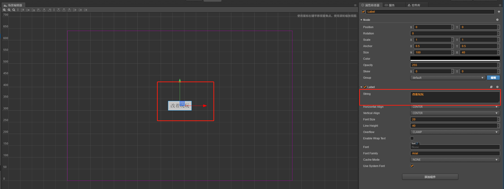
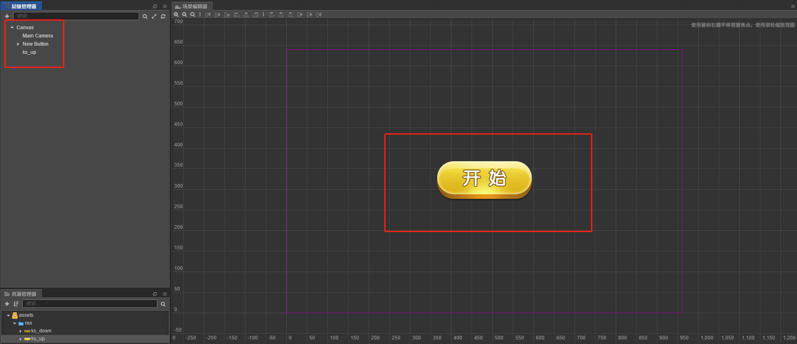
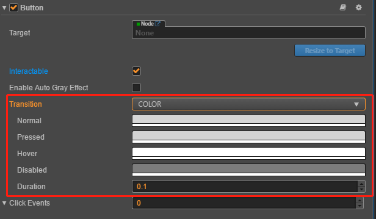
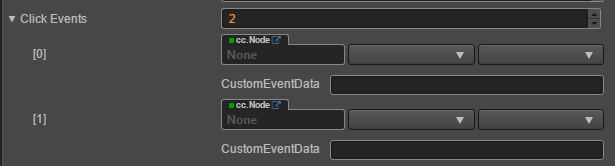
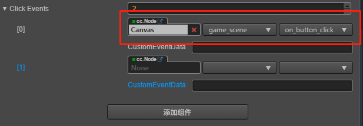
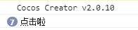

# cc.Button

> 知识大纲
1. 添加按钮的方法
    1. 直接创建带Button组件的节点;
    2. 先创建节点，再添加组件;
2. 按钮组件, 按钮是游戏中最常用的组件, 点击然后响应事件;
3. 按钮的过渡效果:
    * 过渡: 普通状态, 鼠标滑动到物体上, 按下状态, 禁用状态
    1. 没有过渡，只有响应事件;
    2. 颜色过渡, 过渡效果中使用颜色;
    3. 精灵过渡，使用图片过渡;
    4. 缩放过渡, 选项，在disable的时候是否置灰;     
4. 按钮禁用;
5. 按钮添加响应事件 --> 节点-->组件 --> 代码的函数;
6. 按钮传递自定义参数; --> 字符串对象;   
7. Button响应这个触摸点击，所以Button所挂的这个节点，
    一定要有大小,如果你向大小(0, 0)的节点上，挂一个Button,这个是无法响应点击事件;
    
> 练习
1. 添加按钮
    1. 直接创建带Button组件的节点;
        * 在左侧层级管理器的Canvas上右键，创建节点-->创建UI节点-->Button(按钮)
        * 这样就创建了个默认的button
        * 仔细观察层级管理器，发现button下有background，background下有label
        * label大家都懂的，可以在属性管理器修改string，改变button按钮中的文字描述
            
            
        
        * 当然你也可以不需要label，比如引用图片什么的，这里先把label组件删除    
    2. 先创建节点，再添加组件
        * 我们先把资源copy到res文件夹下
        * 拖动**ks_up**到canvas下
            
            
            
        * 点击前面添加的图片，选择添加组件-->UI组件-->Button,添加Button组件
        
                

2. 按钮的过渡效果    
    * 我们继续看属性检查器，按钮组件里有个**Transition**的选项默认是none，我们这边改变下看下
        1. Color
            * 选中Color后，我们发现有这么几个属性
              
                 
              
            * Normal为普通状态，Pressed按下，Hover悬停，Disabled禁用，Duration过渡时间    
            * 我们可以运行下，就用默认的颜色，玩下这个Button看下效果
            * 还有个选项大家看下，取消选中，按钮就会禁用 
            
                
            
        2. Sprite
            * 和Color同理
            * 我们拖动下图片，因为资源有限，
                理论上是应该有4张图片来完成这个过渡效果的，现在将就的演示下
                
                  
            
            * 这里很明显，normal状态我们选择了up这个图片，
                pressed状态我们用的是down这个图片，依次类推。。。   
            * 运行玩耍啦    
        3. Scale
            * 这个一看名字，就是缩放放大啥的
                
                
                
            * 我们就用默认的玩一把，运行！果然点击后放大了耶~ 
            * 还有个选项**Enable Auto Gray Effect**，
                它可以在按钮被禁用的时候使按钮的颜色直接变灰色
                
            * 为什么Color和Sprite没这个选项，因为他们都可以配置Disabled时用什么颜色或是图片   
3. 按钮禁用(就是前面第三点中**Interactable**选项) 
4. 按钮添加响应事件
    * 我们先来看下**Click Events**这个属性，这个代表按钮有多少个响应事件，一个按钮可以有多个响应事件
    * 这里演示比方我们输入个2   
    
        
        
    * 开始写响应事件的代码，新建**game_scene.js**脚本并挂在**Canvas**下
    
        ```
        cc.Class({
            extends: cc.Component,
        
            properties: {
        
            },
        
            // LIFE-CYCLE CALLBACKS:
        
            // onLoad () {},
        
            start () {
        
            },
        
            on_button_click(){
                console.log("点击啦");
            }
        
            // update (dt) {},
        });

        ```
    * 然后我们就可以拖动Canvas到cc.Node,然后选择脚本，选择函数
    
         
        
    * 运行start！！点击玩耍吧！！
    
        
                     
    * 按钮传参怎么搞,比如说关卡按钮，传参就是第几关
    * 大家有没有看到属性检查器里有个属性叫**CustomEventData**
    * 首先这个按钮的自定义参数是字符串参数，比方你写个10，其实是字符串的10
    * 实践出真知
    
        
        
        ```
            on_button_click(e, level){
            	console.log("点击啦", parseInt(level));
            }
        ``` 
        
        
              
    
