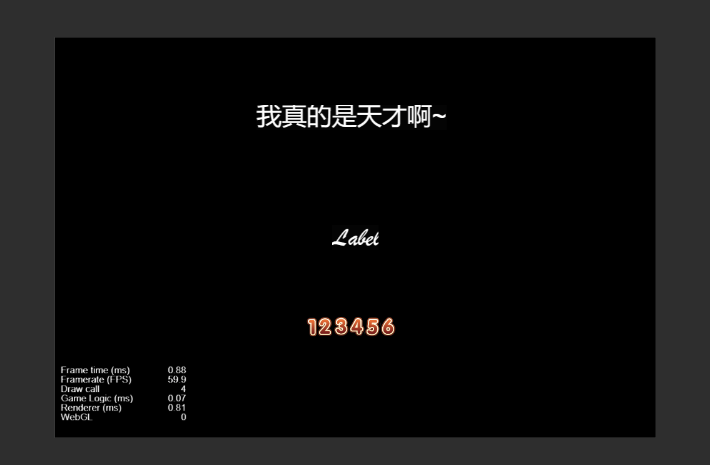
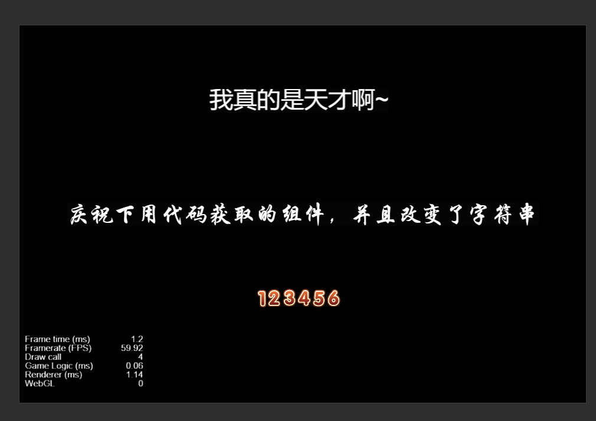

# 代码使用cc.Label

> 知识大纲
1. 代码中获取cc.Label组件;
2. 代码绑定cc.Label组件到编辑器;
3. 修改cc.Label的文字内容:  label.string = “xxxxxxxxxx”;

> 练习
1. 新建**font_scene.js**,并挂到Canvas下
2. 在层级管理器Canvas新建一个Label组件，取名为**bmp_label**
3. 获取Label组件
    1. 属性检查器里绑定
        * 老样子，在properties里写属性
        ```
        properties: {
            bmp_font: {
                type: cc.Label,
                default: null
            }
        },
        ```   
        * 打开编辑器，将bmp_label拖拽至**Bmp Font**属性下
        * 通过代码改变label的字符串
        ```
        onLoad(){
            this.bmp_font.string = "我真的是天才啊~";
        },
        ```
        * 运行~~
        
        
        
    2. 纯代码里获取
        * 直接代码搞起，不清楚的记得多查API
        ```
        onLoad(){
            this.bmp_font.string = "我真的是天才啊~";
            let sys_label = this.node.getChildByName("sys_label").getComponent(cc.Label);
            sys_label.string = "庆祝下用代码获取的组件，并且改变了字符串";
        },
        ``` 
        
        
       
            
        
