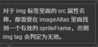
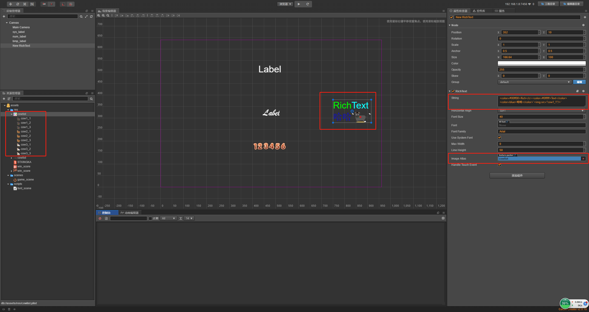

# RichText组件

> 知识大纲
1. 添加富文本组件;
2. 设置富文本的字符内容;

> 练习
1. 和创建Label一样,同样是2种方式，这里以第一种为例
2. 在Canvas下右键，创建节点-->创建渲染节点-->RichText
    * 观察场景编辑器中的RichText，两个单词颜色竟然不一样
    * 然后我们看下属性检查器里的String属性，卧槽，和一般的果然不一样啊
    
          
        
    * 感觉和html很像，定义了文字的颜色，所以展示出来的颜色不一样！！ 
3. 讲几个例子练练
    * color标签  
        1. <color=blue>哈哈</color>
        2. 果然有蓝色的字了
        
               
                  
    * img标签
        1. 先搞资源，把**cowlist.png**和**cowlist.plist**放在res下
        2. 这2个文件和之前的位图文件类似，简单的来说就是图片里有很多牛，
            然后plist把它分割成一个一个牛
        3. 把cowlist拖拽至RichText的**image Atlas**属性   
             
            
             
        4. 我们在string属性里面写img标签，具体语法如下
        5. ``
        6. 这样就可以看到效果啦
            
            
            
    * u标签 - 给文本加下划线 (以下标签小伙伴自行练习)
    * i标签 -  用斜体来渲染
    * b标签 -  用粗体来渲染
    * size标签 -  指定字体渲染大小，大小值必须是一个整数
        * `<size=30>enlarge me</size>`
    * outline标签 - 设置文本的描边颜色和描边宽度    
        * `<outline color=red width=4>A label with outline</outline>`
    * [查看API](https://docs.cocos.com/creator/manual/zh/components/richtext.html)    

        