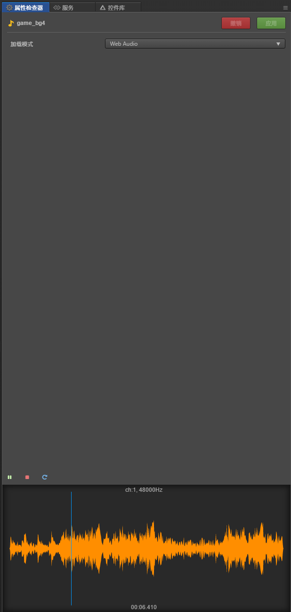

# cc.AudioSource

> 知识大纲
1. AudioSource组件是音频源组件, 发出声音的源头;
2. AudioSource组件面板:
      * clip: 声源的播放的音频对象: AudioClip, mp3, wav, ogg,
      * volume: 音量大小, [0, 1]百分比
      * mute: 是否静音;
      * Loop: 是否循环播放;
      * Play on Load: 是否在组件加载的时候播放;
      * Preload: 是否预先加载;
      
> 练习
1. 创建AudioSource组件
    1. 创建一个空节点
        * 空节点改名为**audio**
    2. 在空节点的属性检查器中添加组件
        * 点击添加组件-->其他组件-->AudioSource
    3. 看属性检查器中AudioSource的属性，参考知识大纲
2. 准备好音频文件，玩音乐啦
    1. 将事先准备好的音频文件**click.wav**和**game_bg4.mp3**放入res文件夹中
    2. 把**game_bg4.mp3**拖拽至AudioSource组件中的clip属性 
    
         
        
    3. 点击res中的**game_bg4.mp3**在右侧属性检查器中可以点击播放按钮，聆听游戏的bgm吧~
    
         
        
    4. 在AudioSource组件里勾选上**Play on Load**，**Preload**，**Loop**然后运行~
        * 小伙伴可以玩耍下是否静音
        * 可以在调整下音量大小          