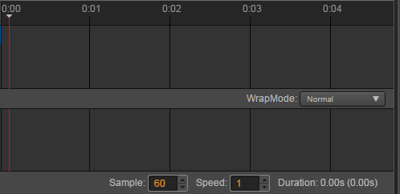
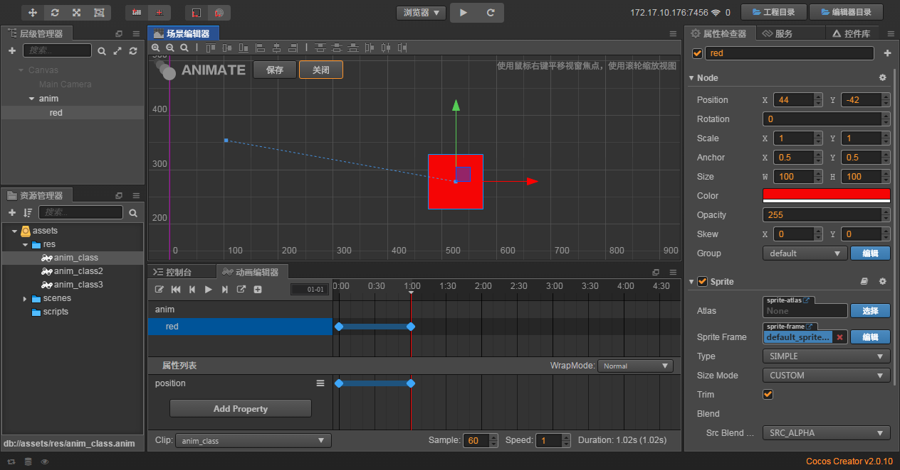
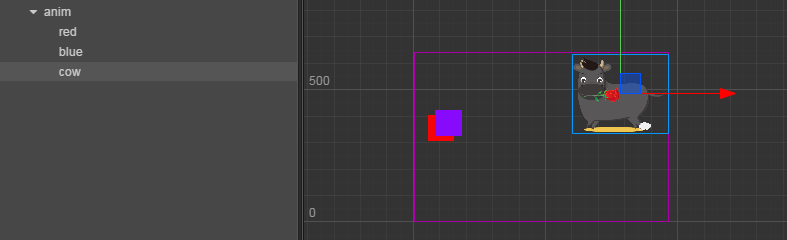

# 动画编辑器的原理

> 知识大纲
1. 时间轴
2. 在不同的时刻，调整节点以及孩子节点的不同的属性的值，然后创建出补间动画;
3. 节点调动画的属性:
    * 位置, 缩放, 旋转, 大小, 颜色, 透明度, 锚点, 扭曲, ...;
4. 动画编辑器也可以调节节点的子节点 
5. 动画参数:
    * Sample: 1秒多少帧
    * Speed: 播放速度,越小越慢
    * wrapMode:  Normal, Loop, PingPong, Reverse, Loop Reverse, PingPongReverse;
6. 动画
    * 添加动画属性
    * 添加关键帧/删除关键帧,选到关键帧，在属性编辑器上编辑和修改;
    * 编辑补间动画曲线路径;
    
> 练习   
1. 先来看看整个动画编辑器里面有些什么
    * 细心的小伙伴应该一开始就发现有这么一根时间轴
    
        
        
    * 鼠标滚轮可以缩放，放大，鼠标右键可以拖动到你想要的时间点
    * Sample指的是1秒多少帧，默认60帧
    * Speed指的是速度
    * wrapMode指的是动画播放的模式，比如循环啊，乒乓球来回放啊，反着放啊等等，
        默认就是Normal，播放一次

2. 原理
    * 参考知识大纲第二条
    * 和css的动画原理其实是差不多的，补间动画举个例子就像是css中的animation属性，比如元素移动的动画
        给元素个初始位置，在给个结束位置，给个时间，他就会有动画效果出来，就会看到元素
           从起始位置移动到结束位置   
3. 做一个简单的动画
    * 在anim下创建个单色精灵，取名**red**,把颜色改为红色   
    * 然后我们在动画编辑器中左上角点击编辑按钮,点击完后如下图所示
    
        
        
    * 点击**Add Property**，可以看到一堆可以做动画的属性，这里以position为例子，
        所以点击**Add Property**后选择**position**
    
    * 然后我们拖动我们的单色精灵**red**,默认就添加了0:00秒的关键帧
        (一般来说可以不用默认操作，点击插入关键帧，然后在右侧属性检查器里调整属性值) 
    
             
    
    * 拖拽红色的线，移动到你想要的时间节点，点击**position**边上的三条横杠的按钮，
        点击插入关键帧，如下图所示
        
        
        
    * 这个时候我们在移动单色精灵，告诉动画编辑器我们选中的时间节点，它要移动到哪里
    
         
        
    * 这个时候其实动画已经做好了，我们看到场景编辑器中的虚线就是单色精灵移动的轨迹，
        我们还可以拖动红色的线来观察场景编辑器中单色精灵移动的动画
        
    * 然后点击场景编辑器中的保存按钮~可以直接运行看效果了！
    
    * 我们可以玩下wrapMode，这边小伙伴自己改变wrapMode点击运行玩耍哈~
    
    * 补充，我们可以点击虚线，然后在场景编辑器里调整动画
        1. 点击虚线，然后能看到场景编辑器中，虚线变粗
        
              
            
        2. 拖拽虚线，各种玩耍
        
            
            
        3. 保存点击运行 
4. 帧动画
    * 先把我们准备的素材**cowlist.plist**和**cowlist.png**放在我们的res目录下        
     
        
        
    * 把cow1_1拖拽至层级管理器**anim**下面,并改名为**cow**,然后将牛移动到利于观察的位置
    
          
        
    * 点击动画编辑器的编辑，点击**Add Property**，然后选中**cc.Sprite.spriteFrame**
    
    * 在00的位置添加关键帧，默认的就是00开始的时间有**cow1_1**
    
    * 将左侧资源管理器的**cow1_2**拖拽至动画编辑器中关键帧的位置，调整至你想要的时间点
    
    * 参考前面一步，将**1_3**和**1_1**继续拖拽至你想要的时间点，
        为什么是1-2-3-1的顺序，是因为这里做的动画可以让牛跑起来，
        无缝链接(**循环播的第一帧和最后一帧是一样的可以让动画看起来很流畅**)
        
        
        
    * 保存后可以运行啦，这样就能看到牛在跑动啦~            
             
    
        
    
              
    
        
    
    
        
