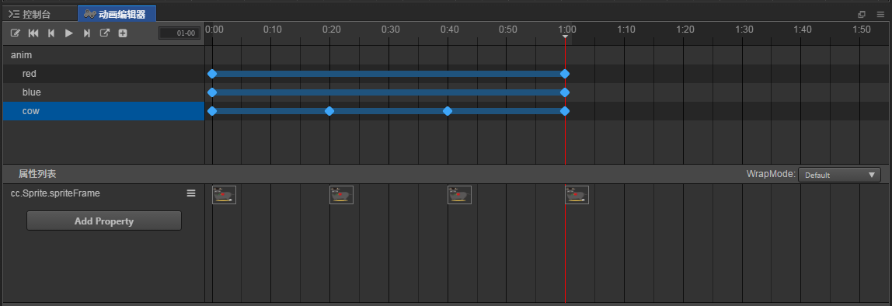
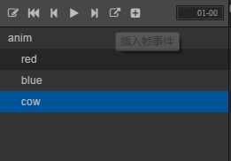
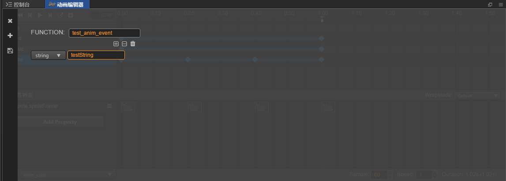

# 动画里面调用代码函数

> 知识大纲
1. 插入一个时间到动画里面;
2. 编辑这个时间触发的函数: 名字 + 参数
3. 遍历当前动画组件所挂节点上面所有的脚本或组件，根据这个名字来触发函数;
4. **要慎用，代码和动画之间不易太多的调用**;

> 练习
* 我们演示下如何调用
    * 我们先到动画编辑器里，编辑选中**cow**
    * 先将红色的线移到结束的时间点上
    
        
        
    * 点击**插入帧事件**，在加号左边的这个按钮(这里因为截图不方便截鼠标移上去的效果)
    
           
        
    * 双击你插入帧的上面个白块，就是红线上方的白色方块   
    
          
        
    * 然后就会有这样个界面
    
            
    
    * 输入函数名，点击加号可以添加参数，可以选择参数类型
    
        
        
    * 新建个脚本**anim_event_test.js**, 并挂在anim这个节点上    
    
        
        
    * 在**anim_event_test.js**脚本里编写代码，就是之前写的那个function的名字**test_anim_event**
        ```
        cc.Class({
            extends: cc.Component,
        
            properties: {
                
            },
        
            test_anim_event(){
                console.log("这个就是帧事件");
            },
        
            // LIFE-CYCLE CALLBACKS:
        
            onLoad () {},
        
            start () {
        
            },
        
            update (dt) {},
        });

        ```    
    * 执行就能看到控制台打印"这个就是帧事件"    