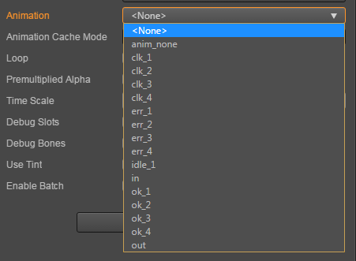
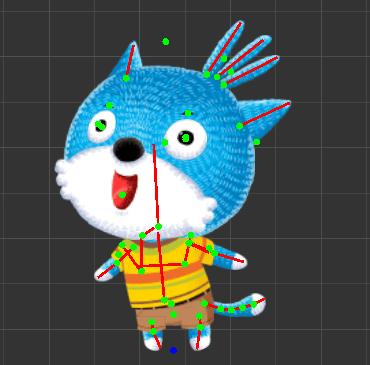
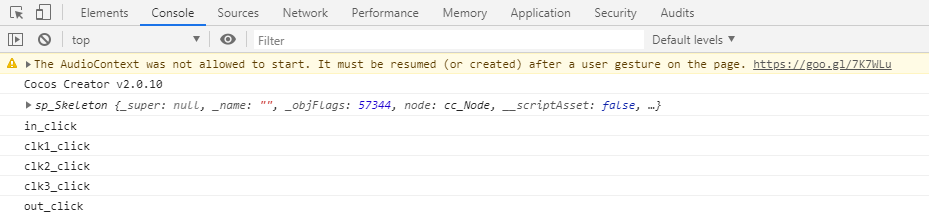

# sp.Skeleton

> 知识大纲
1. sp.Skeleton: 控制面板属性
    * Skeleton Data: 骨骼的控制文件.json文件;
    * Default Skin: 默认皮肤;
    * Animation:  正在播放的动画;
    * Loop: 是否循环播放;
    * Premultiplied Alpha 是否使用贴图预乘;
    * TimeScale: 播放动画的时间比例系数;
    * Debug Slots: 是否显示Slots的调试信息;
    * Debug Bone: 是否显示Bone的调试信息;
2. sp.Skeleton重要的方法，Skeleton是以管道的模式来播放动画，管道用整数编号，管道可以独立播放动画，Track 
    * clearTrack(trackIndex): 清理对应Track的动画
    * clearTracks(); 清除所有Track动画
    * setAnimation(trackIndex, "anim_name", is_loop)清除管道所有动画后，再重新播放
    * addAnimation(trackIndex, "anim_name", is_loop)往管道里添加一个动画 
    
> 练习
1. sp.Skeleton: 控制面板属性
    1. **animation** 先来讲最有兴趣的这个    
        * 我们可以看到对应的下拉框有这些
            
              
        
        * 这些数据又是哪来的，请看我们的**JXM.json**中有个key值就是**animation**  
        * 选中一个你有兴趣的动画，就可以运行啦
    2. **Loop** 是否循环播放  
        * 勾选了就是循环播放，不勾选则播放一次  
        
    3. **Premultiplied Alpha** 是否使用贴图预乘
        * 默认启用，启用后就会有你看到觉得不舒服的地方，这里我们还是来玩下**大家来找茬**吧，
            下面我会贴2张图分别时启用和不启用的
        
            
            
                
            
        * 区别很明显这边大家自己领悟感受哈  
    4. **Debug Slots** 是否显示Slots的调试信息
        * 这里截图给大家看下Slots调试
        
            
        
    5. **Debug Bone** 是否显示Bone的调试信息 
        * 这里截图给大家看下Bone调试
        
             
            
    6. **TimeScale** 调整动画速度
        * 默认是1，这里简单玩耍了下，改为2，动画速度变快，改为0.5，动画速度变慢        
2. sp.Skeleton重要的方法
    0. 动画管道的概念
        * Skeleton是以管道的模式来播放动画
        * 要播放很多个动画，比如A,B,C,D,E...
        * 先放A，在放B，然后在C，依次类推...
    1. 为了演示，我们新建几个按钮组件，用来播放不同的动画，
        这里记得把**spine**的**Animation**属性改为**anim_none**,
        为了让入场动画看上去和谐点，所以一开始画面什么都没有
        
        
              
    2. 创建**spine_scene.js**脚本,挂在Canvas下
    
    3. 编写脚本
        * 获取sp.Skeleton组件依然是那2种方式
            1. 编辑器界面绑定
                ```
                properties: {
                    ske_anim: {
                        type: sp.Skeleton,
                        default: null
                    }
                },
                ```
                
                
                
            2. 代码获取
                ```
                onLoad () {
                    let spine = this.node.getChildByName("spine");
                    this.ske_com = spine.getComponent(sp.Skeleton);
                    console.log(this.ske_com);
                },
                ```
        * 按钮点击触发的方法
            1. 先写代码,这里和前面的按钮名字一一对应
                ```
                in_click(){
                    console.log("in_click");
                },
            
                clk1_click(){
                    console.log("clk1_click");
                },
            
                clk2_click(){
                    console.log("clk2_click");
                },
            
                clk3_click(){
                    console.log("clk3_click");
                },
            
                out_click(){
                    console.log("out_click");
                },
                ```     
            2. 在绑定事件，这里就截图一张，
                不清楚的小伙伴请学习前面的章节[点击学习Button](../day-008-Button/00-cc.Button使用.md)         
                
                
                
            3. 所有的按钮都点击添加好事件后运行，在浏览器端打开控制台，点击不同的按钮后观察吧
            
                    
                
        * 开始做动画效果了
            1. 直接上代码
                ```
                in_click(){
                    console.log("in_click");
                    //先清理所有管道
                    this.ske_com.clearTracks();
                    //三个参数 序号 动画名称 是否循环播放
                    this.ske_com.setAnimation(0, "in", false);
                    //idle_1动画加入管道
                    this.ske_com.addAnimation(0, "idle_1", true);
                },
            
                clk1_click(){
                    console.log("clk1_click");
                    this.ske_com.clearTracks();
                    this.ske_com.setAnimation(0, "clk_1", false);
                    this.ske_com.addAnimation(0, "idle_1", true);
                },
            
                clk2_click(){
                    console.log("clk2_click");
                    this.ske_com.clearTracks();
                    this.ske_com.setAnimation(0, "clk_2", false);
                    this.ske_com.addAnimation(0, "idle_1", true);
                },
            
                clk3_click(){
                    console.log("clk3_click");
                    this.ske_com.clearTracks();
                    this.ske_com.setAnimation(0, "clk_3", false);
                    this.ske_com.addAnimation(0, "idle_1", true);
                },
            
                out_click(){
                    console.log("out_click");
                    this.ske_com.clearTracks();
                    this.ske_com.setAnimation(0, "out", false);
                },    
                ```        
            2. 运行玩耍吧    