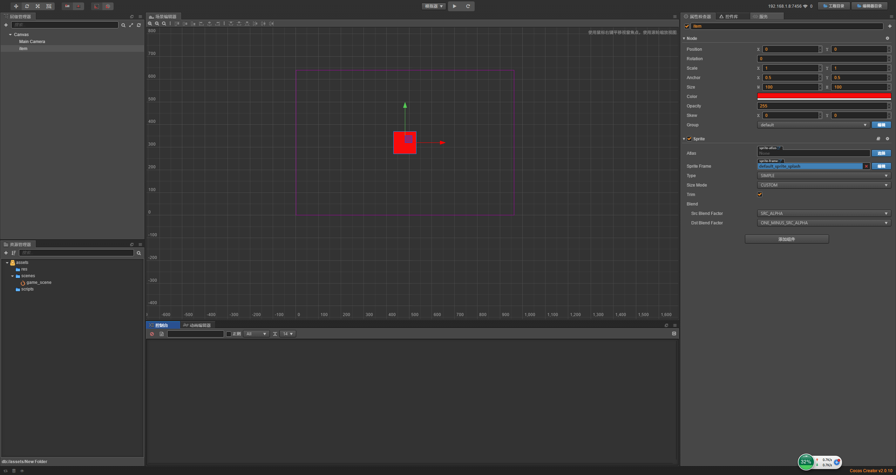
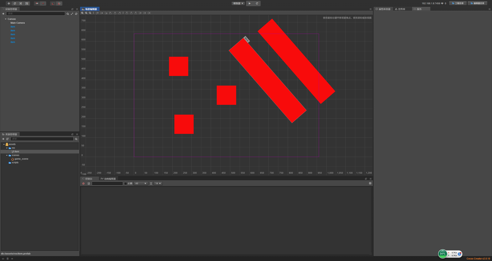
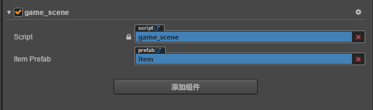

# 预制体 

> 知识大纲
1. 制作预制体: 将节点拖入到assets文件夹下;
2. 加载预知体: 代码加载(统一在资源加载时讲解)与手动绑定;
3. 预制体对象实例化: cc.instantiate;

> 练习
1. 什么叫预制体
    * 比如说飞机游戏，我方发射的子弹，源源不断发射的子弹，子弹可以作为个模板，
        这个模板可以称为预制体
2. 创建编辑使用预制体
    * 在Canvas下新建个单色精灵，取名为item，随便给个颜色
        
        
        
    * 如果把这个单色精灵当做是子弹，是个模板，我们把这个item拖拽至res文件夹  
    
        
        
    * 可以把res的**item**拖拽至Canvas下，然后移动下位置
    
        
        
    * 可以双击res中的**item**， 进行编辑预制体
    
        
        
    * 我们改改大小，旋转旋转，然后点击**保存**然后**关闭**    
            
        
        
    * 然后看场景编辑器之前的item貌似没什么变化，然后我们在拖动编辑后的item到Canvas下，
        就能发现新的item还是有效果的
        
        
        
3. 编写代码
    * 老样子,创建**game_scene.js**脚本，
        挂在Canvas下(Canvas属性检查器中添加**game_scene.js**组件)            
    * 一般预制体其实还是在代码里面使用的比较多
    * 两种绑定方式
        1. 编辑器绑定
            ```
            properties: {
            	item_prefab: {
            		type: cc.Prefab,
            		default: null
            	}
            },
            ```
            
            
            
        2. 在代码中获取
            ```
            onLoad () {
            	let item = cc.instantiate(this.item_prefab);
            	this.node.addChild(item);
            },    
            ```
            
               
            
            * 很明显多了一条斜杠，因为我们通过代码添加了预制体 
            
                      