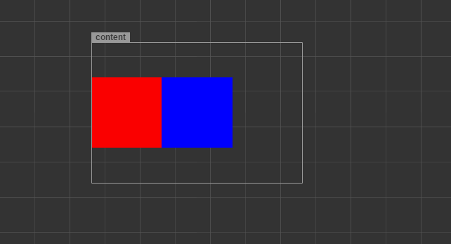
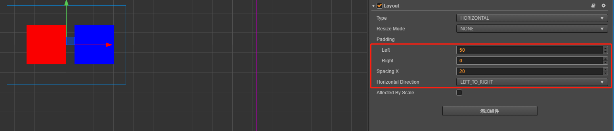
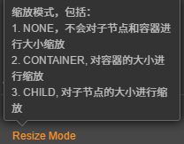
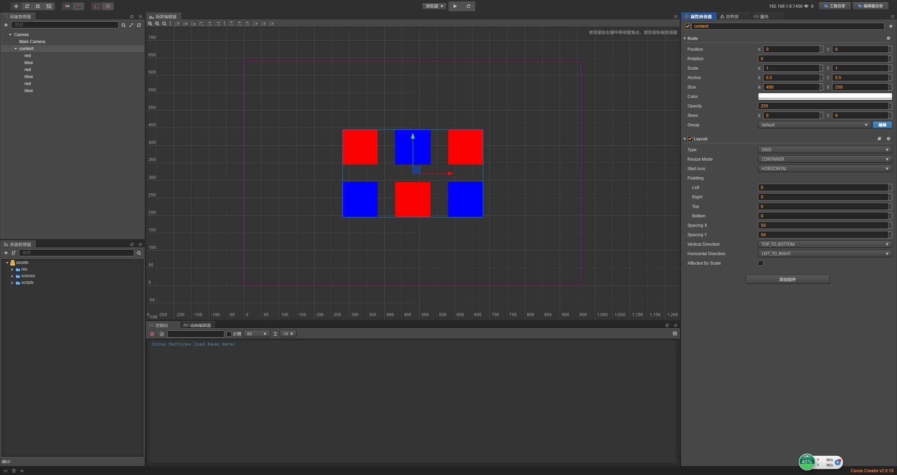

# cc.Layout

> 知识大纲
1. 布局组件
    * 有些物体的布局，可以不用我们写死位置，可以根据内容来排版
    * 比如垂直排版, 水平排版等，这样的话，就是不用我们自己调整，就给我们排好非常方便
2. 布局组件的面板属性:
    * ResizeMode:
        1. Node: 不会对子节点和容器进行大小缩放
        2. Child: 对子节点的大小进行缩放
        3. CONTAINER: 对容器的大小进行缩放; 常用的
    * 布局类型:  
        1. 水平
        2. 垂直
        3. GRID布局
        
> 练习
1. 创建布局组件
    1. 我们先把前面的残局收拾下，把viewport删除，添加个空节点content
    2. 然后在content下添加2个单色精灵，一个为红色，取名red，一个为蓝色，取名blue 
    
        
        
    3. 在content属性检查器添加layout组件
        * 添加组件->添加UI组件->Layout           
    4. 可以简单玩耍如何布局
        * TYPE属性(下拉框)
            
            
            
            1. 水平
                * 选中后就会变成这样
                
                    
                    
                * 然后我们修改下其他属性，比如left-容器左边距离多少，
                    Spacing X-调整元素之间的距离    
                    
                    
                    
                * 还有个缩放模式小伙伴可以自行玩耍 
                    
                    
                    
            2. 垂直
                * 和水平类似
            3. Grid
                * 先复制几个red和blue
                
                    
                    
                * 调整下grid的其他属性
                
                     
                    
                * 我们还可以调整下容器的宽度
                
                    
                    
                * 剩下的也通过实践去玩耍，完成各式各样的布局吧    
                            