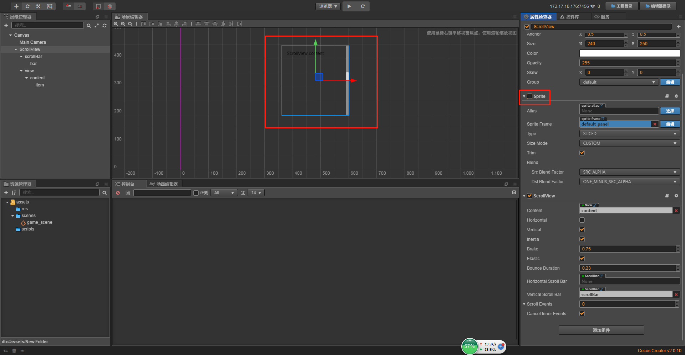
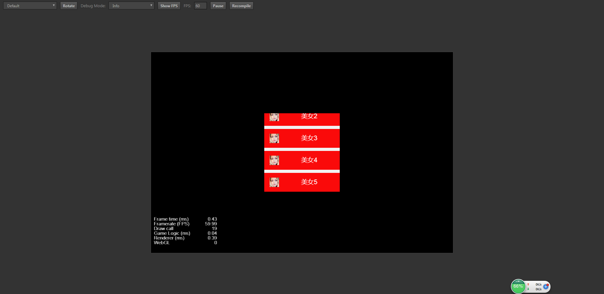
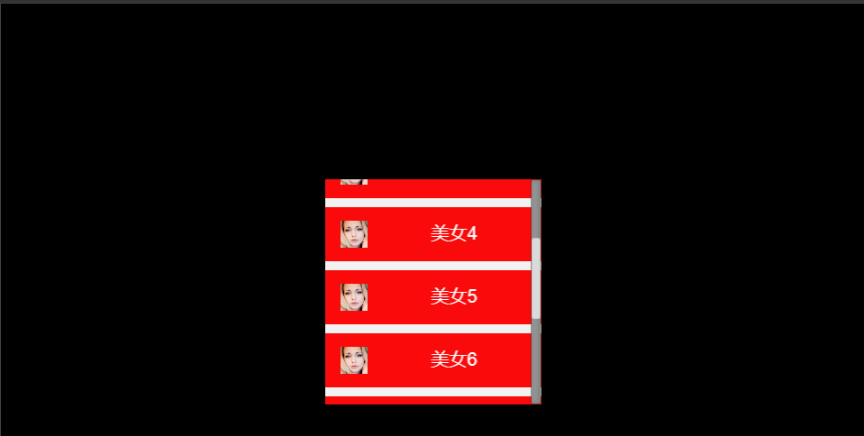

# cc.ScrollView

> 知识大纲
0. 需要有前3小节(预制体，Mask，Layout)的基础
1. 滚动列表的主要结构:
    * root -> view(Mask裁剪超出范围的内容) -> content(Layout)负责内容排版
2. 滚动列表的每个选项:
    * root(w, h,制定大小，好给Layout用)
3. 代码里面使用cc.ScrollView:
    1. 将选项做成预制体
    2. 在代码里面new出预制体,加入到content节点下
    
> 练习
1. 创建Scroll View
    * Canvas下右键创建节点->创建UI节点->Scroll View，然后取名为**ScrollView**
    
        
        
    * 了解下这个节点，看下属性检查器，看下结构
        1. 属性检查器 
            * 先看有哪些组件
            
                
                
            * Sprite组件
                * 这个是背景，我们可以把active取消选中应该就会发现没有背景颜色了，
                  我们也可以自己选择背景，拖拽至这个组件的Sprite Frame节点内
            
                      
 
            * Scroll View组件
                * 对应的节点有bar和view
                * 这个和下面的结构一起说
        2. 结构
            * 先来看下结构
            
                
                
            * scrollBar
                * 这个scrollBar其实就是滚动条    
                * 下面的bar就是滚动的滑块
                
            * view
                * 视图，就是滚动可以查看的视图区域
                * 所以这个肯定会有个Mask组件，因为超过范围的就会看不到 
                
                    
                    
            * content
                * 宽度一般和view保持一致
                * 高度一般肯定是超出view的，因为有mask所以超出部分隐藏，滚动条滑下去就能看到
            * item
                * content里面的内容 
        3. 做个小案例
            * 把scrollBar的active属性取消选中，这样滚动条就隐藏了
            * 因为content宽度一般和view保持一致，所以我们先把content宽度改为240   
            * 我们先修改下content下每个item节点锚点，大小等属性
                1. 先把item下的label组件删除
                2. 把item的锚点改为(0.5,0.5)
                3. 把item的大小size改为(240,60) **为了之后layout布局，需要根据这个size布局**
            * 为了方便布局，我们在content的属性检查器添加layout组件 
                1. 使用垂直布局
                2. resize mode模式选择容器
                3. 把item的position的x值改为0 
            * 我们在item节点里创建点东西吧
                1. 我们创建个单色精灵，大小也改为(240,60),改为红色，取名为red
                2. 我们在item下在放个图像，把avator1拖拽至item下 ，然后改下缩放(0.3,0.3),
                    然后拖拽下位置 放到左侧位置
                3. 在创建个label节点，取名为name，作为昵称名字，font size改为20，拖动到合适的位置
                4. 然后copy这个item然后黏贴，这边演示我复制了4份，一共5个item，
                    其中一个因为超出view所以看不到但实际是存在的
                    我们其实还可以用过view这个节点属性检查器中的Mask组件的active属性，选中，取消选中来看效果 
                    
                      
                    
                5. 为了方便区分，我们把每个item的label文字改为美女1，美女2，美女3...依次类推
                6. 然后修改下垂直布局的其他属性吧。比如spacing y
                
                    
                    
                6. 然后运行~我们可以用鼠标滚动玩耍哦   
                
                    
                    
                      

2. 在代码里面使用ScrollView
    1. 先把scrollView的每一项作为一个预制体，由于和刚开始学习预制体的名字重复，我们把前面的每一项item改个名字
        叫scroll_item, 然后拖拽至res文件夹中  
        
            
    
    2. 然后为了代码演示添加这个预制体到scroll view中，所以我们把前面的资源管理器中的scroll_item都删除
    3. 上代码
        1. 绑定编辑器
            ```
                scroll_item_prefab: {
                    type: cc.Prefab,
                    default: null
                }
            ```
            
            
            
        2. 代码中获取
            * 添加scroll_item其实就是在content里面添加，所以我们编辑器在绑定个scrollview
                ```
                    scrollview: {
                        type: cc.ScrollView,
                        default:null
                    }    
                ```   
                
                 
            
            * 然后就可以写代码添加scroll_item了 
                ```
                    for(let i = 0; i < 10; i++){
                        let scroll_item = cc.instantiate(this.scroll_item_prefab);
                        let label_component = scroll_item.getChildByName("name").getComponent(cc.Label);
                        label_component.string = "美女" + (i + 1);
                        this.scrollview.content.addChild(scroll_item); //因为scrollview属性里有个content已经关联好了content节点
                    }
                ``` 
                
                
            
    4. 提个小细节
        1. 比如说我们又想要滚动条了，然后就把active属性继续选中，然后执行看效果
        
            
            
        2. 很明显滚动条被遮挡住了，这里有很多解决方法，我先说最简单的一种，
            那就是改变层级位置，把scrollBar放在view的后面  
            
              
            
            
            
        3. 也可以修改scroll_item的宽度这边就不做演示了，其实主要原因就是因为滚动条被遮住了    
                                            