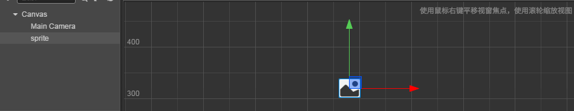

# 本地资源加载

> 知识大纲
1. 在代码里面加载资源必须要求资源在assets/resources/文件夹下;
    1. 根据场景的依赖关系来打包我们的资源;去掉不用的资源
    2. 无法判断在代码里面加载的资源，是哪些？所有的resources目录下的资源，都会被打包
        进去,你在代码里面就能加载到它了。如果资源不在代码里面加载，一般不要放到resources目录下，
        如果放到了，这个资源不管你有没有用，都会被打包进去;     
2. 资源的url不需要加assets/resources这个部分,路径不需要加这个前缀;
3. cc.loader.loadRes(url, onComplete回调函数);
4. loadResArray([], type类型, progressCallback， completeCallback);
5. loadResDir (url [type] [progressCallback ] [completeCallback ])加载一个路径下的资源;
6. getRes(url, [type]); 获取资源id;

> 练习
1. 准备工作
    1. 把这次准备的素材，放入**resources**文件夹下
    
        

    2. Canvas属性检查器中添加组件
        * 添加脚本**game_scene.js**
2. 编写代码        
    1. 本地加载demo
        * 先编辑器绑定AudioSource
            ```
                properties: {
                    audio: {
                        type: cc.AudioSource,
                        default: null
                    }
                },          
            ```
        * 拖拽Canvas到audio属性    
        
            
            
        * 编写本地加载声音的函数  
            ```
            cc.Class({
                extends: cc.Component,
            
                properties: {
                    audio: {
                        type: cc.AudioSource,
                        default: null
                    }
                },
            
                local_load(){
                    //加载本地的声音,注意这里不需要加后缀名也不需要加assets/resources文件路径，直接bg就可以了
                    cc.loader.loadRes("bg", function(err, ret){
                        if(err){
                            console.log(err);
                            return;
                        }else{
                            console.log(ret);
                            this.audio.clip = ret;
                            this.audio.play();
                        }
                    }.bind(this));
                },
            
                // LIFE-CYCLE CALLBACKS:
            
                onLoad () {},
            
                start () {
                    this.local_load();
                },
            
                // update (dt) {},
            });
            ```  
        * 然后运行看控制台信息  
            
              
            
        * 继续演示本地加载图片
            1. 先在Canvas新建个精灵节点
            
                
             
            2. 编辑器绑定
                ```
                sprite: {
                    type: cc.Sprite,
                    default: null
                }
                ```
                
                
                
            3. 代码本地加载图片
                ```
                //加载本地图片
                cc.loader.loadRes("disk", cc.SpriteFrame, function(err, ret){
                    if(err){
                        console.log(err);
                        return;
                    }else{
                        console.log(ret);
                        this.sprite.spriteFrame = ret;
                    }
                }.bind(this));
                ```   
            4. 运行
            
                 
    
    2. 获取资源id  
        ```
        //加载本地图片
        cc.loader.loadRes("disk", cc.SpriteFrame, function(err, ret){
            if(err){
                console.log(err);
                return;
            }else{
                // console.log(ret);
                // this.sprite.spriteFrame = ret;

                //获取res的作用，可能在下个场景我们要继续使用这个加载好的资源
                this.sprite.spriteFrame = cc.loader.getRes("disk", cc.SpriteFrame);
            }
        }.bind(this));
        ```     
3. 其他API小伙伴们自行测试玩耍             