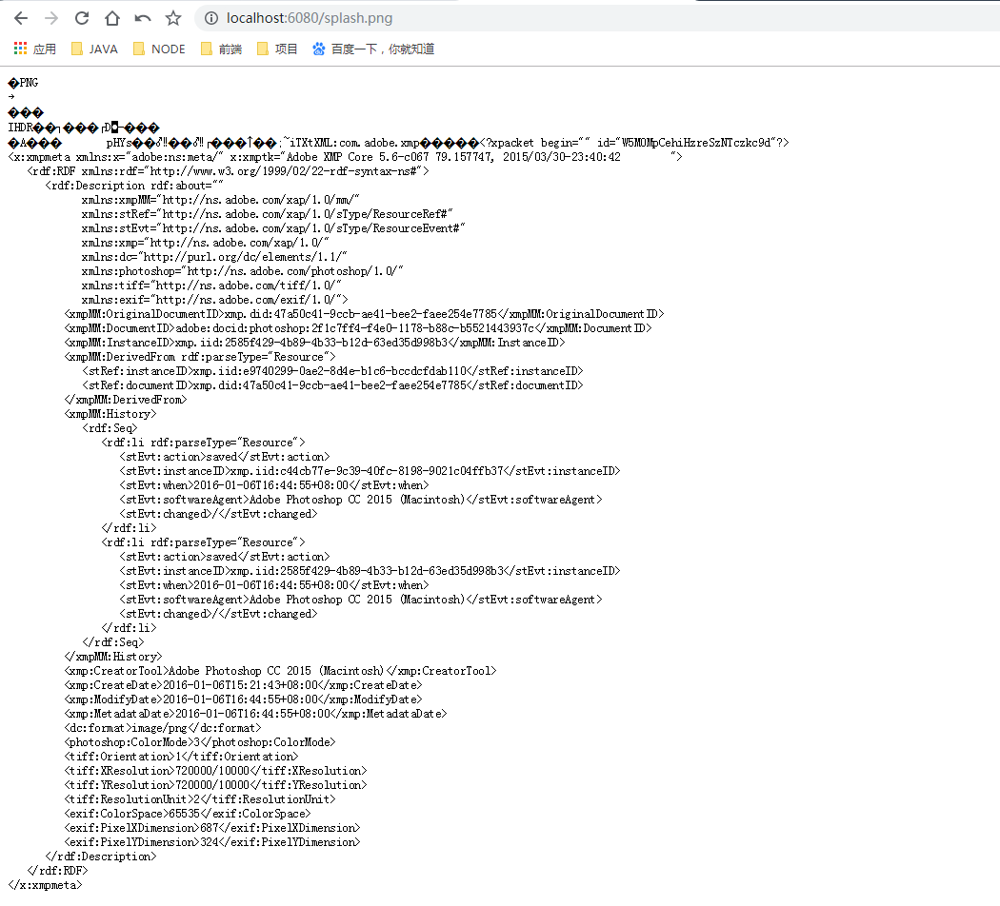
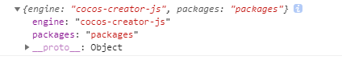

# 远程资源加载 

> 知识大纲
1. cc.loader.load(url, 结束回调函数);
2. cc.loader.load({url: "", type: ""}, 结束回调函数);
3. 远程加载任意类型文件;

> 练习
1. 准备工作
    1. 这里就需要有一定的node基础了，首先必须要有node的环境
    2. 这里提供了webserver的项目，我们远程加载的资源就是www_root下的资源，
        比如图片**splash.png**和音乐**bg.mp3**
    3. 我们跑一下这个项目，只需要执行命令`node webserver` 
    4. 运行后我们去浏览器端访问下[点击此处](http://localhost:6080/);
    5. 看到的页面是这样子就说明没问题
    
        
        
    6. 我们可以尝试下访问图片，在url后面加上"/splash.png" 
    
         
     
    7. 其他文件大家自行测试
2. 远程加载图片
    1. 编写代码远程加载图片
        ```
        remote_load(){
            //远端加载图片
            cc.loader.load("http://localhost:6080/splash.png", function(err, ret){
                if(err){
                    console.log(err);
                    return;
                }
                //返回的ret是个texture对象
                console.log(ret);
                this.sprite.spriteFrame.setTexture(ret);
                this.sprite.node.setContentSize(ret);
            }.bind(this));
        },
    
        // LIFE-CYCLE CALLBACKS:
    
        onLoad () {},
    
        start () {
            // this.local_load();
            this.remote_load();
        },
        ```
    2. 运行看结果
        
        
 
 3. 远程加载音乐 
    1. 编写代码  
        ```
            //远端加载音乐
            cc.loader.load({url: "http://localhost:6080/bg.mp3", type: "mp3"}, function(err,ret){
                if(err){
                    console.log(err);
                    return;
                }
                console.log(ret);
                this.audio.clip = ret;
                this.audio.play();
            }.bind(this));
        ```
    2. 运行就能听到声音了  
 4. 远程加载json
    1. 编写代码
        ```
        //远端加载json
        cc.loader.load({url: "http://localhost:6080/project.json", type: "json"}, function(err,ret){
            if(err){
                console.log(err);
                return;
            }
            console.log(ret);
        }.bind(this));
        ```     
    2. 运行看控制台
    
         
 
 5. 远程加载任意类型文件  
     1. 编写代码
         ```
         //远端加载任意类型
         cc.loader.load({url: "http://localhost:6080/test.mydata", type: "mydata"}, function(err,ret){
             if(err){
                 console.log(err);
                 return;
             }
             console.log(ret);
         }.bind(this));
         ```     
     2. 运行看控制台
     
                     