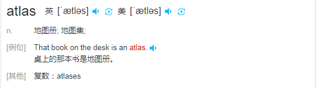
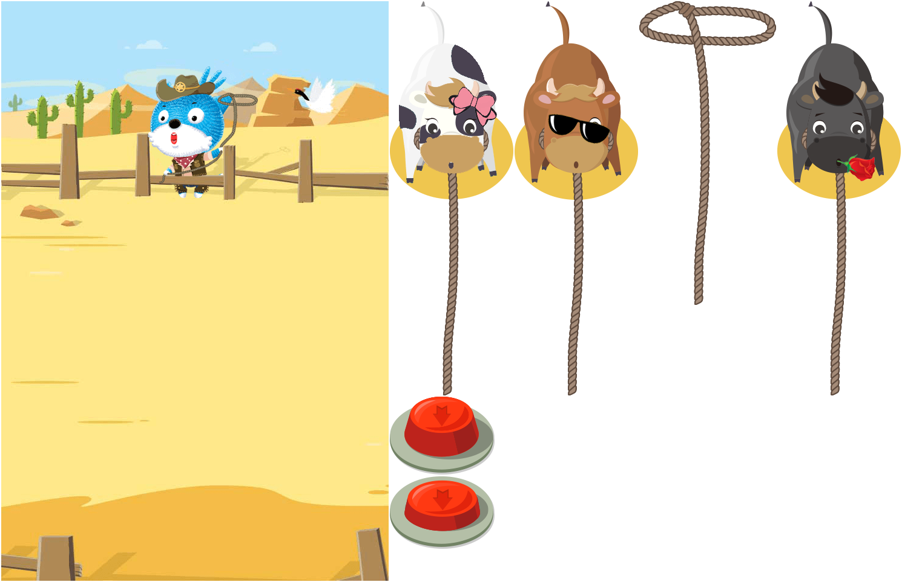

# 为什么要有图集

> 知识大纲
1. 图片解码到内存, 内存加载到显卡生成OPENGL纹理;
2. 把所有的小图打到一张大图里面，可以使用一张OPENGL纹理,优化程序的性能;
3. 图集的缺点: 每次图片更新后都要重新打包。
4. 图集打包工具TexturePacker的使用
    1. 添加要打包的图片文件夹;   --> Add Folder比较方便
    2. 配置好对应的相关属性;
    3. 打包输出.plist与.png文件;
    
> 练习
1. 图集图集意思就是图片的集合
2. 有个单词大家之前(骨骼动画)看到过了，叫做atlas
    
    

3. 各种小图打成一张大图，是为了性能提高，类似这样

    
    
4. 在第十八天学习后，我们就是要学会上面的大图是如何制作的(使用TexturePacker)    
    
    
