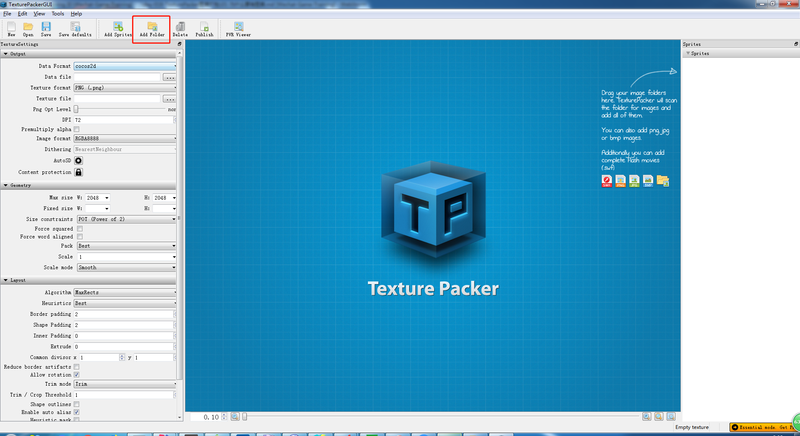
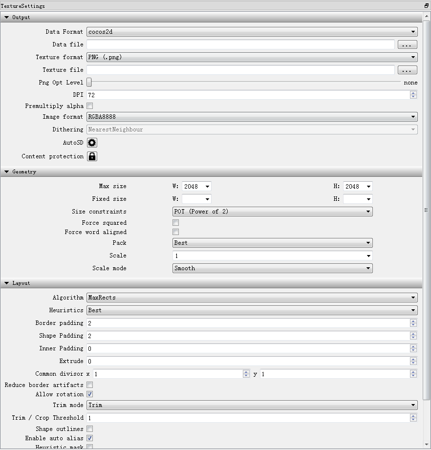
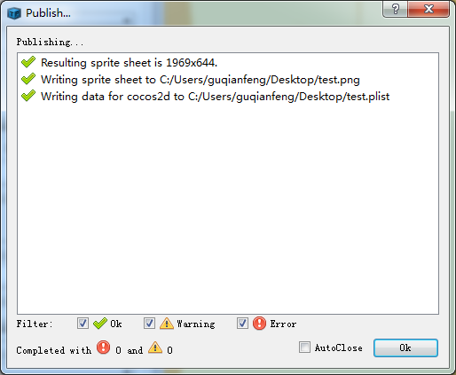

# 为什么要有图集

> 知识大纲
1. 图片解码到内存, 内存加载到显卡生成OPENGL纹理;
2. 把所有的小图打到一张大图里面，可以使用一张OPENGL纹理,优化程序的性能;
3. 图集的缺点: 每次图片更新后都要重新打包。
4. 图集打包工具TexturePacker的使用
    1. 添加要打包的图片文件夹;   --> Add Folder比较方便
    2. 配置好对应的相关属性;
    3. 打包输出.plist与.png文件;
    
> 练习
1. 图集图集意思就是图片的集合
2. 有个单词大家之前(骨骼动画)看到过了，叫做atlas
    
    

3. 各种小图打成一张大图，是为了性能提高，类似这样

    
    
4. 在第十八天学习后，我们就是要学会上面的大图是如何制作的(使用TexturePacker)  

5. 安装**TexturePacker**
    1. 解压tools文件夹下的**TexturePacker_3.0.9.rar**
        
        
        
    2. 里面有3个文件，其中msi后缀的是安装程序，我们双击后安装
    3. 安装完成后进到安装后进到bin目录下，我这边的路径是这样的
        * `D:\CodeAndWeb\TexturePacker\bin`         
    4. 把之前解压的另外2个后缀exe的文件，copy至这个目录，替换文件目录下的文件
    5. 这样就破解好了
6. 打开**TexturePacker** 
    1. 映入眼帘的是~~
    
               

    2. 添加要打包的图片文件夹，这里使用**Add Folder**因为比较方便
    
        
        
        
        
        
        
    3. 这里简单提一句，为什么要用**Add Folder**
        * 文件是同步的，比方说你文件夹里删除图片或者新增图片，TexturePacker会同步更新
        * **Add Sprites**则没有同步的说法，每次都需要手动点击添加   
        
    4. 在来看下左边的属性
        1. 映入眼帘的是~
        
            
            
        2. Data Format
            1. 是个下拉框，可供选择的有
            
                
                
            2. 有很多引擎可以选，这里我们使用cocos2d
        3. Data file
            1. 这个是生成图片集的路径，比方说我们选择桌面，名字取名为test 
            2. 点击保存后就会变成这样
            
                
                
            3. 很明显就能看到test.png和test.plist    
        4. Texture format
            1. 这个就是导出的格式，也是个下拉框选项  
            
                  
                
            2. 我们就用默认的png格式就好了
        5. Size constraints
            1. 这个就是改大小的约束的，是个下拉框选项   
            
                 
            
            2. 默认是PO2(这个会有很多空白的浪费的空间)，我们在这里选择Any Size   
        6. 其他属性就不做介绍了，自行查阅资料，按照需求选择        
    5. 点击Publish发布 
        1. Publish在这里
        
            
            
        2. 点击后结果
        
                                          
                
        3. 我们前面选择的目标路径就是桌面，快去看下桌面吧
        
            
            
    6. 还可以创建个打包工程
        1. 按`Ctrl+S`，保存在桌面，取名为pack 
            
            
        
        2. 下次可以双击直接打开编辑我们的TexturePacker工程
        3. 比如说下次我们要增加图片，就可以直接打开tps文件，打开这个项目开始编辑了~
         
