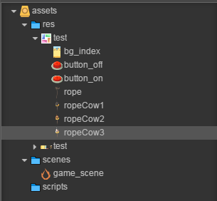
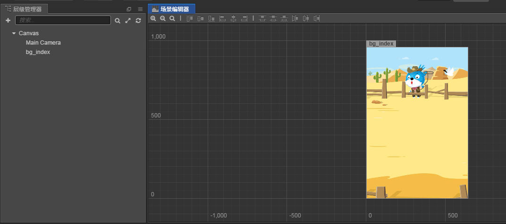
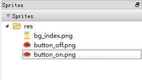
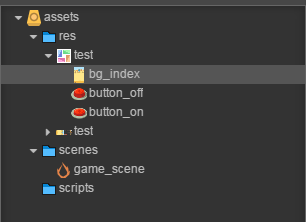

# creator使用图集

> 知识大纲
1. creator识别图集后，点击plist展开，能显示每个小图的图片;
2. 精灵使用图集,直接将小图的spriteFrame拖入到精灵的spriteFrame属性里面;
3. 每张小图可以正常的使用;
4. 图集有变动，直接替换就可以;

> 练习
1. 准备工作
    1. 新建好项目后，把我们前面制作的图集**test.png**和**test.plist**放到res目录下
    
          
        
    2. 很明显能看到，我们单个图片都被切出来了~
    3. 配置Canvas属性检查器，Size改为(640, 960)  
2. 开始玩耍       
    1. 把bg_index拖拽至Canvas下，就能看到
        
           
        
    2. 我们来看下bg_index的属性检查器
        1. 属性是这样子的
        
            
            
        2. 能看到有Atlas属性，这个指的就是图集
        3. Sprite Frame这边指的就是切下来的小图
        4. 很明显和我们普通拖拽图片是不一样的，普通拖拽的图片atlas属性就是为空的
    3. 如果我们要改变图集该怎么做？
        1. 比方说我们有些图不需要了，删除图集里的图片，需要重新制作图集
        2. 双击**pack.tps**,这样就能打开TexturePacker  
        3. 看到右侧我们的图片文件夹 
        
               
            
        4. 我们现在到文件夹中删除rope开头的文件，这里马上就能看到文件同步了 
        
              
            
        5. 然后重新发布，在把发布后的2个文件替换creator项目中的res的文件     
        
            
            
        6. 增加图集也是一样的操作，只是前面是删除，现在是新增
        7. 一般我们也会把**pack.tps**放在项目中，方便图片管理 
            