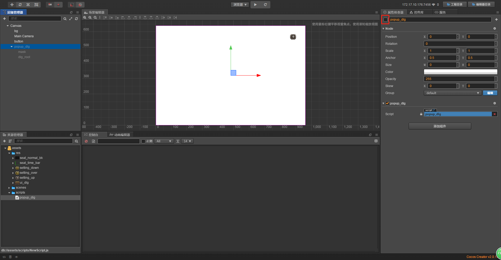

# 弹出式对话框

> 知识大纲
1. 对话框的结构:
    1. 根节点
    2. mask: 全屏的单色精灵,监听事件,关闭对话框;
    3. dlg与它的孩子: 对话框的内容,监听事件，挡住不让他传递到mask节点上;
    4. 弹出式动画:
        * mask: 渐变进来;
        * 对话框内容缩放,并加上easing缓动对象;
    5. 收起式动画:
        * mask: 渐变出去;
        * 对话框内容缩小,并加上easing缓动对象;
2. 对话框组件脚本
    1. show_dlg
    2. hide_dlg
    
> 练习
1. 准备工作    
    * 把素材拖入res文件夹中
        
        
        
2. 弹出式对话框的制作
    1. 目标是点击个按钮，弹出对话框，在点击周围，对话框小时    
    2. 先做个按钮
        1. 把素材中的**setting_up**拖拽至Canvas下，改名为button
        2. 拖拽至右上角位置，然后属性检查器的属性Size Mode选择原始大小RAW
        3. 添加一个按钮组件，修改其属性:
            * Target属性 -> 把button拖拽至此
            * Transition选择精灵过度
                1. normal -> setting_up
                2. pressed -> setting_down
                3. hover -> setting_over
                4. disabled -> setting_down
        4. 完成以上步骤，界面就是这个样子的，点击运行测试下效果 
        
             
    
    3. 做个对话框
        1. 在Canvas下新建个空节点，取名为**popup_dlg**,意思为弹出式的对话框  
        2. 在**popup_dlg**创建个单色精灵，取名为**mask**
            1. 这个mask(遮罩)是用来遮挡的，因为对话框弹起后，不让用户点击对话框以外的功能，
                点击了只是关闭对话框 
            2. 可以任意设置颜色，设置透明也可以，这里我用的是(0,0,0,128)
            3. mask的Size改为(960, 640)  
            4. 给mask添加个按钮组件，等等会用到的，这里target属性就是mask 
        3. 为了好看，我们在Canvas下在加个单色精灵，取名为bg，
            作为背景，给个背景颜色，默认的白色就挺好的，Size不要忘记改成(960, 640) 
        4. 在popup_dlg下在新建个空节点，取名为dlg_root
            * 在dlg_root的属性检查器中添加精灵组件，修改其属性
                1. Sprite Frame - 把ui_dlg拖拽至此
                2. Size Mode - 改为Raw   
        5. 最终效果如图所示    
            
              
            
    4. 创建脚本**popup_dlg.js**，在popup_dlg节点下添加这个脚本组件
        1. 先编写2个接口
            ```
            show_dlg(){
                //展示对话框
                this.node.active = true;
            },
        
            hide_dlg(){
                //隐藏对话框
                this.node.active = false;
            },
            ```          
        2. 前面的mask节点下的button组件可以派作用了，因为弹出对话框后点击对话框外面就是隐藏对话框，
            然后对话框外面是什么啊，当然就是mask啦，所以我们这样配置
            
            
         
        3. 隐藏做好了，那就可以做显示了啊，同理我们配置button节点是这么配置的
        
            
            
        4. 然后我们点击层级管理器的popup_dlg,在属性检查器中把active的属性取消选中   
        
             
            
        5. 然后运行就能看到个简单的效果了(非最终效果)
            * 点击按钮，显示出对话框
            * 点击对话框以外的区域，隐藏对话框
            * 非最终效果因为我们还有些bug没处理，而且动画还没有做，
            
        6. 细心的小伙伴就会发现个bug，就是对话框显示出来后，
            我们其实不用点击对话框外面的区域，点击对话框也能让对话框隐藏，如何去解决这个问题  
            1. 首先要知道原因，这是因为事件传递，依然传递到了mask节点，mask节点上就有隐藏对话框的方法
            2. 要阻止传递，所以我们这里给dlg_root添加个按钮组件   
                * target - dlg_root拖拽至此
                * 加了这个按钮组件后就能挡住传递了
                
        7. 前面显示对话框，我们还可以新建个脚本**game_scene.js**用来测试，在Canvas节点下添加这个脚本组件
            1. 直接先上代码   
                ```
                let popup_dlg = require("popup_dlg")
                cc.Class({
                    extends: cc.Component,
                
                    properties: {
                        dlg: {
                            type: popup_dlg,
                            default: null
                        }
                    },
                
                    // LIFE-CYCLE CALLBACKS:
                
                    // onLoad () {},
                
                    start () {
                
                    },
                
                    // update (dt) {},
                
                    on_show_dlg_click(){
                        this.dlg.show_dlg();
                    },
                });
                ```
            2. 然后编辑器绑定的dlg，把popup_dlg拖拽至此
            3. button节点的按钮组件这样改  
                
                
                
            4. 运行可以看到和前面的结果是一样的 
    5. 做动画效果
        1. 编辑器先绑定下属性，方便之后的操作
            ```
            properties: {
                mask: {
                    type: cc.Node,
                    default: null;
                },
                mask_opacity： 128,
                content: {
                    type: cc.Node,
                    default: null
                }
            },
            ```
            
            
            
        2. show - mask 渐变出来 dlg 由小到大
            ```
            show_dlg(){
                //展示对话框
                this.node.active = true;
                this.mask_opacity = 0;
                let fin = cc.fadeIn(0.3, this.mask_opacity);
                this.mask.runAction(fin);
                this.content.scale = 0;
                let s = cc.scaleTo(0.3, 1).easing(cc.easeBackOut()); 
                this.content.runAction(s);
            },
            ```  
        3. hide - mask 渐变出去 dlg 由大到小   
            ```
            hide_dlg(){
                //隐藏对话框
                let fout = cc.fadeOut(0.3);
                this.mask.runAction(fout);
                let s = cc.scaleTo(0.3, 0).easing(cc.easeBackIn());
                let end_func = cc.callFunc(function(){
                    this.node.active = false;
                }.bind(this));
                let seq = cc.sequence([s, end_func]);
                this.content.runAction(seq);
            },
            ```                  
             
        
            
            
                 
    
    
