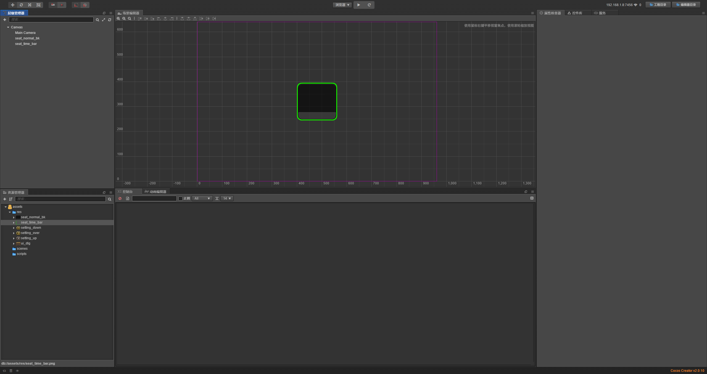
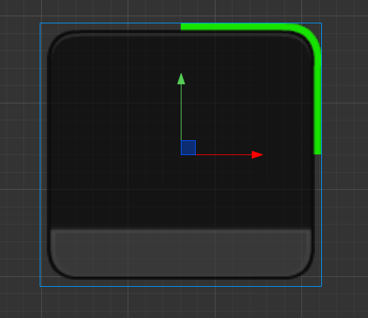

# 个性化时间进度条

> 知识大纲
1. 编写脚本, 来使用sprite的扇形来显示当前的进度:
2. 属性: 
    1. action_time: 定时器的时间
    2. clockwise: 是否为顺时针或逆时针
    3. reverse:  是否反转
    4. play_onload: true 是否加载时播放
    5. start_clock_action: 开始累积时间，看时间过去的百分比,来改变精灵显示的百分比; 
    6. stop_clock_action: 停止计时累积;
    
> 练习
1. 把**seat_normal_bk**和**seat_time_bar**拖拽至Canvas下
    
    
    
2. 修改time_bar的属性
    1. Type 改为 Filled
    2. Fill Type 改为 Radial
    3. Fill Center 改为 (0.5, 0.5) 代表圆心在正中心 
    4. Fill Start 就先用默认值0
    5. Fill Range 改为 0.25
    
           
        
3. 新建**timebar.js**脚本,挂在time_bar这个节点上
    1. 绑定编辑器属性
        1. action_time: 15 - 代表定时器的时间
        2. clockwise: false - 是否为顺时针或逆时针，默认逆时针
        3. reverse:  false  - 是否反转，默认不反转
        ```
        properties: {
            action_time: 15,
            clockwise: false,
            reverse: false,
            play_onload: true,
        },
        ```
    2. 定义2个方法        
        1. start_clock_action: 开始累积时间，看时间过去的百分比,来改变精灵显示的百分比; 
            * 可以传一个结束动画时的回调函数
        2. stop_clock_action: 停止计时累积;  
        
    3. 编写onLoad方法
        ```
        onLoad () {
            this.sprite = this.getComponent(cc.Sprite);
            this.node.active = false;
            this.now_time = 0;
            this.is_running = false;
            if(this.play_onload){
                this.start_clock_action(function(){
                    console.log("时间结束啦");
                });
            }
        },
        ``` 
    4. 完善前面的开始和结束方法
        ```
        start_clock_action(end_func){
            if(this.action_time <= 0) return;
            this.node.active = true;
            this.is_running = true;
            this.end_func = end_func;
            this.now_time = 0;
        },
        
        stop_clock_action(){
            this.node.active = false;
            this.is_running = false;
        }
        ```    
    5. 编写update方法
        ```
        update (dt) {
            if(!this.is_running) return;
            this.now_time += dt;
            let percent = this.now_time / this.action_time;
            if(percent > 1){
                percent = 1;
                this.sprite.fillRange = percent;
                this.is_running = false;
                this.end_func && this.end_func();
            }
            this.sprite.fillRange = percent;
        },
        ```    
    6. 运行就能看到效果啦， 当时间走完时就能看到控制台打印了信息`时间结束啦`
    7. 顺时针逆时针怎么处理
        1. 其实就是把percent传负值就可以了
        2. 代码如下
            ```
            update (dt) {
                if(!this.is_running) return;
                this.now_time += dt;
                let percent = this.now_time / this.action_time;
                if(percent > 1){
                    percent = 1;
                    this.sprite.fillRange = percent;
                    this.is_running = false;
                    this.end_func && this.end_func();
                }
                if(this.clockwise){
                    percent *= -1;
                }
                this.sprite.fillRange = percent;
            },
            ```   
    8. 反转怎么做
        1. 其实也很简单，就是1-percent就可以了
        2. 代码如下
            ```
            update (dt) {
            	if(!this.is_running) return;
            	this.now_time += dt;
            	let percent = this.now_time / this.action_time;
            	if(percent > 1){
            		percent = 1;
            		this.sprite.fillRange = percent;
            		this.is_running = false;
            		this.end_func && this.end_func();
            	}
            	if(this.clockwise){
            		percent *= -1;
            	}
            	if(this.reverse){
            		percent = 1 - percent;
            	}
            	this.sprite.fillRange = percent;
            },
            ```    
           
        
           
    
    
