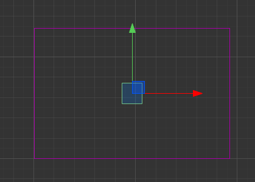

# 刚体碰撞器 

> 知识大纲
1. 光有刚体还不够，还要为每个刚体添加一个物理性状;
2. 物理形状的类型:
    * 矩形物理碰撞器;
    * 圆形物理碰撞器;
    * 多边形物理碰撞器;
    * 链条碰撞器: PhysicsChainCollider; 
3. 碰撞器的物理参数:
    * Tag: 碰撞器的标记,区别一个节点上多个不同的碰撞器;
    * Density: 相状的密度;
    * Sensor: 是否为一个碰撞感应器;
    * Friction: 摩擦系数;
    * Restitution: 弹性系数[0, 1], 0没有弹性, 1完全弹性碰撞;
    * Editing: 可以编辑碰撞器的形状;
4. 一定要加物理碰撞器，而不是碰撞系统的碰撞器，非常容易出错误

> 练习
1. 注意: **物理碰撞器不是碰撞组件里的碰撞器**
2. 一定要在添加组件->物理组件->Collider里添加
    * 这里有多个类型，根据需求来定
    * 这里演示用BoxCollider
        
        
        
    * 然后我们就能看到刚体就有形状了  
        
         
        
    * 可以在BoxCollider组件里的Size属性修改刚体的大小，这里选中Editing，可以拖动改变大小
        
              
