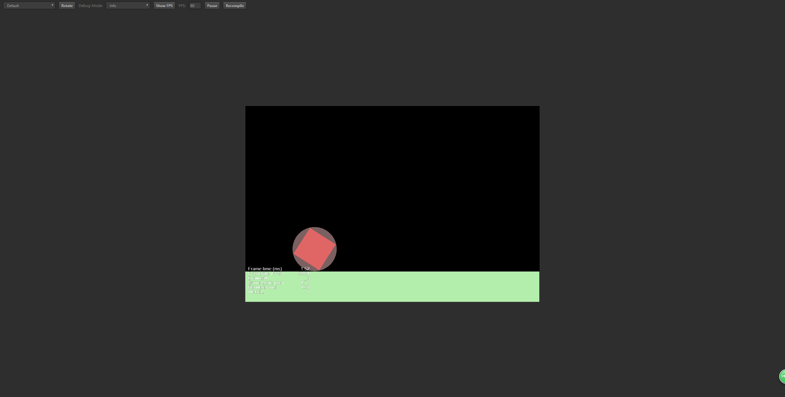
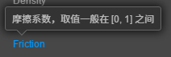
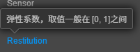

# 刚体碰撞器 

> 知识大纲
1. 光有刚体还不够，还要为每个刚体添加一个物理性状;
2. 物理形状的类型:
    * 矩形物理碰撞器;
    * 圆形物理碰撞器;
    * 多边形物理碰撞器;
    * 链条碰撞器: PhysicsChainCollider; 
3. 碰撞器的物理参数:
    * Tag: 碰撞器的标记,区别一个节点上多个不同的碰撞器;
    * Density: 相状的密度;
    * Sensor: 是否为一个碰撞感应器;
    * Friction: 摩擦系数;
    * Restitution: 弹性系数[0, 1], 0没有弹性, 1完全弹性碰撞;
    * Editing: 可以编辑碰撞器的形状;
4. 一定要加物理碰撞器，而不是碰撞系统的碰撞器，非常容易出错误

> 练习
1. 注意: **物理碰撞器不是碰撞组件里的碰撞器**
2. 一定要在添加组件->物理组件->Collider里添加
    * 这里有多个类型，根据需求来定
    * 这里演示用BoxCollider
        
        
        
    * 然后我们就能看到刚体就有形状了  
        
         
        
    * 可以在BoxCollider组件里的Size属性修改刚体的大小，这里选中Editing，可以拖动改变大小
        
            
        
3. 碰撞器的物理形状
    1. 矩形物理碰撞器
        * 我们前面演示的就是这种
    2. 圆形物理碰撞器
        * 我们选中item,删除之前的矩形碰撞器，给他添加个圆形的，然后通过Editing属性修改碰撞器大小
        
             
           
        * 运行下，发现和之前自由落体区别不大，然后我们给它一个X方向的速度在运行看下，看它就转起来了
        
               
            
        *  这里还可以测试下之前刚体的一个属性Fixed Rotation，勾选上发现落地后并不会滚起来   
    3. 多边形物理碰撞器  
        * 我们依然选中item，删除之前的圆形碰撞器，给它添加个多边形碰撞器
        * 选中Editing后，和我们之前碰撞检测的碰撞器多边形编辑的方式差不多
        * 剩下的属性调整，运行效果，小伙伴自行测试
    4. 链条碰撞器
        * 后续学习中用到了在讲解         
4. 碰撞器的属性
    1. Editing
        * 这个前面已经玩过了，我们可以手动拖动改变offset也能拖动改变碰撞器的大小
    2. Tag
        1. 先来看下编辑器给的提示
        
               
            
        2. 其实一个刚体可以带多个碰撞器，这里的tag给的标记，
            比方说我们一个刚体搞了n个碰撞器，然后这里的tag就能告诉我们发生碰撞了到底是哪个被碰撞了
    3. Density  
        1. 先来看下编辑器给的提示
            
                  
               
        2. 密度能决定个物体的质量 
    4. Sensor
        1. 先来看下编辑器给的提示
        
            
            
        2. 勾选上就不会有物理碰撞，我们能看到我们前面的刚体穿过了地面
        3. 会产生碰撞回调是什么意思呢，就是能触发函数，比如游戏里的传送门，玩家快速进入传送门，
            传送门不应该被碰撞产生运动吧(门不会撞飞吧)，但我们能触发函数进入下一个场景
    5. Friction
        1. 先来看下编辑器给的提示
        
             
            
        2. 就如编辑器提示那样，这是个摩擦系数，配置的值在0~1之间 
        3. 如果把这个改为0会非常好玩，匀速直线运动的理想化就是这样，我们在地面上放个刚体，
            给他一个X的速度，然后摩擦系数改为0，就可以看他一直在X轴运动，直到移出画面
    6. Restitution 
        1. 先来看下编辑器给的提示
            
            
        
        2. 简单的说就是这个刚体有没有弹性，这个非常好玩了，
            我们把这个系数改个1，然后运行下，发现高处坠落的刚体又弹起来了                                                 
