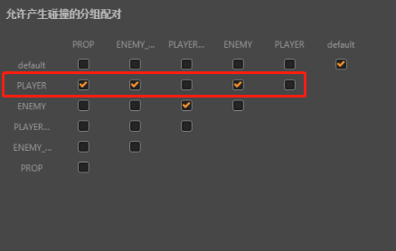

# 物体类型与碰撞矩阵

> 知识大纲
1. 添加物体类型: 每个类型对应一个名字group与groupIndex
2. 创建物体的时候要选择一个类型;
3. 配置碰撞矩阵，决定哪些物体类型碰撞;

> 练习
1. 要使用物理引擎，要给物体分类，和之前的碰撞检测一样
    * 关系列表是还是之前碰撞检测的配置方式，点击项目->项目设置
    * 这个配置的道理还是可以用之前举飞机游戏的例子类似，就比如
        * 玩家的子弹不能攻击玩家(当然你也可以开启友伤)，
        * 敌人的子弹总不能攻击敌人吧(否则一个boss招了一堆小弟，然后boss把自己小弟也一起干死了？)
        * 道具可以和玩家碰撞，不能和敌人碰撞吧(武器强化敌人也能吃，这。。。好像玩起来也很刺激)
        * 敌人可以和玩家碰撞，敌人的子弹也可以和玩家碰撞
        * 诸如此类的就不在举例子了
2. 在分组管理里新增分组，及关系表 
    * 一共要新增5个分组，分别是
        1. **PLAYER** - 玩家
        2. **ENEMY** - 敌人
        3. **PLAYER_BULLET** - 玩家子弹
        4. **ENEMY_BULLET** - 敌人子弹
        5. **PROP** - 道具(比如强化武器啊，全屏炸弹啊)
    * 关系表，或者称为碰撞矩阵配置  

           
        
    * 我们拿一行举例来说，从左往右的顺序来看，一共有5个选中框 
    
        
        
    * 玩家和道具是能碰撞的，所以PLAYER和PROP这第一个勾就勾上了
    * 玩家和敌人的子弹是能碰撞的，所以第二个勾也勾上了
    * 玩家和玩家的子弹不能碰撞，所以第三个勾没勾上
    * 玩家和敌人能碰撞，所以第四个勾勾上了
    * 玩家和玩家不能碰撞，所以第五个勾没勾上       
    
3. 在上次的项目中，把item(就自由落体的那个物体)分组改为PLAYER，把地面改为ENEMY  
    
    
    
    
   
4. 这个时候运行，结果和之前是一样的，item掉在了地上

    

5. 我们把地面的分组改为PLAYER，前面在配置矩阵的时候，我们让PLAYER之间是不会发生碰撞的，正好测试下，
    结果的确不会碰撞，看到了item穿过了地面
    
    
