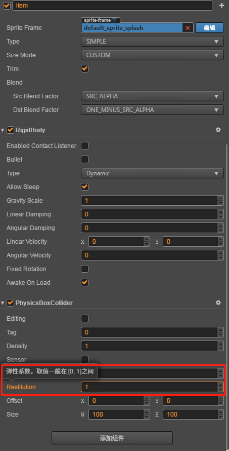
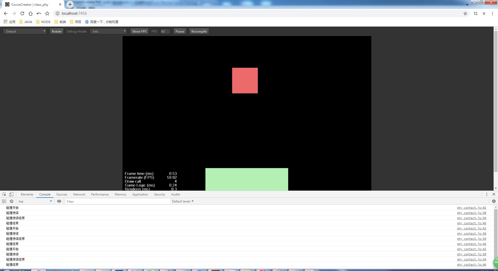

# 碰撞事件监听

> 知识大纲
1. 刚体组件开启碰撞监听;
2. 当有碰撞发生的时候,遍历刚体所在的节点所挂的所有的组件，
    看组件是否实现了碰撞检测函数，如果是，那么调用;
3. 在需要检测碰撞的组件代码里面编写碰撞响应函数:
     * onBeginContact ( contact, selfCollider, otherCollider): 碰撞开始
     * onEndContact (contact, selfCollider, otherCollider): 碰撞结束  
     * onPreSolve(contact, selfCollider, otherCollider); 碰撞持续,接触时被调用;
     * onPostSolve (contact, selfCollider, otherCollider);  碰撞接触更新完后调用,可以获得冲量信息
4.  如果把碰撞器设置成了sensor,那么只会做碰撞检测，而不会改变物体碰撞后的运动状态;
     * sensor: 用于触发器: 道具, 关卡的出口，入口等;
     
> 练习
1. 为了能够更好的模拟碰撞监听，这里修改下前面的自由落体item的碰撞器组件其中的一个属性**Restitution**,
    把他改为1，然后运行下就能看到item会上下弹跳了，就像琦玉老师的左右往返跳跃，这个就变成了上下往返跳跃
        
     

2. 刚体组件开启碰撞监听，指的就是勾选这个属性，要勾选了才能在开启监听

    
    
3. 新建脚本**phy_contact.js**脚本，先挂在item下   
4. 在**phy_contact.js**编写脚本
    1. 监听碰撞开始
        ```
        onBeginContact ( contact, selfCollider, otherCollider){
            console.log("碰撞开始")
        },
        ```      
    2. 监听碰撞结束
        ```
        onEndContact ( contact, selfCollider, otherCollider){
            console.log("碰撞结束")
        },
        ```
    3. 监听碰撞持续 - 这个用的不多
        ```
        onPreSolve ( contact, selfCollider, otherCollider){
            console.log("碰撞持续")
        },
        ```
    4. 监听碰撞持续结束 - 这个用的也不多   
        ```
        onPostSolve ( contact, selfCollider, otherCollider){
            console.log("碰撞持续结束")
        },
        ```
    5. 运行看控制台打印结果，因为我们的item是上下往返运动，所以
        
        
        
    6. 参数的学习
        1. contact
        2. selfCollider
        3. otherCollider           