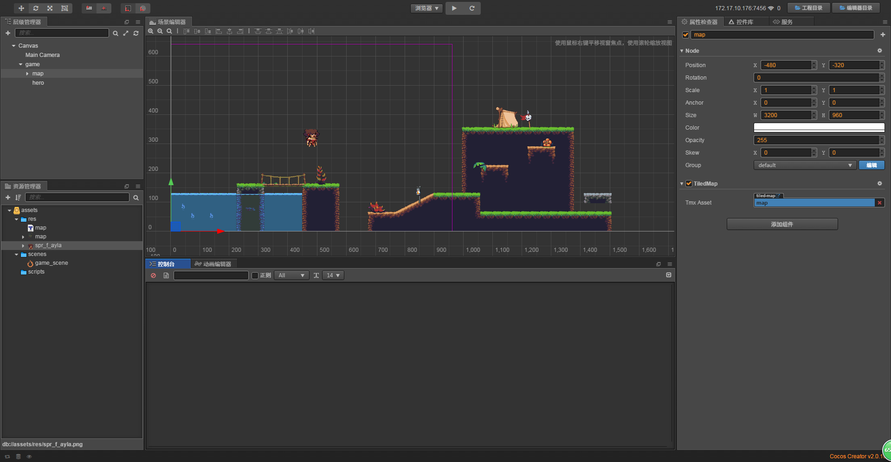
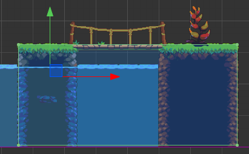
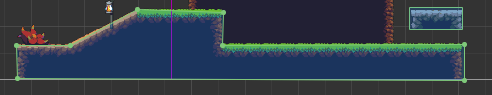

# 官方物理引擎案例

> 知识大纲
1. 准备好tiled地图;
2. 为tiled地图编辑好物理碰撞器;
3. 放出角色,为角色编辑好物理碰撞器;
4. 监听键盘事件
5. 设置角色的水平和竖直速度;
6. 设置cc.Camera组件,设置Camera跟随玩家; 

> 练习
1. 准备工作
    1. 新建项目，然后把素材放入res文件夹中
    2. 在Canvas下新建个空节点取名为game
    3. 拖动素材
        1. 把素材中的map(tiled)拖拽至game节点下，然后调整下位置
        2. 把素材中的**spr_f_ayla**拖拽到game节点下，取名为hero
        3. 如下图所示

                
          
    4. 把上次物理引擎的课程中的开启物理引擎的脚本**enable_phy.js**拿过来,
        放在scripts目录下，挂在Canvas节点下  
2. 开始玩耍
    1. 配置碰撞器
        1. 在game节点下新建个空节点，取名为phy_map，添加个Box的刚体碰撞器
        2. 修改组件的属性
            1. 刚体的type选为Static
            2. 选中Editing，调整至下图大小位置 
            
                  
                   
        3. 在添加第二个Box的刚体碰撞器
            * 选中Editing，调整至下图大小位置
            
                  
                
        4. 在添加三个Box的刚体碰撞器
            * 选中Editing，调整至下图的位置
            
                   
                
        5. 添加一个多边形Polygon的刚体碰撞器  
            * 选中Editing，调整至下图的位置
                    
                   
                
        6. 碰撞器的最终的效果应该就是这个样子，一共添加了六个碰撞器
                
            
            
        7. 为了快速的演示效果，我们的主角也加个Box的碰撞器
            (主角这里还要选中Fixed Rotation的属性，这里忘记勾选了，为了不让主角旋转)
            
               
            
        8. 然后运行，我们就发现主角在重力的作用下掉在了地上
        
            
             
    2. 编写hero脚本
        1. 新建**hero.js**,并挂在hero下
        2. 开始撸码
            1. 先来监听键盘事件
                ```
                cc.Class({
                    extends: cc.Component,
                
                    properties: {
                        
                    },
                
                    // LIFE-CYCLE CALLBACKS:
                
                    onLoad () {
                        cc.systemEvent.on(cc.SystemEvent.EventType.KEY_DOWN, this.on_key_down, this);
                        cc.systemEvent.on(cc.SystemEvent.EventType.KEY_UP, this.on_key_up, this);
                    },
                
                    start () {
                
                    },
                
                    update (dt) {
                
                    },
                
                    on_key_down(){
                        console.log("key_down");
                    },
                
                    on_key_up(){
                        console.log("key_up");
                    }
                });
                ```                                      
            2. 获取刚体组件，2种方式
                1. 编辑器绑定
                    1. 具体代码如下
                        ```
                        properties: {
                            body: {
                                type: cc.RigidBody,
                                default: null, 
                            },
                        },
                        ```
                    2. 然后把hero拖拽至RigidBody属性中  
                    
                        
                
                2. 代码直接获取
                    * `this.body = this.node.getComponent(cc.RigidBody);`      
            3. 然后做按键功能
                1. 空格键控制人物跳跃     
                    * 按空格实际上就是在给了人物一个y方向的瞬时速度
                    * 代码如下
                        ```
                        on_key_down(e){
                            // console.log("key_down");
                            // console.log(e.keyCode);
                            switch(e.keyCode){
                                case cc.macro.KEY.space:
                                    this.jump();
                                    break;
                                case cc.macro.KEY.left:
                    
                                    break;
                                case cc.macro.KEY.right:
                    
                                    break;
                            }
                        },
                        
                        jump(){
                            //加一个竖直方向的瞬时速度
                            let v = this.body.linearVelocity;
                            v.y = 200;
                            this.body.linearVelocity = v;
                        },
                        ```
                    * 然后我们运行按空格就能看到人物跳起来了，
                        我们可以调整y方向的速度和重力加速度达到我们想要的跳跃效果    
                2. 左右方向键控制人物水平移动
                    * 我们这边可以做一个功能，比如按了左键，只要不抬起按键，人物就一直往左边走，
                        只有松开了才能停止运动
                    * 所以我们这边在onLoad的时候要给个标志位，例如`this.input_flag = 0;`，
                        这样我们在按下左右键的时候可以给值-1，+1，然后松开的时候在把这个标志改为0
                    * 具体代码如下
                        ```
                        cc.Class({
                            extends: cc.Component,
                        
                            properties: {
                                body: {
                                    type: cc.RigidBody,
                                    default: null, 
                                },
                            },
                        
                            // LIFE-CYCLE CALLBACKS:
                        
                            onLoad () {
                                cc.systemEvent.on(cc.SystemEvent.EventType.KEY_DOWN, this.on_key_down, this);
                                cc.systemEvent.on(cc.SystemEvent.EventType.KEY_UP, this.on_key_up, this);
                                this.input_flag = 0;
                            },
                        
                            start () {
                        
                            },
                        
                            update (dt) {
                                if(this.input_flag){
                                    this.walk(this.input_flag);
                                }
                            },
                        
                            on_key_down(e){
                                // console.log("key_down");
                                // console.log(e.keyCode);
                                switch(e.keyCode){
                                    case cc.macro.KEY.space:
                                        this.jump();
                                        break;
                                    case cc.macro.KEY.left:
                                        this.input_flag = -1;
                                        break;
                                    case cc.macro.KEY.right:
                                        this.input_flag = 1;
                                        break;
                                }
                            },
                        
                            on_key_up(e){
                                switch(e.keyCode){
                                    case cc.macro.KEY.space:
                                        
                                        break;
                                    case cc.macro.KEY.left:
                                        this.input_flag = 0;
                                        break;
                                    case cc.macro.KEY.right:
                                        this.input_flag = 0;
                                        break;
                                }
                            },
                        
                            jump(){
                                //加一个竖直方向的瞬时速度
                                let v = this.body.linearVelocity;
                                v.y = 200;
                                this.body.linearVelocity = v;
                            },
                        
                            walk(dir){
                                let v = this.body.linearVelocity;
                                v.x = 100 * dir;
                                this.body.linearVelocity = v;
                            },
                        
                        
                        });
        
                        ```        
                    * 运行以后，就可以按左右方向键和空格键测试了，然后的确能控制人物移动加跳跃~    
                3. 优化
                    * 方向键，往左走的时候可以让人物转头  
                    * 本质其实就是改变下scaleX的值
                    * 所以在walk方法最后加入改写scaleX的代码，具体如下
                        ```
                        walk(dir){
                            let v = this.body.linearVelocity;
                            v.x = 100 * dir;
                            this.body.linearVelocity = v;
                            this.node.scaleX = dir;
                        },
                        ```  
                    * 之后小伙伴自行调整速度大小，重力加速度大小之类的让游戏体验更好点    
                    * 然后就是优化视角了，因为现在我们主角走在最右边地图就看不见了，所以接下来我们要学习
                        [Camera组件](./02-cc.Camera组件.md)    