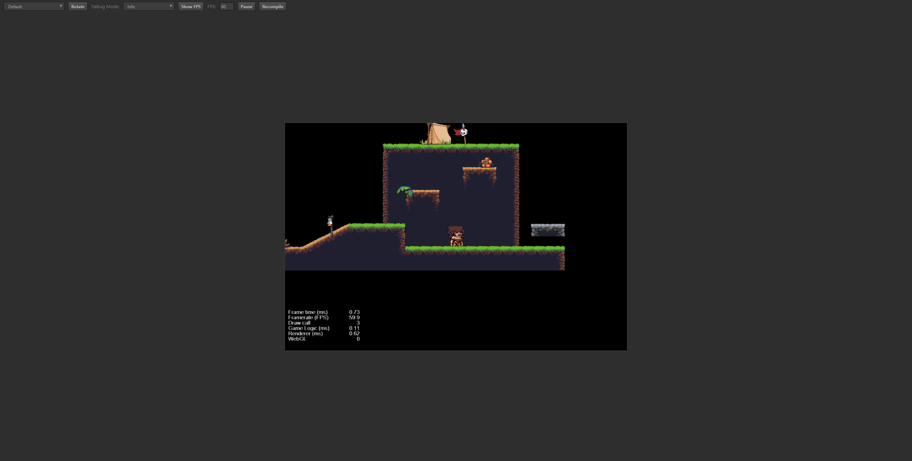

# cc.Camera组件

> 知识大纲
1. 配置哪些物体受Camera组件影响;
2. 配置Camera跟随目标

> 练习
1. 前面的案例是需要优化的，因为当我们的角色移出屏幕后并没有展现后面的地图
2. Camera是什么鬼？中文意思其实就是相机，可以这么简单粗暴的理解，
    让角色带着相机走，相机在哪，那画面就跟着了 
3. 其实我们的Camera节点一直都在，小伙伴有没有发现。他就在这里，一开始默认就添加好了
    
        

4. 我们新建个**bind_camera.js**脚本，挂在Camera节点下
5. 先要绑定个target，告诉camera跟随哪个目标走
    1. 编辑器绑定
        ```
        properties: {
            target: {
                type: cc.Node,
                default: null,
            }
        },
        ```      
    2. 把hero节点拖拽至target属性  
        
          

6. 跟随目标的代码怎么写
    ```
    update (dt) {
        if(!this.target) return;
        let wpos = this.target.convertToWorldSpaceAR(cc.v2(0, 0));
        let pos = this.node.parent.convertToNodeSpaceAR(wpos);
        this.node.setPosition(pos);
    },
    ```  
7. 然后运行就能解决问题了，优化完毕
    
        
    
8. 补充
    * 只想跟随目标X的方向改怎么做
    * 把前面的`this.node.setPosition(pos);`改成`this.node.x = pos.x;`          