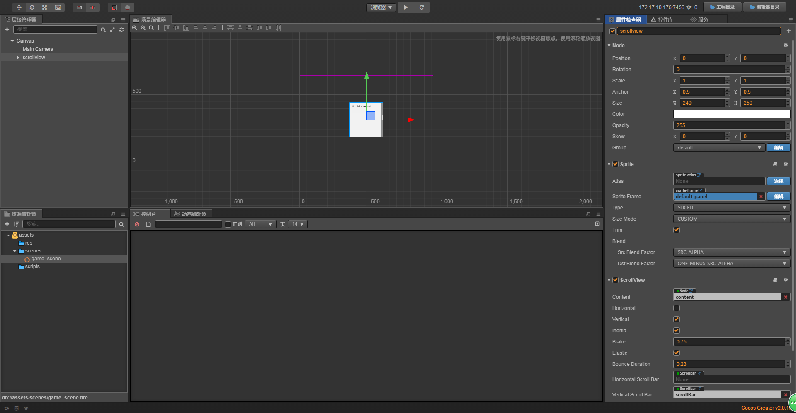
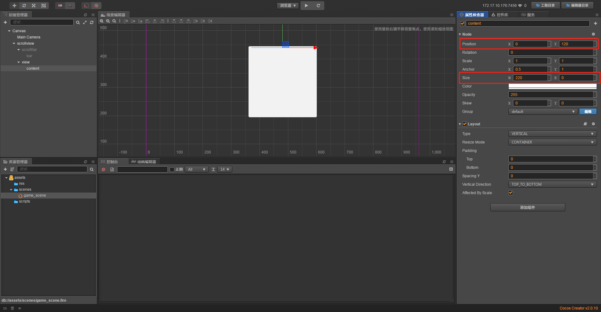
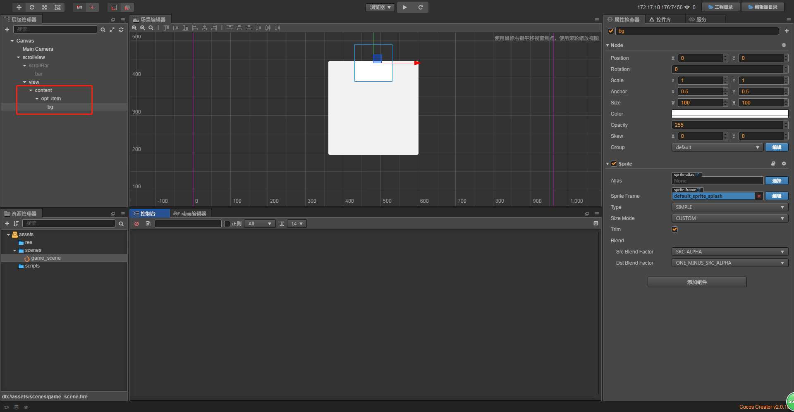
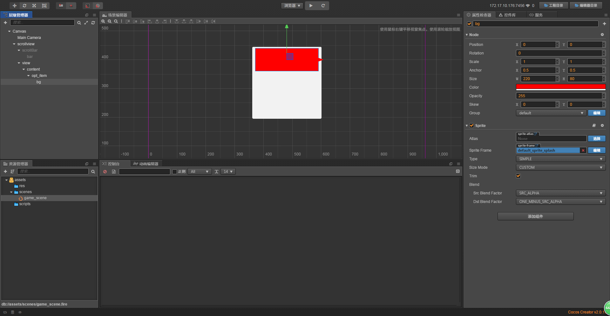
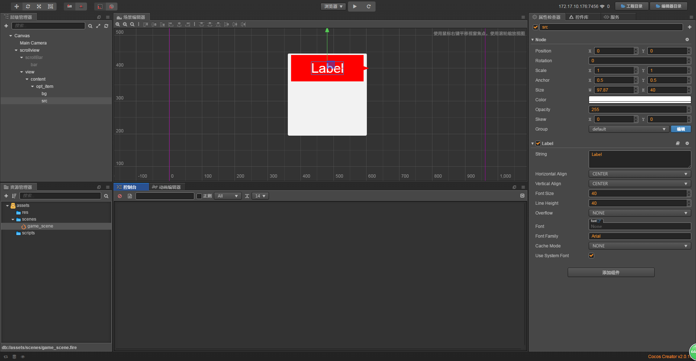
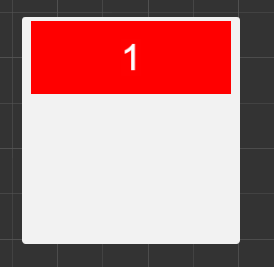
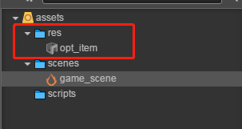
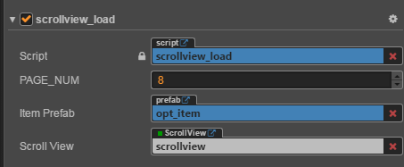

# 动态加载列表

> 知识大纲
1. 每个记录是滚动列表里面的一个项，我们将整个列表分为3页，每页固定的项的数目;
2. 一个PAGE的项最好超过滚动列表的大小;
3. 课程案例, 创建一个滚动列表
    * 每一个page为一个页,共3个页，每个page有8个项;
    * 3 * 8 = 24个项, 用1-100来模拟数据记录;
4. 编写代码往滚动列表里面加入所需要的项目;

> 练习
1. 在Canvas下新建一个ScrollView节点(Canvas右键->创建节点->创建UI节点->ScrollView),取名为scrollview

    
    
2. 我们把scrollBar节点隐藏掉，即把active属性不勾选
    
       
    
3. 接下来我们把content下的item删除，然后给content节点添加Layout组件(添加组件->UI组件->Layout) 
    * Type选择垂直布局
    * Resize Mode选择容器
    * Spacing Y改为10(这里一开始忘记加了，为了让之后每一项有间隔)
    * 如下图所示
    
        
    
4. 然后我们改下content的节点属性
    * Size的高度改为0，因为要动态加载
    * Position往上调整些，y的值改为120
    * 如下图所示
    
        
     
5. 在Content下新建一个空节点，代表的每一项内容，取名opt_item, 
    然后在opt_item下新建个单色精灵，取名为bg，作为每一项的背景颜色   
    * 如下图所示
    
        
        
    * 修改opt_item和bg的属性
        * opt_item和bg的Size都改为(220, 80)
        * bg的Color改为红色
    * 如下图所示 
        
            

6. 在opt_item下新建个Label节点(opt_item右键->创建节点->创建渲染节点->Label)，取名src
    * 如下图所示  
        
             
        
    * 修改Label的属性
        * String改为1
    * 如下图所示
        
        
        
7. 这样我们就可以做预制体了，把opt_item拖拽至res目录下，[不知道预制体是什么点击此处](../day-013-预制体,Mask,Layout,ScrollView/01-预制体.md)        

        
    
8. 预制体如何使用
    1. 我们就把res中的预制体**ope_item**往层级管理器下的content节点下拖
    2. 我们拖几个进去吧，如下图所示 
    
        
        
9. 新建**scrollview_load.js**脚本，挂在scrollview节点上
    1. 为了模拟动态加载，我们先把content下的所有节点都删除
    
        
           
    2. 我们模拟数据就用1~100的整数
        ```
        onLoad () {
            this.value_set = [...new Array(100).keys()].map(item => item + 1);
            console.log(this.value_set);
        },
        ```
    3. 我们先编辑器绑定一些属性
        ```
        properties: {
            PAGE_NUM : 8, //每页8个
            item_prefab: {
                type: cc.Prefab,
                default: null,
            },
            scroll_view: {
                type: cc.ScrollView,
                default: null
            }
        },
        ```
        
        
        
    4. 在onLoad里动态加载每一项opt_item
        ```
        onLoad () {
            this.value_set = [...new Array(100).keys()].map(item => item+1);
            this.content = this.scroll_view.content;
            for(let i = 0; i < this.PAGE_NUM * 3; i ++){
                let item = cc.instantiate(this.item_prefab); //实例化预制体
                this.content.addChild(item);
            }
        },
        ```   
    5. 运行后的确加载了opt_item，我们接下来修改lable的string属性，让1~24显示出来
        1. 在start的时候初始化个index
            ```
            start () {
                this.start_index = 0;
            },
            ```    
        2. 编写个加载数据的函数**load_record**,在此之前还要讲之前实例化的每个预制体存入一个数组中，
            最终效果是
            ```
            cc.Class({
                extends: cc.Component,
            
                properties: {
                    PAGE_NUM : 8, //每页8个
                    item_prefab: {
                        type: cc.Prefab,
                        default: null,
                    },
                    scroll_view: {
                        type: cc.ScrollView,
                        default: null,
                    }
                },
            
                // LIFE-CYCLE CALLBACKS:
            
                onLoad () {
                    this.value_set = [...new Array(100).keys()].map(item => item + 1);
                    this.content = this.scroll_view.content;
                    this.opt_item_set = [];
                    for(let i = 0; i < this.PAGE_NUM * 3; i ++){
                        let item = cc.instantiate(this.item_prefab); //实例化预制体
                        this.content.addChild(item);
                        this.opt_item_set.push(item);
                    }
                },
            
                start () {
                    this.start_index = 0;
                    this.load_record(this.start_index);
                },
            
                // update (dt) {},
            
                load_record(start_index){
                    this.start_index = start_index;
                    for(let i = 0; i < this.PAGE_NUM * 3; i ++){
                       let lable = this.opt_item_set[i].getChildByName("src").getComponent(cc.Label);
                       lable.string = this.value_set[start_index + i];
                    }
                }
            });

            ```
            
            
        
    6. 如何24项中显示100个内容？
        1. 先来[学习原理](./03-往下加载示意图.md)
  
    
                     
 