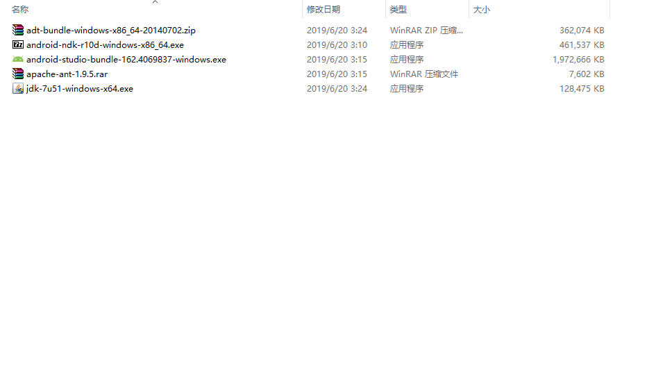

# android编译工具

> 知识大纲
1. android开发工具是基于JAVA来开发的，所以需要安装JDK(java develop kit);
2. android的应用开发程序，是基于Android SDK来开发的;
3. 游戏引擎是有C/C++开发的，所以需要使用NDK来把游戏引擎变成二进制库.so给android应用
    程序调用(通过JNI);
4. ADT/android studio工具自带SDK(推荐android studio);
5. ant android打包是基于ant来打，所以我们要安装它;
6. 了解以上概念后就可以下载对应的软件进行安装了
    (由于部分文件过大，本项目并没有提供这些，大家请去官方网站下载)

    