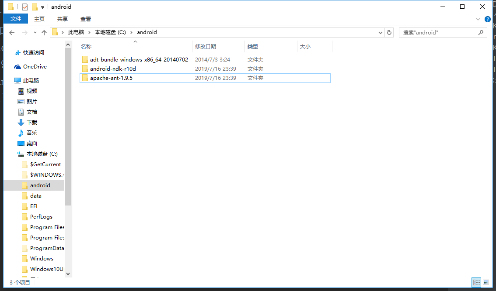

# 安装SDK与NDK

> 知识大纲
1. 创建一个android编译工具的目录,比如c:/android
2. 解压SDK工具**adt-bundle-windows-x86_64-20140702.zip**到android目录,并添加环境变量
    * ANDROID_SDK_ROOT: C:\android\adt-bundle-windows-x86_64-20140702\sdk
3. 运行NDK工具**android-ndk-r10d-windows-x86_64.exe**，会解压出一个文件，
    然后放到android目录,并添加环境变量;
    * NDK_ROOT: C:\android\android-ndk-r10d
4. 安装ANT，解压apache-ant-1.9.5-bin.zip,并添加环境变量
    * ANT_ROOT 配置为: C:\android\apache-ant-1.9.5\bin
5. 最终的C:\android文件夹下应该是这样的
    
        
