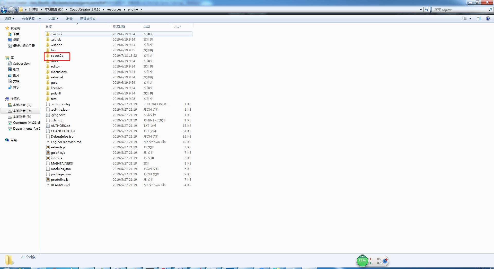

# 本章目录

* 主要是做本地的文件读写

* [FileUtils](./01-FileUtils.md)

> 练习
* 这里提供一个小技巧，就是当你API不熟的时候，除了网上查资料，查API文档，还可以直接在creator安装目录看源码
    1. 找到cocos文件夹，在我们creator下的这个目录
        (cocos是cpp为主的，我们js引擎的源码在engine文件夹下的cocos2d)
    
        
        
    2. 用IDE打开cocos
    
         
        
    3. 我们全局搜FileUtils，找对对应的cpp文件，然后搜索我们记得大概名字的API 
    
          
        
    4. js引擎的源码也是差不多这样找，这里也给大家来个示范 
    
        
        
           