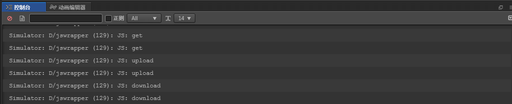

# HttpClient

1. Http Client: GET，POST是http的两种请求;
2. 获取网页数据我们一般使用http Get,GET传递参数通过?开始每个参数之间使用&来隔开;
3. 上传数据我们一般使用POST协议来上传;
4. download下载一般也用GET来做, xhr.responseType 指的是数据的类型:
    * "" -  (默认)DOMString 是一个UTF-16字符串, DOMString 直接映射到 一个String
    * "arraybuffer" -  对象被用来表示一个通用的，固定长度的二进制数据缓冲区
    * "blob" -  Blob对象表示不可变的类似文件对象的原始数据
    * "json" -  JavaScript object, parsed from a JSON string returned by the server
    * "text" -  DOMString
    * 根据你要获取的数据类型来决定，比如下载一个文件，可以采用arraybuffer模式;
5. 使用http.js里面的get请求;
6. 使用http.js里面的post上传文件数据;
7. 使用http.js里面的get下载文件,并保存到本地;

> 练习
1. 准备工作
    1. 新建项目后新建脚本**game_scene.js**, 挂在Canvas下
    2. 在脚本里新建3个方法，**on_get_click**,**on_upload_click**,**on_download_click**
        ```
        cc.Class({
            extends: cc.Component,
        
            properties: {
        
            },
        
            // LIFE-CYCLE CALLBACKS:
        
            onLoad () {},
        
            start () {
        
            },
        
            update (dt) {},
        
            on_get_click(){
                console.log("get");
            },
        
            on_upload_click(){
                console.log("upload");
            },
        
            on_download_click(){
                console.log("download");
            },
        });
        ```
    3. 我们在场景编辑器里做3个按钮，label分别为**get**， **upload**， **download**,然后绑定前面我们写的方法
    
         
        
    4. 我们可以先运行下，点击按钮，看下是否绑定到对应的方法上了，事实证明没什么问题
    
               

    
