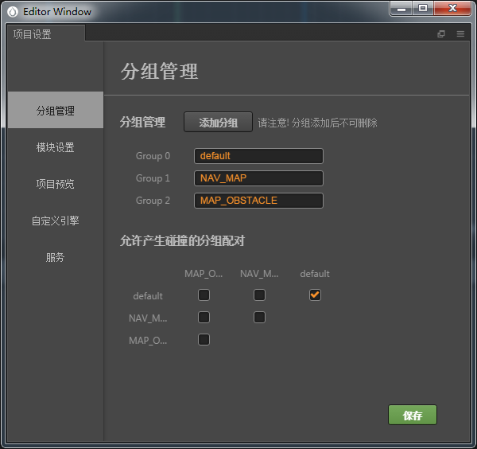
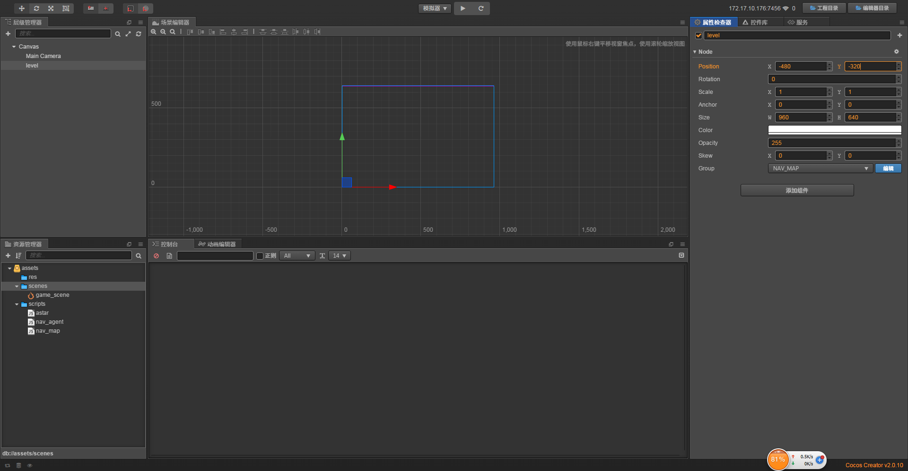
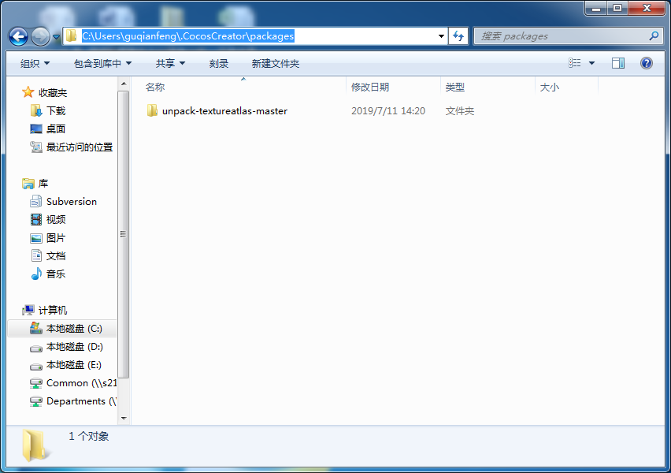

# creator网格导航寻路

> 知识大纲

1. 这是个很固定的需求，但游戏引擎creator没有很好的解决这个问题
2. 所以我们自己用插件实现一个
3. 怎么导出地图数据
4. 怎么做寻路
5. 寻路完成后角色如何行走

> 练习
1. 新建项目，新建**res**, **scripts**, **scenes**文件夹，保存**game_scene**到scenes文件夹中
2. 把我们导航组件的3个js文件拷贝到我们的**scripts**文件夹中

    
    
3. 使用原则:
    1. 将地图的根节点设置为NAV_MAP， map要指定大小
    2. 将地图的障碍物设置为MAP_OBSTACLE
    3. 启动菜单中的选项，来生成地图的数据，0代表可以通过，1代表障碍物
    4. 每个地图块的锚点必须是(0.5, 0.5)
    5. map_root的锚点必须是(0, 0)
    6. 地图的原点是从左下角开始的
4. ~实际操作~
    1. 在项目设置里添加2个分组，一个是NAV_MAP, 一个是MAP_OBSTACLE
    
        
    
    2. 创建地图
        * 新建个空节点，取名为level1，假设这个就是第一关的地图吧
        * 要指定它的大小，Size属性改成(960, 640)
        * 把锚点坐标改为(0, 0),这个是必须的
        * 然后对齐到Canvas，修改Position的属性，改为(-480, -320)
        * 修改分组，改为NAV_MAP
        * 如图所示
        
            
            
        * 在level1下创建地图背景，这里用单色精灵代替(当然你也可以使用图片的)，取名为bg
        * 同样也要改变它的属性，这里就不一一写了，具体达到的效果见下图  
        
             
            
    3. 创建障碍物  
        * 我们还是用单色精灵代表障碍物，在level1下创建单色精灵，取名为item，
            改为半透明红色，还可以修改它的大小
            记得还要改分组，改成MAP_OBSTACLE
        * 如下图所示
        
            
            
    4. 插件
        1. 简单了解原理
            * 看到我为你们准备的插件中的**gen_navmesh**了嘛，我们先来看下package.json文件  
                ```
                {
                  "name": "gen_navmesh",
                  "version": "0.0.1",
                  "description": "A package for unpacking texture atlas created with TexturePacker.",
                  "author": "zilongshanren",
                  "main": "main.js",
                  "main-menu": {
                    "i18n:MAIN_MENU.package.title/gen_navmesh/gen": {
                      "message": "gen_navmesh:gen"
                    }
                  },
                  "name": "gen_navmesh",
                  "scene-script": "gen_navmesh.js"
                }
                ```    
            * 其中main-menu这个属性其实就是指定了我们菜单会多出来这个扩展插件
            * 然后还有个场景脚本scene-script属性，他告诉我们这个脚本是gen_navmesh.js
            * 我们再看下main这个属性，指定的入口main.js，看下这个脚本 
                ```
                  messages: {
                    'gen' () {
                      Editor.Metrics.trackEvent({
                        category: 'Packages',
                        label: 'gen_nevmesh',
                        action: 'Open By Menu'
                      }, null);
                      
                      Editor.Scene.callSceneScript('gen_navmesh', 'gen_nevmesh', function (err, map) {
                          Editor.log("Gen nav map data...");
                          var path = Path.join(Editor.projectPath, 'assets', "maps");
                          
                          Fs.mkdirsSync(path);
                          var json_data = JSON.stringify(map);
                          json_data = "var " + "game_map_" + map.name + "=" + json_data + ";";
                          json_data = json_data + "\n" + "module.exports = " + "game_map_" + map.name;
                
                          Fs.writeFileSync(Path.join(path, "game_map_" + map.name + ".js"), json_data);
                          Editor.log("Gen nav map Success !!!!!!!");
                
                      });
                      
                    },
                  },
                ```
            * 在导出exports的messages有个gen函数，这个就是我们菜单点击后会执行的函数  
            * callSceneScript这里就能看到调用的就是前面说的那个场景脚本
            * 我们接着来看下gen_navmesh脚本，其中有这么一个方法
                ```
                'gen_nevmesh': function (event) {
                    /*;
                    Editor.log('children length : ' + canvas.children.length);
                    var pos = canvas.convertToWorldSpaceAR(cc.p(0, 0));
                    Editor.log(pos);
                    */
                    var canvas = cc.find('Canvas')
            
                    var map = gen_tools.find_map(canvas);
            
                    var game_map = null;
                    if(map) {
                        game_map = gen_tools.gen_map_data(map);
                    }
            
                    if (event.reply) {
                        event.reply("OK", game_map);
                    }
                },
                ```
            * 以上代码中，有这么一行代码`var map = gen_tools.find_map(canvas);`
            * 然后我们再去看下find_map这个方法
                ```
                find_map: function(root) {
                    if (root.active === false) {
                        return null;
                    }
            
                    if(root.group === "NAV_MAP") {
                        return root;
                    }
            
                    for(var i = 0; i < root.children.length; i ++) {
                        var node = this.find_map(root.children[i]);
                        if (node) {
                            return node;
                        }
                    }
            
                    return null;
                },
                ```
            * 很明显我们能发现，它去找了节点的组，是不是NAV_MAP, 把它作为地图
            * 在一开始还判断了是否可视化，判断了active的属性
            * 如果没有找到这个节点，会去孩子节点这里找
            * 所以在一开始的时候我们创建了分组，给地图设置分组 
            * 剩下的代码我就不一一解读了，有障碍物的代码，有生成地图的代码，小伙伴自行理解       
        2. 安装插件
            * 先要找到这个路径
            
                 
                
            * 然后把我们插件下的gen_navmesh整个文件夹copy进去     
            
                 
                
            * 然后我们在creator就能看到这个了   
            
                
            
        3. 使用插件 
                
            
              
                
             
    