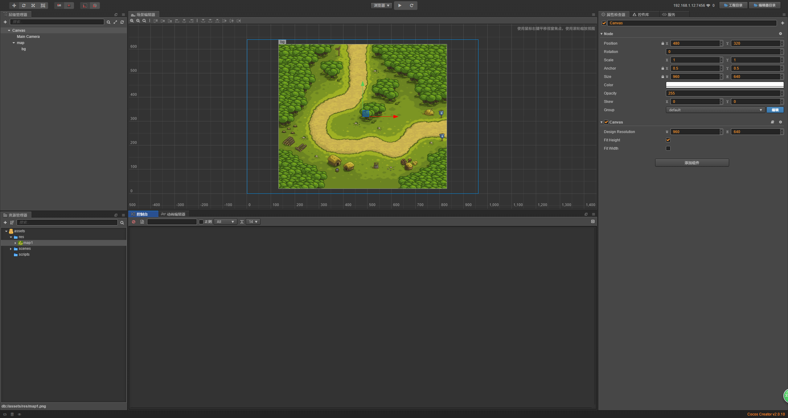
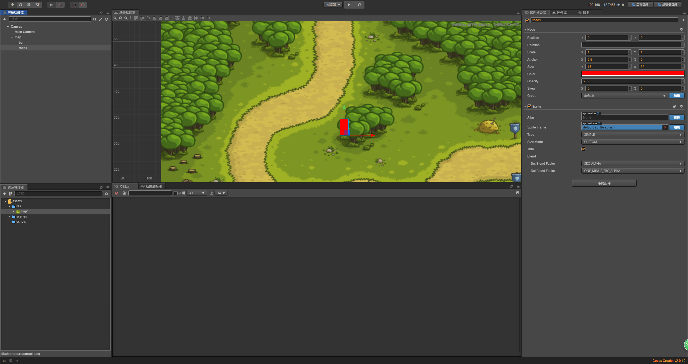
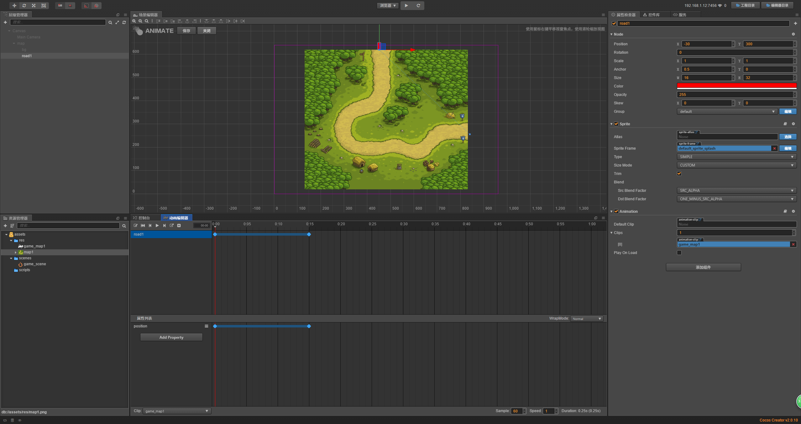

# 动画编辑器编辑地图路径

> 知识大纲
* 目标是学习用动画编辑器编辑地图路径

> 练习
1. 准备工作
    1. 把准备的资源放入res文件夹中
    2. 在Canvas下新建个空节点，取名为map
    3. 我们把前面的资源拖动到map下，取名为bg
    
        

2. 用动画编辑器制作路径
    1. 在map下新建个单色精灵
        1. 取名为road1
        2. 修改属性
            * 颜色改为红色
            * 锚点改为(0.5, 0)
            * Size改为(16, 32)
        3. 如图所示
            
            
                  
    2. 添加Animation组件，绘制地图路径  
        1. 给Map节点添加组件->其他组件->Animation 
        2. 在层级管理器中选中road1，然后点击场景编辑器下方的动画编辑器,点击新建Clip文件
            取名为**game_map1**,保存至res文件夹中
        3. 然后拖动到前面动画组件的Default Clip属性  
        4. 然后我们点击编辑，给road1添加属性，点击**Add Property**，选中position属性 
        5. 在position边上的按钮，点击插入关键帧
        
             
            
        6. 我们把第一帧的位置放在地图的起点，然后拖动红线到15s的位置，在添加关键帧，把我们的位置放在终点处              
        
            
            
        7. 我们可以点击下那条淡淡的虚线，它就会变粗 
        
              
            
        8. 然后我们可以点击虚线的任意点，然后拖拽编辑我们的路径，拖到满意为止然后保存 
        
                
            
        9. 这个曲线我们称为贝赛尔曲线，我们要生成地图路径是用个脚本生成的，源码小伙伴们自行研究
            1. 先把scripts中的**gen_map_path.js**拷贝到我们的scripts文件夹中
            2. 在节点**map**上挂这个组件 
            3. Canvas之前忘记改尺寸了，改为700*600  
            4. 运行就可以看到
            
                
            
            