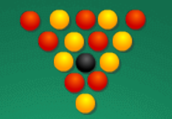
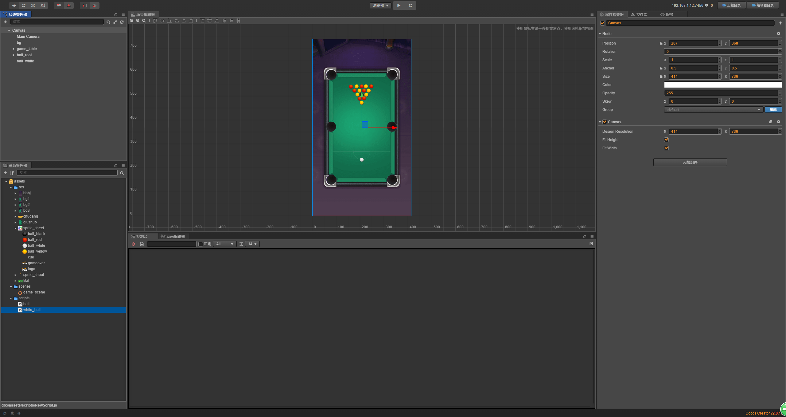

# 开启物理引擎

> 知识大纲
* [详细参考学习](../day-020-物理引擎基本配置/00-物理引擎基本配置.md)

> 练习
1. 布局工作
    1. 新建项目，新建3个文件夹(老样子，res，scripts，scenes)
    2. 把准备好的游戏资源copy到res文件夹中
    3. Canvas大小改为(414, 736),fit height和fit width一起勾选
    4. 把**bbbj.png**背景拖拽至Canvas下，改名为bg，在将大小改为(414, 736)
    
        
        
    5. 在Canvas下新建个空节点，取名为game_table,作为我们的球桌
    6. 制作球桌
        1. 把**qiuzhuo.png**拖拽至game_table在，取名为img    
        
            
            
        2. 配置球桌边缘
            1. 一共有6个边缘
                
                
            
            2. 我们在game_table下新建个空节点，取名为**phy_edge**，分组改为edge，刚体组件改为静态属性Static    
            3. 给phy_edge添加物理碰撞的组件 
            
                   
                
            4. 然后editing，调整下大小位置   
                
                 
                
            5. 接着把剩下的5个也做好
            
                
                
        3. 配置球桌球袋
            1. 在**game_table**下新建节点**phy_pocket**   
            2. 在phy_pocket新建空节点p1，意思是第一个球袋
            3. 添加物理碰撞组件，这里要用Circle，并且改为Static以及勾选Sensor，对了还有分组要改成pocket
            4. 然后editing，调整大小位置  
            
                   
            
            5. 配置剩下的球袋,这里要注意下细节，就是腰洞的位置，不应该和球洞的位置一致，
                因为母球可以贴着边缘从腰洞这边打过去的，如果位置一致，你们懂得~  
                
    7. 制作球
        1. 在Canvas下新建节点**ball_root**
        2. 我们能看到我们一共有这么几种球   
        
               
            
        3. 拖拽ball_red到ball_root下
        4. 修改其属性
            * 分组改为ball
            * 选择原始大小Raw
            * 添加物理碰撞组件，并调整大小
            * 弹性系数改为1
            * 线性阻力也改为1
            * 转动的阻力也改为1
        5. 新建脚本**ball.js**,挂在ball_red下 
        6. 我们ball一共有15个，红色7个黄色7个黑色1个，我们复制下，
            改下名字(红色的就是ball_red,黄色的就是ball_yellow,黑色的就是ball_black)，
            调整下位置摆放，这里我比较懒就随便放下，小伙伴可以精细地调整下,摆成个三角形
            
            
            
        7. 我们搞下白球，拖拽ball_white到canvas下，注意不是ball_root下
            * 修改分组white_ball
            * 添加物理碰撞组件,调整大小
            * 新建个**white_ball.js**,挂在white_ball下 
            * 调整下白球的位置，放在开杆的位置    
            
                   
                
    8. 创建球杆
        1. 把球杆的图片cue拖拽至Canvas下，记得修改分组cue
        2. 我们可以把球杆一开始放在最底下，就是游戏开始的时候是看不到它的    
        
            
            
        3. 选择原始大小Raw  
        4. 创建cue脚本，挂在cue下   
        5. 添加物理碰撞组件，调整大小 
        
2. 开启物理引擎，直接用以前写过的物理引擎脚本，挂在Canvas下 
    * 运行的时候发现球自由落体就往下掉了是因为台球游戏是不需要设置重力加速度的
    * 我们把重力加速度改为0就可以了              
               