# 创建台阶

> 知识大纲
1. 设置分辨率: 720x1280
2. 台阶的原点:
3. 配置好4个中心点,如果跳到就到4个中心点，否则就失败;
4. 编写代码获得中心点的位置，来初始化Player;
5. 斜率: 0.5560472, 与平行四边形相当;
6. 块开始的世界坐标的位置: （180， 350）

> 练习
1. Canvas调整大小为(720, 1280)，新建game_scene脚本挂在canvas下
2. 拖拽背景到Canvas下，修改大小(720, 1280)

    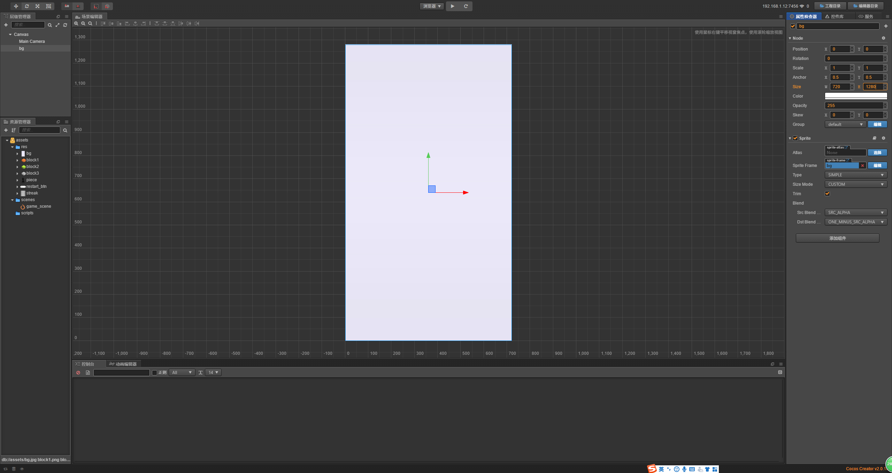
    
3. 新建个空节点game,这个是做场景移动的，对就是之前说的Camera
4. 在game下新建个空节点，取名为block_root，用于放跳跃的平台(block块)
5. 在game下新建个空节点，取名为player  
    1. player有下压的动画，还有要旋转跳跃，所以我们这边在player下创建3个节点
        1. rotate节点是旋转
        2. 然后拖拽图片**piece**到rotate下
            * 这个做动画取名为anim
            * 因为做压缩的动画所以锚点的y改为0
            
                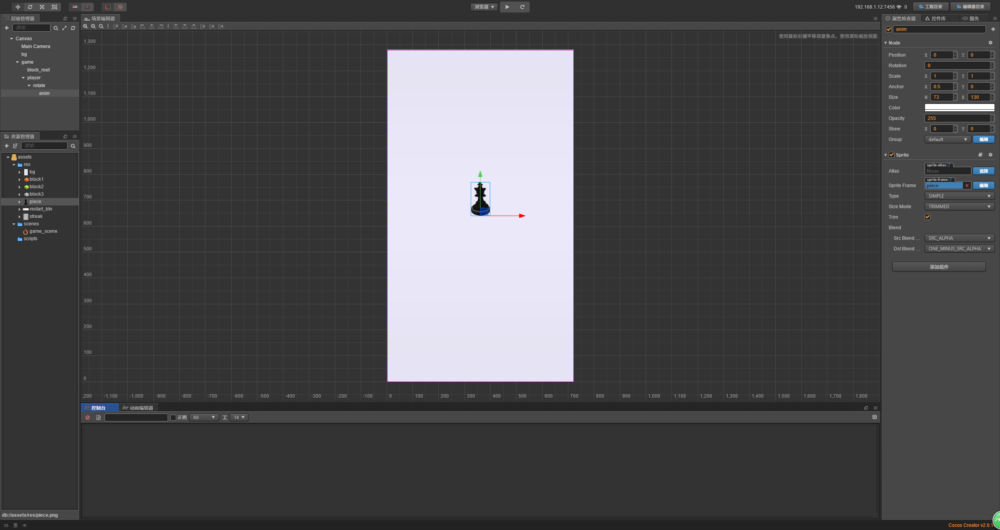
                
        3. 新建个player脚本挂在player下        

6. 为了做跳跃的效果，我们要开始做block块了
    1. 目标要要做3个block
    2. 先来做第一个b1
        * 在block_root下新建一个空节点，取名为b1
        * 把图片block1拖拽至b1的节点下，取名为icon，选择RAW原始大小
        * 简单调整下位置，调到下方     
        
            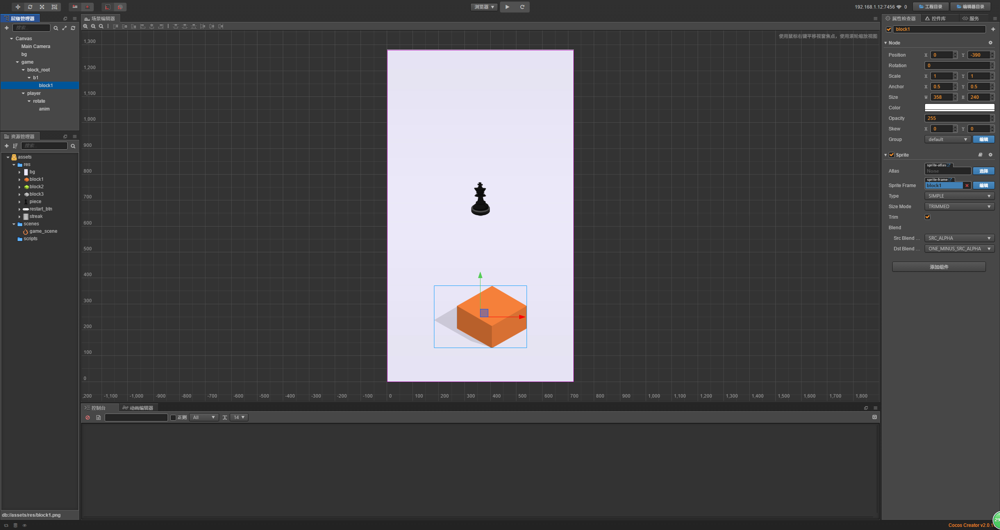      
            
        * 这边我们以下图中圈出来的位置作为block的原点
        
            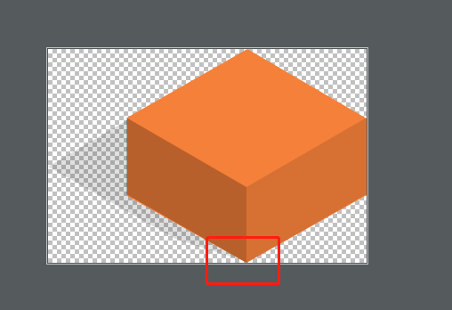      
            
        * 这里可以使用一个技巧，我们在b1下新建一个单色精灵，取名为org       
            1. size改成(5, 5)
            2. 颜色改为红色
            3. 单色精灵的作用就是为了帮我们调整block的位置，如下图所示
            
                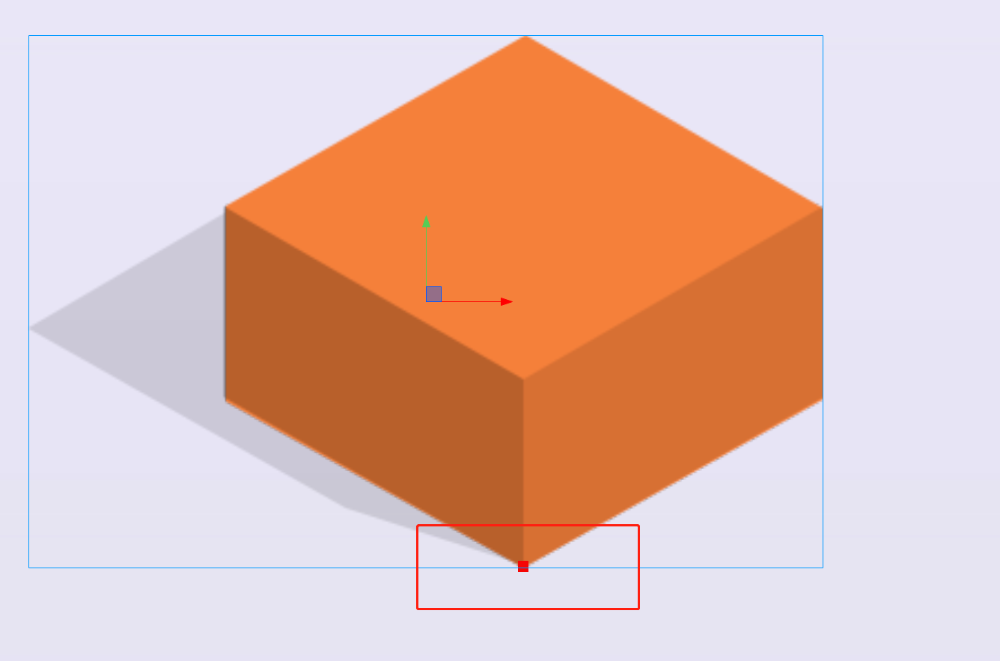 
                
            4. 调整好位置后我们就可以把这个单色精灵active取消选中了   
            
                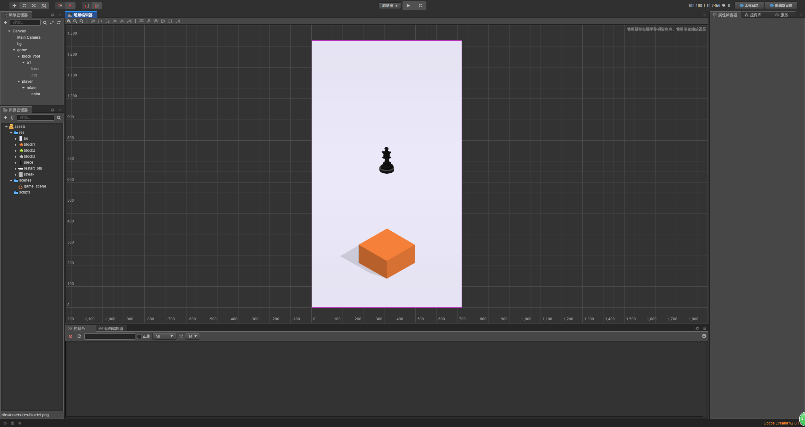 
                
        * 接下来我们来分析下，玩家可以跳到的位置区间是哪里  
            1. 首先是关键的3个点
            
                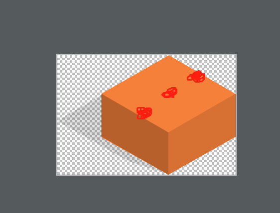      
                
            2. 上图中能看到，主要的点就是2个边缘的点和一个block的中心点
            3. 我们先来做block的中心点，在b1下新建个单色精灵，取名为mid
                * size改为(10, 10)
                * 颜色改为蓝色
                * 我们把玩家先移到中间的位置
                
                    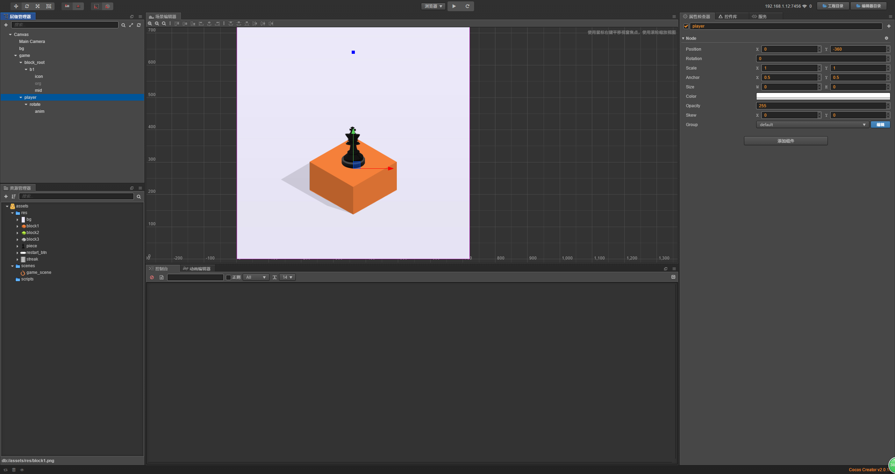
                    
                * 所以我们把我们mid点也移动到这个位置，这样mid点就确定好了
                
                    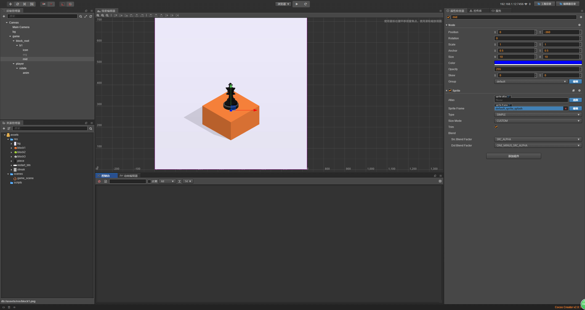  
                    
            4. 同理我们做下up和down这个点
                * 先移动玩家到合适的位置
                * 在复制mid，拖动位置，记得修改名字
                
            5. 同理还有左右2个点
                * 最终的效果就是这样的 
                    
                    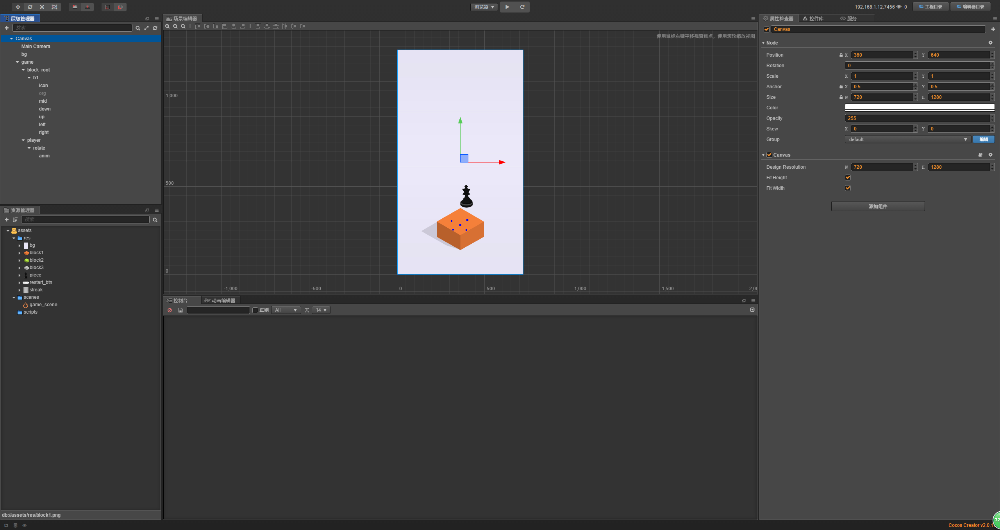    
                    
            6. 新建个block脚本，挂在block下
            7. 然后我们就可以复制block了，在修改下精灵图片就可以了       
            
                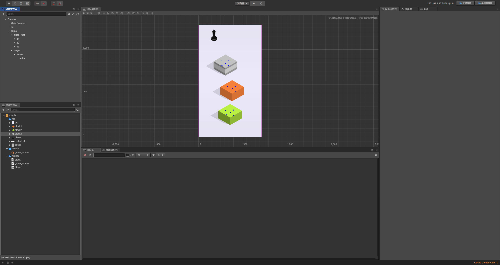  
                
            8. 然后把b1, b2, b3分别拖拽至res中，生成预制体，把block_root下的删除
            
                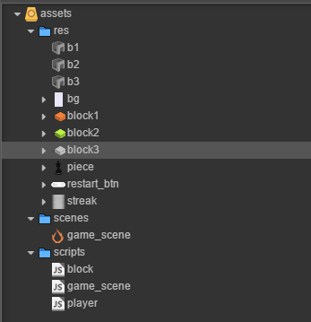  
                
7. 开始编写代码                  