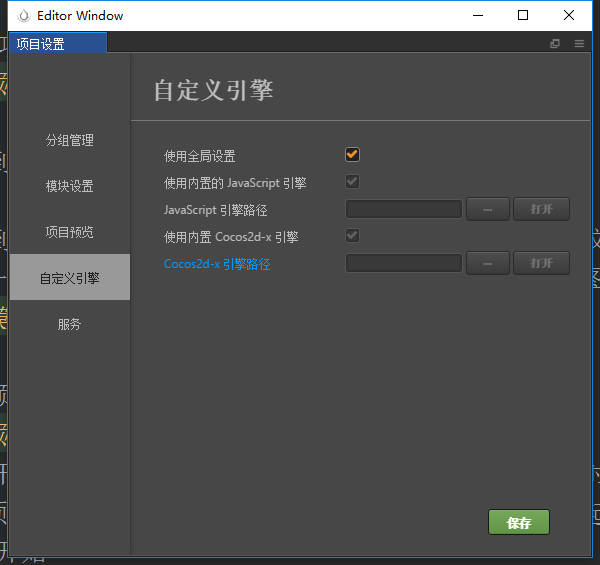
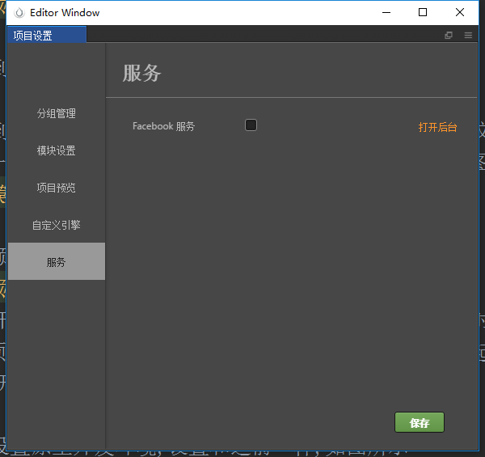
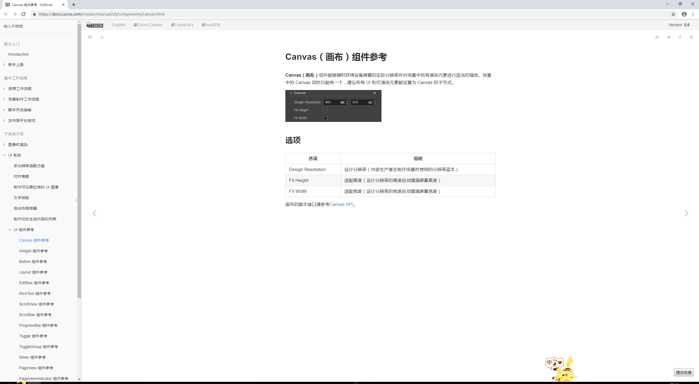

# 开发工具的一些其他功能
> **Creator 设置**
1. 点击菜单栏 -> 文件 -> 设置 如下图所示

    
    
    1. 常规
        * 我这边都采用默认的，有特殊要求的可以自己设置，
            因为是中文的都比较好理解，这里就不赘述了
    2. 数据编辑
        * 数据编辑，这里建议各位小伙伴使用自己经常使用的IDE，比如说，
            我作为前端，一直使用的IDE就是WebStorm，这样在电脑文件夹中，
            打开js文件之类的就是用WebStorm了，
            可以和creator配合使用，享受双倍的快乐
            (后续我有用了sublime配合creator，因为WebStorm自动保存，导致编译一直有问题，sublime是手动保存，
                保存后切到creator就能看到js文件一闪，代表编译好了。)
        * 最近发现WebStorm其实可以关闭自动保存功能的，小伙伴可以自己百度看下怎么搞  
            
        
    
    3. 原生开发环境
        * 小白表示使用默认内置的游戏引擎就可以了，
            理论上可以在使用其他的引擎
            
         
         
    4. 预览运行
        * 使用默认的就可以了，
            有特殊要求的可以自己配置
   
          
    
> **项目设置**  
1. 点击菜单栏 -> 项目 -> 项目设置 如下图所示

   
   
   1. 分组管理
        * 之后用到了再说，简单的说就是配置分组，可添加分组
   2. 模块设置
        * 没有用到的模块可以不选用，这样之后构建发布上线的压缩文件可以
            在小一点，提高性能，仔细阅读模块设置的一句话，如下图
            
      
             
   3. 项目预览
        * 初始化预览场景，这个非常有用，如下图所示
        
      
    
        * 当前打开场景指的就是你现在所打开的场景开始运行，有些时候，比如一些游戏
            你必须想从A场景过度到其他场景，你可以选择A场景作为起始场景，即运行时先从
            A场景开始，哪怕你现在所打开的场景不是A
   4. 自定义引擎
        * 见文件设置原生开发环境,设置和之前一样,如图所示
        
       
    
   5. 服务
        * 好像暂时用不到？~
        
    
   
> **构建发布**
1. 点击菜单栏 -> 项目 -> 构建发布 如下图所示  
         
     
   
   1. 游戏名称这边不用多说什么，当然是大佬们想怎么起就怎么起~
   2. 发布平台注意选择下，大家可以看下平台有哪些，有没有很兴奋~
   3. 发布路径记得自己可以浏览选择
   4. 初始场景很重要，就是你游戏一运行进去是哪个场景
   5. 参与构建场景是勾选哪些是构建场景的，后续详细说
   6. 后面几点我就不一一列举了，不清楚的可以将鼠标移上去看Creator指导你 如图所示
   
    
   
   7. 之后真构建完成小demo的时候也会详细的讲，现在只是简单介绍下
   
2. 学习中看到一句话待验证应该是真实可靠的- -
    * 为何build项目，可以有这么多平台
    * 因为之前讲解时，看到了creator安装目录有2个引擎，
        如果是web相关的平台，使用的则是**engine**下的引擎(js写的游戏引擎)
        其他的则是**cocos2d-x**,貌似是c++写的
    * 这个项目主要是做微信小游戏，游戏引擎文件为js文件，所以之后深入肯定
        要去看js文件的源码
    
> **Creator文档**
1. 点击菜单栏 -> 帮助(小伙伴们自己可以多看看哈)
    * [使用手册](https://docs.cocos.com/creator/manual/zh/) 
    * [API文档](https://docs.cocos.com/creator/api/zh/)
    * [中文论坛](https://forum.cocos.com/c/Creator)  
    
2. 还有个方式可以看文档(不用点帮助,这里以Canvas为例)
    * 点击开发工具左侧**层级管理器**下的Canvas
    * 请查看右侧**属性检查器** 如图所示  
            
     
    
    * 点击红框内的小按钮
    * 卧槽浏览器就打开了这个，不就是Canvas我们要找的嘛，如下图所示
    
     
    
> 简单提下组件
1. 我们来看下Canvas
    * 点击开发工具左侧**层级管理器**下的Canvas
    * 请查看右侧**属性检查器** 如图所示 
     
         
     
    * 其实这里表示有2个组件，一个是Node组件，一个是Canvas组件  
    * 组件里面的每个属性不清楚都可以用鼠标移上去看属性说明，如下图所示
    
    
    
    * Node节点不能删除，每创建个东西都是有node节点的，就如上图，canvas有2个节点，Canvas节点可以点击remove，
        但node节点是无法删除的
2. 组件代码
    * 来来来，我们先新建一个场景和一个脚本，如图所示
    
    
    
    * 我们双击打开**game_scene**这个js文件
    ```
        // Learn cc.Class:
        //  - [Chinese] https://docs.cocos.com/creator/manual/zh/scripting/class.html
        //  - [English] http://docs.cocos2d-x.org/creator/manual/en/scripting/class.html
        // Learn Attribute:
        //  - [Chinese] https://docs.cocos.com/creator/manual/zh/scripting/reference/attributes.html
        //  - [English] http://docs.cocos2d-x.org/creator/manual/en/scripting/reference/attributes.html
        // Learn life-cycle callbacks:
        //  - [Chinese] https://docs.cocos.com/creator/manual/zh/scripting/life-cycle-callbacks.html
        //  - [English] https://www.cocos2d-x.org/docs/creator/manual/en/scripting/life-cycle-callbacks.html
        
        cc.Class({
            extends: cc.Component,
        
            properties: {
                // foo: {
                //     // ATTRIBUTES:
                //     default: null,        // The default value will be used only when the component attaching
                //                           // to a node for the first time
                //     type: cc.SpriteFrame, // optional, default is typeof default
                //     serializable: true,   // optional, default is true
                // },
                // bar: {
                //     get () {
                //         return this._bar;
                //     },
                //     set (value) {
                //         this._bar = value;
                //     }
                // },
            },
        
            // LIFE-CYCLE CALLBACKS:
        
            // onLoad () {},
        
            start () {
        
            },
        
            // update (dt) {},
        });
    ```
    * 使用开发工具新建js文件，自动生成了组件模板
    * extends继承,一个组件必须要继承自cc.Component或者它的子类,js的继承就不赘述了
    * properties属性，能够绑定到编辑器上面去
    * 事件后面会详细讲，这里简单了解下，可查看API
    * 接下来添加下组件 如下图所示
    
    
    
    * 点击添加组件，选择**用户脚本组件**，
        选择我们前面新建的**game_scene**脚本,之后就会看到
        
    
    
    * 我们现在加个属性看看，在脚本文件里添加个isDebug的属性,具体代码如下
    ```
        properties: {
            // foo: {
            //     // ATTRIBUTES:
            //     default: null,        // The default value will be used only when the component attaching
            //                           // to a node for the first time
            //     type: cc.SpriteFrame, // optional, default is typeof default
            //     serializable: true,   // optional, default is true
            // },
            // bar: {
            //     get () {
            //         return this._bar;
            //     },
            //     set (value) {
            //         this._bar = value;
            //     }
            // },
            isDebug: false
        },
    ```
    * 然后在看我们Creator开发工具有什么变化，卧槽！
    
    
    
    * 这样就可以可视化编辑属性了
    
        
    
    
   
        